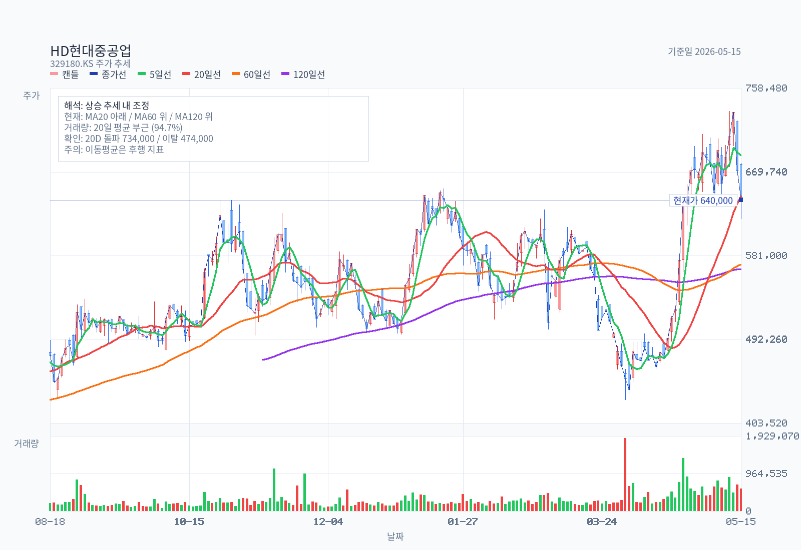
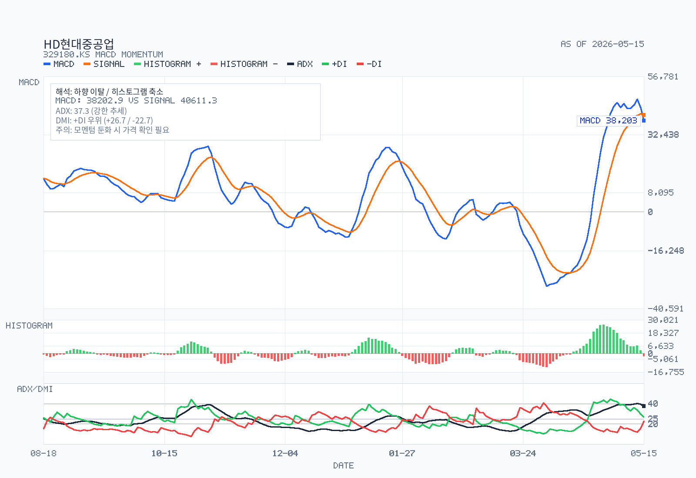

# KrResearchKit — Korean Equity Research

미국 주식, 한국 주식, KRX 포트폴리오, 한국 섹터 리서치용 AI 스킬 모음입니다. **Claude Code**와 **OpenAI Codex CLI** 양쪽 네이티브입니다.

언어:

- English — [README.md](README.md)
- 한국어 — [README-kr.md](README-kr.md)

한국 주식 리서치에서 가장 강합니다. 종목 하나가 DART 공시, KRX 차트, 증권사 컨센서스, 외국계 IB 커버리지, Naver 블로그 게시까지 한 번에 처리되어 `analysis-example/kr/<company>/memo.md`에 정리됩니다.

## 빠른 설치

Claude Code에서:

```text
/plugin marketplace add ray5273/kr-research-kit
/plugin install kr-research-kit@kr-research-kit-marketplace
```

Anthropic 커뮤니티 마켓플레이스 등록은 심사 중입니다 — 승인되면 별도 `marketplace add` 없이 공식 카탈로그에서 바로 검색됩니다. [docs/MARKETPLACE.md](docs/MARKETPLACE.md) 참조.

<details>
<summary>수동 설치 (Codex / Claude Code git clone)</summary>

Codex:

```bash
git clone --single-branch --depth 1 https://github.com/ray5273/kr-research-kit ~/.codex/src/kr-research-kit
cd ~/.codex/src/kr-research-kit && bash ./scripts/install-all-skills.sh
```

Claude Code:

```bash
git clone --single-branch --depth 1 https://github.com/ray5273/kr-research-kit ~/.claude/src/kr-research-kit
cd ~/.claude/src/kr-research-kit && bash ./scripts/install-all-claude-skills.sh
```

OpenDART API 키, macOS Naver fallback, Windows PowerShell, 커스텀 설치 경로, Chrome 확장 DART 경로는 모두 [docs/INSTALL.md](docs/INSTALL.md)에 있습니다.

</details>

## 활용 시나리오

end-to-end 4가지. 각 프롬프트는 Claude Code(`/skill`) 또는 Codex(`$skill`)에서 그대로 동작합니다.

### 1. Naver KOL — 종목 메모 작성부터 블로그 게시까지 (10분)

```text
/kr-stock-plan SOOP(067160) 결정 메모 작성한 다음, 차트·DART·증권사·외국계 IB·블로거 인사이트까지 채우고, 마지막에 Naver 블로그에 올려줘 (게시 직전에 미리보기 보여줘)
```

체인: `kr-stock-plan` → `kr-stock-chart` → `kr-stock-dart-analysis` → `kr-foreign-analyst` + `kr-analyst-report-*` → `kr-naver-blogger` + `kr-naver-insight` → `kr-stock-analysis` → `kr-naver-blog-publish` (사용자가 스크린샷 미리보기로 명시 승인해야만 발행 — 자동 게시 없음).

산출물: 완성된 메모 + 5분할 차트 + Naver SmartEditor draft. [HMM 메모 예시](analysis-example/kr/HMM/memo.md).

### 2. 외국계 IB 컨센서스 트래킹 (3분, USP)

```text
/kr-foreign-analyst 삼성전자(005930)에 대한 외국계 IB 최근 6개월 커버리지를 한국 뉴스에서 수집해 ## Street / Alternative Views 블록으로 정리해줘. 모든 view는 날짜·broker·rating·TP·한국 뉴스 URL과 1:1 매칭되게 해줘.
```

핵심 차별점: 외국계 IB는 영어 리서치 포털이 아니라 한국어 뉴스로 view를 흘리는 경우가 많습니다. 이 스킬은 모건스탠리·골드만·JPM·노무라·CLSA·UBS·HSBC·맥쿼리·씨티·BofA·다이와 커버리지를 직접 캐치하고, 모든 view를 날짜 표기된 한국 뉴스 URL과 1:1 매칭합니다.

### 3. DART 단일판매·공급계약 시계열 정리 (5분)

```text
/kr-stock-dart-analysis 한미글로벌이 최근 24개월 동안 공시한 단일판매·공급계약을 모두 행별로 정리하고, 현재 유효 계약 금액 중 2027년까지, 2028년까지, 그 이후 연도별로 얼마나 종료되는지 만기 분포 표도 추가해줘. 공시에서 수주잔고를 따로 밝히지 않으면 정식 backlog가 아니라 계약 기간 기준 커버리지라는 점을 분명히 적어줘.
```

산출물: 행별 계약 시계열 + 만기 분포 표 + "공시 vs 추정" 명시. 샘플: [한미글로벌 수주계약리스트](<analysis-example/kr/한미글로벌/수주계약리스트.md>).

### 4. 매일 KOSPI + KOSDAQ 리더십 스크리닝 (2분)

```text
/kr-market-leaders 오늘 기준 KOSPI + KOSDAQ 통합 universe에서 단기·중기·구조 lens별 leadership 스크리닝 돌려줘. RS, 거래량, 52주 신고가 트리거 포함하고, 어제 leaders-YYYY-MM-DD.md와 비교해서 오늘 신규 진입한 top-20 종목을 별도 표로 정리해줘.
```

산출물: `analysis-example/kr-market/leaders-<YYYY-MM-DD>.md` + `.json` 캐시(전일 대비 diff 포함). 매일 새로 생성되는 artifact.

추가 시나리오(섹터 비교, 포트폴리오 헬스, 실적 발표 업데이트) → [docs/MARKETPLACE.md § Use cases](docs/MARKETPLACE.md). 전체 스킬 프롬프트 카탈로그 → [docs/USAGE.md](docs/USAGE.md).

## 산출물 미리보기

메모는 generic 회사 소개가 아니라 의사결정 질문으로 시작합니다. HD현대중공업 예:

> 무엇이 투자판단을 가장 크게 바꾸나? 2026년 하반기에도 1Q26의 15%대 OPM이 유지되는지, 그리고 고선가/엔진/해양/특수선 옵션이 실제 이익으로 이어지는지가 핵심이다.

DART recheck는 `confirmed`, `partially supported`, `not separately disclosed`를 구분한 뒤 밸류에이션과 stance로 넘어갑니다. 차트 산출물은 메모와 함께 저장되어 본문과 시각화가 동기화됩니다.





35개 이상 예시 산출물(메모, Naver 포스트, DART reference, 차트 팩, 섹터 보고서) 전체 인덱스 → [docs/EXAMPLES.md](docs/EXAMPLES.md).

## 구성

23개 스킬. 한국 주식 파이프라인: `kr-stock-plan → kr-stock-chart → kr-stock-dart-analysis → kr-stock-data-pack → kr-stock-analysis`. 미국 주식: `us-stock-analysis`. 섹터 워크플로: `kr-sector-plan / -data-pack / -analysis / -compare / -audit / -update`.

전체 카탈로그 + 스킬별 동작 + 번들 헬퍼 → [docs/SKILLS.md](docs/SKILLS.md).

## 문서

- 설치 (Plugin / Codex / Claude Code / OpenDART / Chrome 확장 / 폰트 / 알려진 이슈) — [docs/INSTALL.md](docs/INSTALL.md)
- 스킬 카탈로그와 동작 방식 — [docs/SKILLS.md](docs/SKILLS.md)
- 스킬별 프롬프트 카탈로그 — [docs/USAGE.md](docs/USAGE.md)
- 분석 예시 인덱스 — [docs/EXAMPLES.md](docs/EXAMPLES.md)
- Marketplace 제출 추적 — [docs/MARKETPLACE.md](docs/MARKETPLACE.md)
- 메모 감수용 품질 루브릭 — [docs/quality-rubrics.md](docs/quality-rubrics.md)

## 검증

```bash
bash ./scripts/validate-skills.sh        # Linux / macOS
.\scripts\validate-skills.ps1            # Windows PowerShell
```

스킬 스펙 검사, strict YAML frontmatter 파싱, 출력 경로 contract, README local-link 검증, golden example 감사를 포함합니다.
