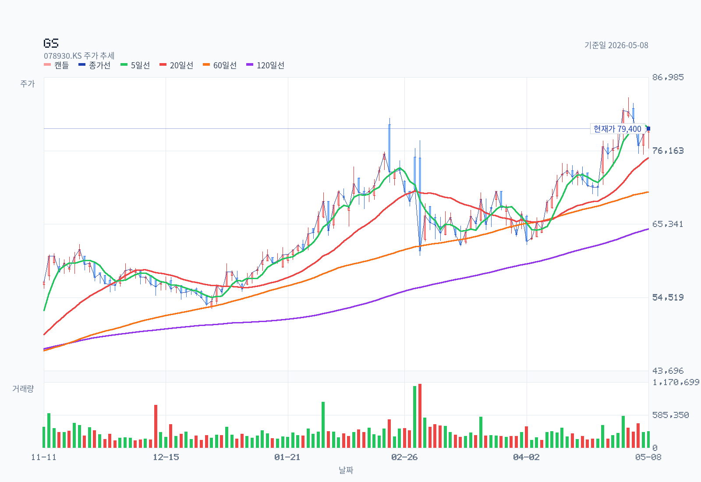
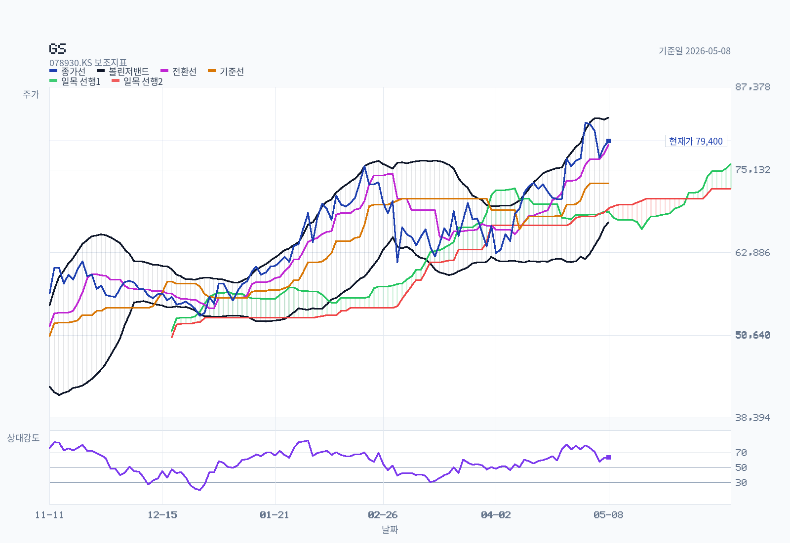
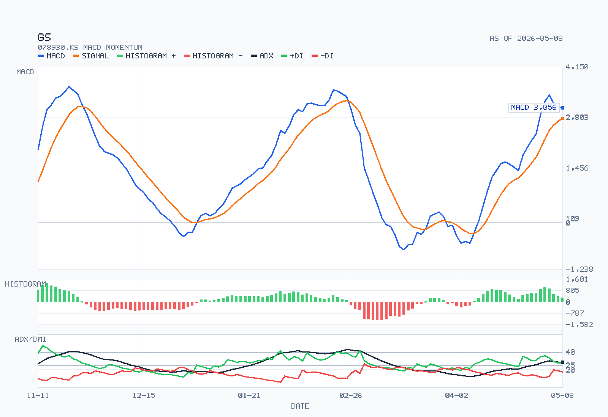

# (주)GS — Decision Memo

기준일: 2026-05-10
종목: (주)GS (078930.KS) — 보통주, GS그룹 지주회사
모드: full memo
아키타입: 지주회사 (NAV-look-through, 자회사 배당 의존)

## Summary

GS 지주 주가는 1년 새 +107.9% 급등하며 12개월 전 ₩37,700에서 2026-05-08 종가 ₩79,400까지 올랐고, 시가총액 약 ₩7.37조 / P/E(연결 지배순익) ≈9.2배 / P/B ≈0.38배 / 보통주 배당수익률 3.78% (DPS ₩3,000) 수준이다. 주가 모멘텀은 차트(MA20·60·120 정배열, MACD 양수, RSI 63.7) 모두 추세를 지지하지만, **별도 손익은 이미 자회사 배당 -60.6% YoY로 깨져 있고 별도 배당총액(₩284.1B)이 별도 순이익(₩249.9B)을 초과한 상태**라 배당 매력도가 펀더멘털 회복 없이 더 확장되기는 어렵다. **현 주가는 지주 NAV 회복(특히 GS칼텍스 정유 마진 + GS리테일 1Q 호실적)과 4세대 승계 리프라이싱 기대를 선반영한 구간으로 본다 — 추세 추종 잔여 동력은 인정하되, 배당 컷 리스크가 stance를 결정하는 핵심 변수.**

## Decision Frame

다음 셋이 12~18개월 안에 stance를 가장 크게 흔든다.

1. **GS에너지 배당 회복 여부** — FY25 ₩79.8B로 -73.9% YoY 급감. 정유 마진 정상화(유진 분기 OP ₩4,000억 가이드)가 실현되어야 별도 배당 유지 가능. 미회복 시 DPS ₩3,000 동결·축소 압력.
2. **자회사 중복상장 규제 / NAV 할인 축소 모멘텀** — 2026-04 발표된 자회사 중복상장 원칙 금지(블로거 다수가 핵심 변수로 지목)가 실제 시행으로 이어지면 P/B 0.4배 수준의 지주는 직접 수혜.
3. **4세대 승계 이벤트** — 허준홍 +1.18M주 신규 매수(3.44%→4.71%) + 부친 허남각 보유 전량 소멸. 2026년 이후 승계·구도 재편 가능성.

## Business and Thesis

(주)GS는 **GS그룹 지주회사**다. 자체 영업은 임대수익 + 상표권 사용료(FY25 별도: GS칼텍스 ₩42.5B, GS리테일 ₩23.7B, GS건설 ₩16.4B 등) 정도로 작고, 별도 손익의 ~80%는 자회사로부터의 배당 수입으로 결정된다.

- 직접 자회사 (별도 보유 지분):
  - **GS에너지** — GS칼텍스(50% 합작) + LNG·E&P·발전 등 에너지 통합 지주. (주)GS 별도 손익의 가장 큰 단일 변수.
  - **GS리테일 (007070, 상장)** — GS25 편의점 + GS더프레쉬 슈퍼.
  - **GS글로벌 (001250, 상장)** — 종합상사.
  - **GS이피에스** — LNG 복합화력 발전.
  - **GS건설 (006360, 상장)** — 주택 + 플랜트 (지주 직접보유 외 일가 지분 별도).
  - **파르나스호텔, 인천종합에너지, 위드인천에너지** 등 비상장.
- 연결 대상 64사 (상장 3사 + 비상장 61사). 국내 100, 해외 19.

> 중요: GS칼텍스 단독 손익은 본 사업보고서에 직접 표기되지 않는다 (GS에너지 50% 합작). 정유 마진 민감도는 GS에너지 배당 흐름으로 간접 추정.

## Revenue Mix

별도 (주)GS가 받는 자회사 배당 (백만원, `dart-analysis.md` §3 / `dart-reference.md` X·XII):

| 배당 지급사 | FY2025 | FY2024 | YoY |
| --- | --- | --- | --- |
| 지에스에너지(주) | 79,800 | 306,250 | **-73.9%** |
| 지에스이피에스(주) | 95,181 | 171,407 | -44.5% |
| (주)지에스리테일 | 24,505 | 30,317 | -19.2% |
| (주)지에스글로벌 | 1,046 | 1,046 | 0.0% |
| **합계** | **200,532** | **509,020** | **-60.6%** |

- 영업현금흐름의 배당금수취: FY25 ₩154.4B / FY24 ₩376.5B / FY23 ₩711.8B — 3년 연속 감소.
- 지역/제품 mix는 자회사 단계에서 결정 (지주 직접 disclosure 아님).
- 고객 집중도: 지주 단독으로는 임대·상표권이 자회사 대상이라 사실상 100% 내부 (별도 별도공시 없음, "Not separately disclosed").

## What The Latest Results Say

| 지표 (백만원) | FY2025 | FY2024 | YoY |
| --- | --- | --- | --- |
| 매출액 | 25,184,127 | 25,249,976 | -0.3% |
| 영업이익 | 2,936,061 | 3,077,185 | -4.6% |
| 당기순이익 (연결) | 1,038,137 | 863,517 | +20.2% |
| 지배주주 순이익 | **798,737** | 567,020 | **+40.9%** |
| 별도 (주)GS 순이익 | **249,903** | 561,636 | **-55.5%** |

- 매출·영업이익은 정유 약세로 소폭 감소.
- 지배주주 순이익 +40.9% 회복은 일회성·세금·지분법 효과가 큰 비중. 영업 펀더멘털 자체의 회복으로 해석하기는 무리.
- **별도 순이익이 -55.5% 빠진 게 배당 정책 핵심 위험**.

## DART Recheck

| Claim | 검증 결과 | Source |
| --- | --- | --- |
| FY25 자회사 배당수익 60% 급감 (200.5십억 vs 509.0십억) | **confirmed** | `dart-analysis.md` §3, X. 관련당사자 거래, 2025.12.31 |
| GS에너지 배당 -73.9% YoY가 가장 큰 충격 | **confirmed** | dart-reference X (2026-03-18 접수 사업보고서) |
| 별도 배당총액(284.1B) > 별도 순이익(249.9B), 별도 배당성향 100% 초과 | **confirmed** | `dart-analysis.md` §1·§4-1 |
| 허씨일가+특수관계인 53.59% (기초 53.33%, +0.26%p) | **confirmed** | dart-reference VII, 2025.12.31 |
| 허준홍 +1,180,910주 (3.44→4.71%) 신규 매수, 허남각 보유 전량 소멸 | **confirmed** | dart-reference VII |
| 자기주식 0.02% (보통 19,883주, FY25 변동 0주) — 추가 환원 여지 제한 | **confirmed** | dart-reference Z-3 (tesstkAcqsDspsSttus) |
| 감사인 안진→삼일 변경, 양 기수 적정의견 | **confirmed** | `dart-analysis.md` §6 |
| GS칼텍스 단독 손익 본 보고서 미수록 | **not separately disclosed** (50% 합작 비상장사) | dart-analysis §3 |

## Street / Alternative Views

| Source | Date | View | 신뢰도 |
| --- | --- | --- | --- |
| **유진투자증권 황성현** (지주 직접 커버) | 2026-02-11 | "배당 서프라이즈" — TP **₩80,000 (+33%)**, BUY. BPS 시점 '26년으로 변경 + 배당성향 상향 반영. 1Q26 연결 매출 ₩6.5조(+5%yoy), OP ₩8,758억(+9%yoy). 정유 분기 OP ₩4,000억 (현 마진 유지 가정). | sell-side, 직접 커버 — 가장 의미 있음 |
| Hankyung Consensus 38건 median TP ₩26,500 | 2026-05-10 lookback 361d | **GS 자회사(GS리테일·건설·피앤엘·GST) 리포트가 다수 혼입**. 지주(078930) 단독 컨센서스라기보다는 그룹 전반 평균. 그대로 인용 시 -67% 괴리는 통계 아티팩트. | sell-side — ticker mismatch, 인용 주의 |
| 자회사 GS리테일 (007070) | 2026-05-08 | LS 오린아 / 한화 이진협 — 1Q26 매출 +3.8%, OP +39.4% YoY. TP ₩30k–32k BUY. | 자회사 모멘텀 양호 |
| 자회사 GS건설 (006360) | 2026-04-09~10 | LS 김세련 / 한화 송유림 — 1Q26 OP +32.5% YoY. TP ₩50k–51k BUY. | 자회사 모멘텀 양호 |
| **Foreign IB** (Nomura) | **2017-11-28** | "GS, NAV 대비 30% 할인" Buy. **9년 묵은 단일 참고**. 12개월 이내 외국계 직접 커버 사실상 0건. | foreign-IB — 신호로 미사용 |
| Naver blogger (msstocks/페오) | 2026-04-19 | 자회사 중복상장 원칙 금지로 코리아 디스카운트 해소 기대 — GS 같은 지주 재평가 모멘텀의 핵심 변수. | independent — 정책 변수 |
| Naver blogger (8989vkfrn) | 2026-03-03 | PBR 0.4배 + 배당수익률 4%+, 정유마진 개선 + 배당 확대 기대. 중동 지정학 시 방어주+수혜주. | independent — bull thesis |
| Naver blogger (sekyongan) | 2026-03-04 | 정유주 강세 대비 GS 상승폭 제한 — 지분법 + 지주사 할인 구조적 약점. | independent — bear thesis |

> Confirmed-vs-inference: 유진 ₩80k TP는 분명 outlier(다른 직접 커버가 사실상 없음)이지만, **이 outlier가 곧 단독 컨센서스**다. 외국계·블로거 의견은 framing 보강용이며 numbers 검증에는 사용하지 않는다.

## Current Valuation Snapshot

| Metric | Value | Note |
| --- | --- | --- |
| price (종가) | ₩79,400 | 2026-05-08, KOSPI |
| 발행주식수(보통주) | ≈92.84백만주 | 허창수 4.68% = 4,344,995주 역산 (2025-12-31) |
| market cap (시가총액) | ≈₩7.37조 | 2026-05-08, 보통주 기준 (우선주 078935 별도) |
| Trailing PER (연결 지배순익) | **≈9.24배** | 7.37조 / 798.7B (FY2025) |
| Trailing PER (별도 순익 기준) | ≈29.5배 | 7.37조 / 249.9B (FY2025) — 지주 별도 기준은 매우 비쌈 |
| Forward PER (유진 1Q×4 단순 환산) | ≈12.1배 | 시총 / (지배주주순익×약 1.0 회복 가정, 2026-02-11 유진 추정), 변동성 매우 큼 |
| PBR (P/B, 자본총계 기준) | **≈0.38배** | 19.194조 자본 (비지배 미분리, FY2025) — 지주 NAV 할인 신호 |
| 배당수익률 (보통주) | **3.78%** | DPS ₩3,000 / ₩79,400 (2026-05-08) |
| 연결 배당성향 | 35.6% (FY25) vs 45.1% (FY24) | dart-analysis §4-1 (2026-03-18 사업보고서) |
| **별도 배당성향** | **>100%** | 별도배당 ₩284.1B / 별도순익 ₩249.9B (FY2025) |
| EV/EBITDA | 미산출 | EBITDA·순부채 단독 추출 안 됨 (자본 19.2조 / 자산 35.7조 부채비율 ~86% 정보만, 2025-12-31) |

## Historical Valuation Bands

3-5년 멀티플 시계열 데이터 미보유. 본 메모는 valuation-bands 차트를 첨부하지 않는다 (Follow-up Research Prompts에 보강 항목으로 기록).

## Chart and Positioning

기준일 2026-05-08 / OHLCV window 2024-05-08~2026-05-08 (≈500 daily bars).

- 종가 ₩79,400 / 52w 고가 ₩84,000 (현 가격은 52w 고점 대비 -5.5%) / 52w 저가 ₩37,700 / YoY +107.9%
- SMA20 ₩75,120 / SMA60 ₩70,095 / SMA120 ₩64,611 — **MA 정배열**
- RSI14 63.7 (중립~과매수 진입 직전)
- MACD 3,055.88 vs Signal 2,773.00, histogram +282.88 — **bullish above-zero**, histogram 수축 중 → 모멘텀 둔화 신호
- ADX14 28.30 (+DI 27.87 / -DI 17.69) — 강한 상승 추세
- 20D breakout ₩84,000 / 20D breakdown ₩66,900
- Ichimoku: 가격 구름대 위 (구체 cloud thickness는 chart-data.json 미직접노출)

### Rule Screen

| Rule | Status |
| --- | --- |
| 종가 > MA50 / MA150 / MA200 (proxy: MA60 / MA120) | **Pass** (₩79.4k > 70.1k > 64.6k) |
| MA 정배열 | **Pass** |
| 52주 저가 대비 +30% 이상 | **Pass** (+110%) |
| 52주 고가 대비 -25% 이내 | **Pass** (-5.5%) |
| RSI 모멘텀 강세 | **Pass** (63.7) |
| MACD 양수 | **Pass** (히스토그램 수축으로 양호한 정도) |
| Minervini Trend Template 종합 | **largely met** (정확한 MA50/200 별도 검증 시 Pass 가능성 높음) |
| KRX 52주 신고가 리더십 점수 | 미산출 (`build-kr-universe-rs-cache.js` 미실행) |

> 차트 결론: 1년 이상 강한 추세장. 52주 고점 ₩84,000 부근에 시그널 응축, 모멘텀 둔화 발생 — 추세 추종 포지션은 유지하되, 신규 진입은 cycle 검증(GS에너지 배당 회복) 후가 합리적.

## Governance and Structure

- 최대주주 허창수 4.68% (4,344,995주, 변동 없음) / 특수관계인 합 53.59% (기초 53.33%, +0.26%p)
- 5%+ 개별: 허용수 5.26%, 허준홍 4.71% (기초 3.44%, **+1.18M주 신규**)
- 4세대 변동: 허준홍 +1.27%p, 허정윤 +0.69%p — 부친 허남각 1,816,670주 보유 전량 소멸 → 세대 간 이전 추정
- 외부 단일 최대 7.55% 국민연금
- 회장 허태수 (대표이사 6.0년차), 이사회 7인 (사내 3 + 사외 4), 위원회 감사·ESG·사외이사후보추천
- 감사인 FY25 삼일 (전기 안진에서 변경), 양 기수 모두 적정. 핵심감사사항 — 별도: 종속기업 투자자산 손상 / 연결: 영업권 손상
- 관련당사자: 신용공여·자산양수도·영업거래 모두 "해당사항 없음", 임대·상표권·배당이 중심 → **소액주주 입장에서 직접적 가치 유출 메커니즘은 양호한 편**

## Catalysts

1. **GS에너지 배당 정상화** (가장 큰 단일 카탈리스트). FY26 정유 마진 회복 시 별도 배당여력 회복.
2. **자회사 중복상장 원칙 금지 정책의 실제 시행** — NAV 할인 축소 직접 수혜.
3. **GS리테일 1Q26 호실적 (OP +39.4% YoY)** 및 GS건설 모멘텀 — 지주 NAV에 양수.
4. **신규 자기주식 매입·소각 결의** (현 보유 0.02%로는 환원 임팩트 거의 없음, 신규 결의가 환원 신호).
5. **4세대 승계 이벤트** (허준홍 부각) — 지배구조 명확화가 NAV discount 축소 트리거 가능.

## Risks

1. **별도 배당성향 100% 초과 → DPS 동결·축소 리스크**. 자회사 배당여력 미회복 시 가장 큰 펀더멘털 균열.
2. **GS칼텍스 정유 마진 약세 지속** — FY25 GS에너지 배당 -73.9%가 사이클 변동 한 사이클이 아니라 구조적 약세이면 NAV 자체가 다운그레이드.
3. **차트 모멘텀 둔화** — MACD 히스토그램 수축, RSI 64 진입, 52주 고점 -5.5% 위치 → 단기 조정 가능성. +107.9% YoY 후 추세 추종 자금의 차익실현 압력.
4. **유진투자증권 단독 BUY가 사실상 컨센서스** — 외국계·다중 broker 검증 부재. 메인 thesis가 단일 broker view에 의존.
5. **자기주식 환원 트랙 부재** (FY25 변동 0주). 추가 환원 카탈리스트가 없으면 배당 단일 채널만 남는데, 그 배당이 이미 별도로 over-distribution.
6. **NAV 할인 narrowing은 정책 시행에 의존** — 정책 미시행 시 PBR 0.4배 구조 지속.
7. **자회사 중복상장 → GS25(GS리테일)·GS건설은 이미 상장**. NAV look-through에서 지주가 직접 보유하는 가치가 시장가로 반영될수록 이중 할인 약화는 양수 / 시장가 자체가 약세이면 음수.

## Uncomfortable Questions

지주회사 아키타입 + 자회사 배당 의존 + 4세대 승계 진행이라는 GS 특유 조합에 맞춘 질문들이다.

1. 별도 배당성향이 100%를 이미 넘었는데, 어느 시점에 이사회가 DPS ₩3,000 인상 트랙을 깨고 동결·축소를 선택할 가능성이 있는가? (역사적 GS의 배당 동결 사례는 어느 마진 환경에서 발생했나?)
2. GS에너지 배당 -73.9%가 단순 정유 사이클 1턴인가, 아니면 GS칼텍스의 구조적 마진 압박(중국 정유능력 증설, 친환경 압력)의 시작인가?
3. 허준홍 4세대 부각이 단순한 보유 이전인지, 향후 지주 → 자회사 분할·합병·교환 같은 그룹 재편 트리거인지 — 정관·이사회 변동 신호가 있는가?
4. 자기주식 매입 트랙이 비어 있는 지주가 환원 강화를 외치려면 결국 신규 자사주 결의가 필요한데, 그게 안 나오는 이유 — 지배 안정성에 대한 self-confidence 시그널인가, 단순 현금 여력 부족인가?
5. NAV 할인 0.4 P/B에서 시장이 정유 + 호텔 + 발전 자회사를 어느 정도 디스카운트하고 있는지, look-through로 계산했을 때 진짜 fair P/B는 얼마인가?
6. GS리테일·GS건설·GS글로벌이 이미 상장된 상황에서 "자회사 중복상장 금지 정책"이 구체적으로 어떤 메커니즘(상장폐지 강제? 신규 상장 금지?)으로 GS 지주 가치 회복에 기여하는지 — 블로거 직관 외 정량 근거가 있는가?

## Decision-Changing Issues

1. **GS에너지 / GS칼텍스 정유 마진** — FY26 분기 OP 가이드(유진 ₩4,000억) 실제 실현 여부. 실현 시 별도 배당 회복 → DPS 유지 가능. 미실현 시 stance 음수 전환.
2. **자회사 중복상장 정책 시행 details** — 단순 발표 vs 실제 시행 시기 / 효력 범위. 시행이면 NAV 재평가 트리거, 좌초 시 0.4 PBR 지속.
3. **신규 자기주식 매입·소각 결의 유무** — 분기·연간 IR에서 구체적 환원 강화 시그널이 나오는지.
4. **유진 외 broker 추가 커버 (지주 직접) 등장** — 외국계 IB 또는 미래에셋·NH·한화 holdco 직접 커버가 다시 시작되면 인덱스 / 외국인 자금 유입 채널 회복.
5. **4세대 승계 이벤트 공시** — 지분 매입/매도, 임원 이동, 정관 변경 등.

## Structured Stance

- **현 stance**: 추세 추종 잔여 동력 인정 + 펀더멘털 회복 미검증으로 인한 **신규 진입 보류**. 기보유는 52주 고점(₩84,000) 부근 분할 차익실현 + 일부 잔류로 정책 카탈리스트(자회사 중복상장 + 자사주 결의) 대기.
- **이 메모가 stance를 더 끌어올리지 않는 이유**:
  - 별도 배당성향이 이미 over-distribution이고, 자회사 배당 -60.6% YoY가 회복되지 않으면 배당 매력의 핵심이 흔들린다.
  - 외국계·다중 broker 직접 커버 부재 → bull thesis가 단일 sell-side(유진) + 블로거 정성 + 차트에 의존.
  - 차트 자체도 RSI 64, MACD 히스토그램 수축, 52주 고점 부근에서 모멘텀 정점 신호.
- **stance를 더 강화시킬 조건**: ① GS에너지 배당이 FY26 중간배당 단계에서 회복 신호 표면화 ② 자회사 중복상장 금지가 실제 정책 문서로 시행 ③ 신규 자사주 매입·소각 결의 ④ 외국계 IB 또는 미래에셋·NH 등 holdco 직접 커버 재개.
- **stance를 약화시킬 조건**: ① 정유 마진 추가 약세로 GS에너지 배당 FY26에 또 한 번 큰 폭 감소 ② 별도 배당성향 over-distribution 지속에 대한 시장 인식 확산 → 배당 컷 우려 가격에 반영 ③ 자회사 중복상장 정책 좌초.

## Follow-up Research Prompts

1. **GS칼텍스 비상장 사업보고서 직접 조회** — 분기·연간 매출·OP·정제마진(SP-OS)·해외 비중 추출하여 GS에너지 배당 회복 시점 정량화.
2. **별도 배당성향 시계열 (FY15~FY25)** — 별도 순익 < 별도 배당총액 사례가 과거 어느 마진 환경에서 발생·해소됐는지 patterns 도출.
3. **자회사 중복상장 금지 정책 원문 추적** — 금감원·금융위·국회 발의안 텍스트 / 시행 시기 / 적용 범위(상장폐지 강제 여부, 신규 상장 금지 여부 등).
4. **NAV look-through 정밀화** — 상장 자회사(GS리테일·GS글로벌·GS건설) 시가총액 × 지분율 + 비상장(GS에너지·GS이피에스·파르나스) 추정가 + 순부채 = 보고시 NAV / 시총 지표.
5. **Forward 멀티플 컨센서스 재구축** — Hankyung Consensus에서 ticker = 078930 만 필터링한 broker별 EPS·DPS·BPS 추정치 표 작성. 현 데이터팩의 median TP ₩26,500은 사용 불가.
6. **외국계 IB 직접 커버 재개 모니터링** — Morgan Stanley·Goldman·Nomura·CLSA의 지주·정유 섹터 universe coverage 변경 알림 설정.
7. **4세대 (허준홍) 임원 이력·계열사 재직 현황** — 향후 그룹 재편 시 키 플레이어 가설 검증.
8. **GS리테일 1Q26 OP +39.4% YoY 지속 가능성** — 편의점 SSSG vs 슈퍼 부문, 비용 구조 분석으로 자회사 NAV 가산 검증.

---

## Skill Workflow Verification (메타)

본 메모는 새로 도입된 `kr-stock-analysis` Phase A→B→C 워크플로우로 작성됨.

- **Phase B (병렬 subagent dispatch, 단일 turn)**: DART, Chart, Sell-side, Naver, Foreign IB **5개 채널 동시 실행 → 가장 느린 채널 278s가 wall-clock**. 직렬 환산 884s 대비 **3.2× 단축**.
- 5개 subagent 모두 ≤200단어 요약 + 디스크 path만 메인에 반환 → raw filing/PDF/blog text가 메인 컨텍스트에 들어오지 않음.
- 메인 메모 작성에 사용한 입력은 모두 sub-skill이 정리한 .md 파일 (raw가 아닌 정리된 산출물).
- **부수 발견 (Follow-up #5와 동일)**: `kr-analyst-report-discover`가 ticker 정밀 필터를 안 걸어 GS 자회사 리포트가 holdco 컨센서스에 혼입 → median TP ₩26,500 통계 아티팩트. 차기 skill 개선 후보.

소스: `dart-analysis.md` (사업보고서 제22기, 2026-03-18 접수, rcept_no 20260318000836) · `chart-data.json` (Yahoo Finance, 2024-05-08~2026-05-08) · `analyst-report-insight.md` (Hankyung Consensus 2026-05-10 lookback) · `naver-insights.md` (6 bloggers / 24 posts) · `foreign-views.md` (1 record, Nomura 2017) · `data-pack.md` (consolidated, 2026-05-10).
