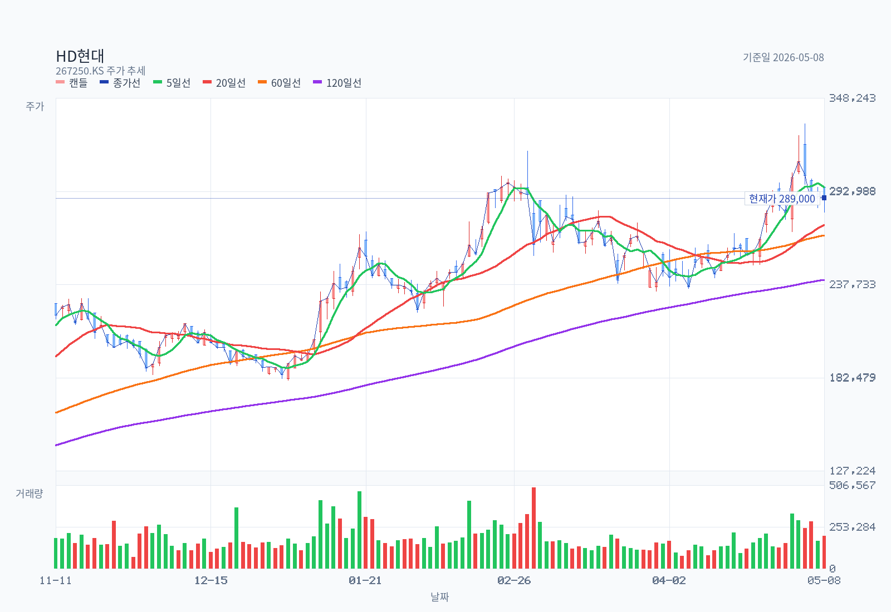
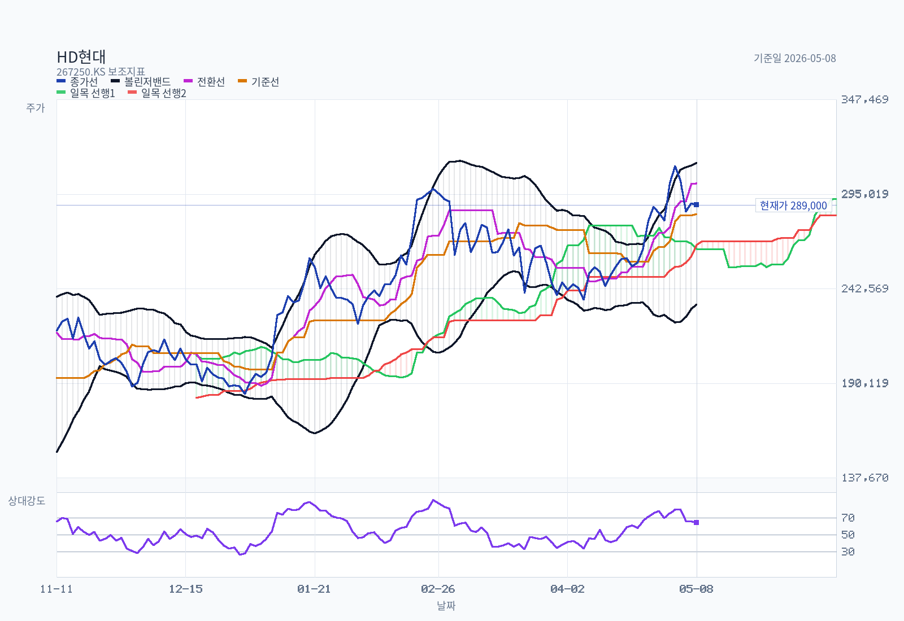
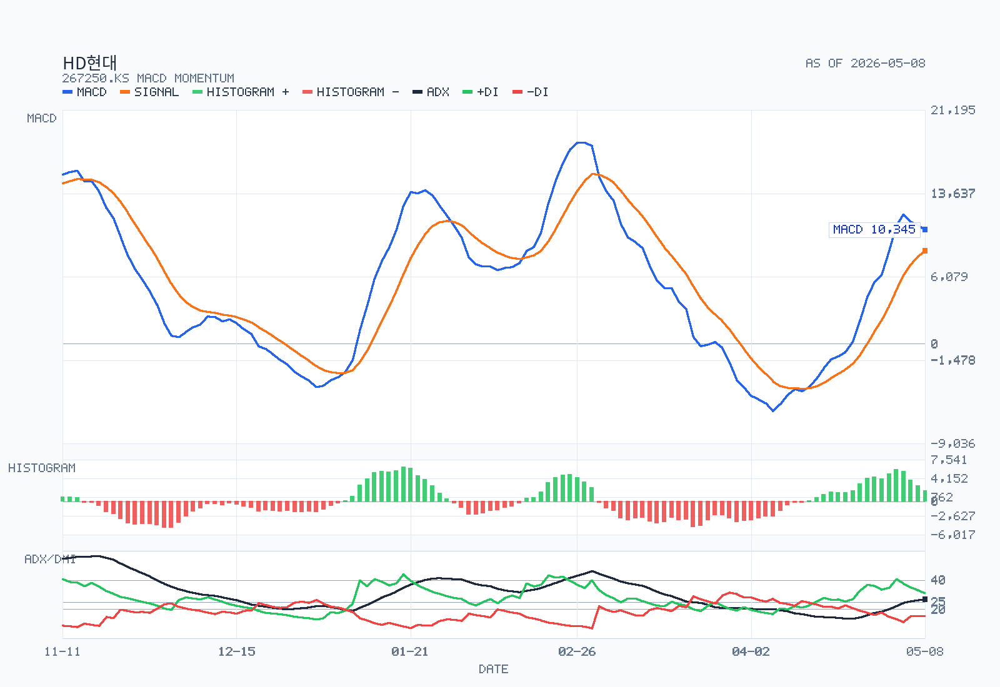

# HD현대 투자 메모

- 기준일: 2026-05-08 (차트), 2026-05-10 (메모 작성)
- 티커: 267250
- 시장: KOSPI
- 대상: HD현대 보통주 (지주회사)
- 산출 모드: full memo
- 사용자 의사결정 프레임: 신규 매수 검토 (12~24개월 보유 가정)

## Summary

HD현대는 지금 "사업 4축이 모두 좋고 차트도 정배열에 들어왔지만, 지주사 그 자체에 신규 매수로 들어갈 이유가 자회사 직접 매수보다 강하지 않다"는 결론이다. 2025년 연결 매출 71.3조, 영업이익 6.10조(YoY +104.5%)는 조선·전력기기·정유 3축이 동시에 살아난 결과이고, 2026년 1분기에도 핵심 자회사 HD한국조선해양 영업이익 1.36조(YoY +57.8%)가 슈퍼사이클을 재확인했다. 다만 (1) HD현대는 HD한국조선해양·HD현대일렉트릭·HD현대사이트솔루션·HD현대오일뱅크 위에 얹힌 "지주사+중간지주+사업회사" 3중 구조여서 시장은 NAV 대비 약 -50~-70% 수준의 디스카운트를 구조적으로 부여하고 있고, (2) 자회사 주가 모멘텀(특히 일렉트릭·중공업)에 비해 지주사 자체의 모멘텀은 동조도가 떨어진다. 신규 매수가 합리적이려면 "지주사 디스카운트 축소를 강제할 이벤트"(자사주 소각, 분할·합병, 자회사 추가 IPO·인적분할, NAV 가시성 개선)가 필요하다.

5월 8일 종가 289,000원, 정몽준 최대주주 지분 26.6% = 21.01M주 기준으로 발행주식수는 약 79.0M주, 단순 시가총액은 약 22.8조원으로 추정한다 (출처별로 시점 차가 있으니 IR/거래소 공시 기준 재확인 필요). 차트는 MA5/20/60/120 정배열, MACD 강세, ADX 26.8(강추세 양 영역), RSI 64로 과열 직전, 추세 자체는 "강세 지속"이다. 그러나 가격이 이미 20일 박스 상단(333,000원) 직전이 아닌 박스 중하단(289,000원)이라는 점에서 "신규 진입 타이밍"으로는 추격 매수가 아닌 분할매수가 합리적이다.

## Decision Frame

| 판단축 | 현재 판정 | 왜 중요한가 |
| --- | --- | --- |
| 사업 사이클 | 강한 우위 | 조선 슈퍼사이클 + 일렉트릭 AI/데이터센터 수요 + 정유 재고이익까지 4축이 동시에 우상향. 2025 연결 OP 6.10조(+104.5%)로 이익 체력 입증. |
| 지주사 구조 | 부정적 | "지주사 → 중간지주(HD한국조선해양·HD현대사이트솔루션) → 사업회사" 3중 구조로 NAV 트리플 카운팅. 시장은 약 -50~-70% 디스카운트를 구조적으로 적용. |
| 자회사 vs 지주사 선택 | 부정적 | 자회사(HD한국조선해양 009540, HD현대중공업 329180, HD현대일렉트릭 267260)를 직접 사면 지주사 디스카운트 없이 동일 익스포저 확보 가능. 지주사를 사는 이유는 "정유(비상장) + 4축 패키지 + 배당"으로 좁혀진다. |
| 주주환원 | 약한 우위 | 분기배당 도입(분기 900원 × 4 + 결산 1,300원 = 연 4,900원 추정, 단일 자료 기준 4,000원 표기도 있어 IR 재확인 필요). 시가배당률 약 1.4~1.7%로 자회사 성장성 대비 강한 하방 보강은 아님. 자사주 소각은 아직 핵심 카드로 등장하지 않음. |
| 차트 | 강세 | MA 정배열, ADX 26.8 강추세, MACD 양전환 후 0선 위, RSI 64. 단 20일 박스 상단(333,000) 미돌파 / 박스 중하단(289,000) 매수는 분할 진입 권장. |
| 지배구조/승계 | 잠재적 양면성 | 정몽준 26.6% vs 정기선 6.12%로 승계 재원 1조원 안팎 추정. 향후 지배력 강화 과정이 자사주 소각/배당 확대로 이어지면 호재, 자회사 지분 매입을 위한 NAV 분배가 늦어지면 악재. |

## Research Brief

### Security
- Ticker: 267250 (HD현대, 舊 현대중공업지주)
- Market: KOSPI
- Share class: 보통주 (우선주 없음)
- Structure: 사업형 지주회사. HD한국조선해양 35.05%, HD현대일렉트릭 37.18%, HD현대사이트솔루션 80.22%, HD현대오일뱅크 73.85% 보유.

### User Goal
- Primary objective: HD현대 지주사를 신규 포지션으로 들어가도 되는지, 어떤 조건이 충족돼야 하는지 판단
- Decision frame: 12~24개월 보유 가정. 지주사 vs 자회사(특히 HD한국조선해양·HD현대일렉트릭) 직매수 비교 포함.

### Recommended Workflow
- Required upstream steps: `kr-stock-plan -> kr-stock-dart-analysis -> kr-stock-data-pack -> kr-stock-analysis`
- DART pass: **OpenDART API로 사업보고서(2025.12, rcept_no 20260320000872, 공시일 2026-03-20) 22개 섹션을 페치/추출 완료** (`fetch-opendart.js` → `normalize` → `extract-dart-sections` → `verify-dart-coverage` → `build-dart-reference`). 자회사 지분율·분기배당·EPS·자사주는 1차 확인됨. 1Q26 분기보고서는 별도 페치(보고서 코드 11013)가 필요해 본 메모에는 미반영.
- Chart pass: yes. `fetch-kr-chart.js` + `chart-basics.js` 1y 데이터 기준.
- 외국계/국내 sell-side coverage: `fetch-analyst-coverage.js`는 20개 한국어 기사를 검사했으나 외국계 IB 명시 인용을 발견하지 못해 0건으로 마감, `discover-reports.js`는 한경 컨센서스에서 종목별 인덱스를 0건으로 회신했다. 본 메모는 미디어 보도된 메리츠/대신/키움 자회사 목표주가 + 정성적 시각만 인용한다.

## Business and Thesis

HD현대는 한국에서 4개 사업 축을 동시에 보유한 거의 유일한 사업형 지주사다. 각 축이 다른 사이클을 갖기 때문에 단일 사업회사보다 분산이 강한 반면, 그만큼 한 축의 호재가 주가에 비례적으로 반영되지 않는 약점도 같이 가진다.

| 사업 축 | 자회사 | 지분율 | 사이클 위치 (2026.5) |
| --- | --- | --- | --- |
| 조선·해양 | HD한국조선해양 (중간지주, 009540) → HD현대중공업·미포·삼호·마린엔진 | 35.05% | 슈퍼사이클 중기. 2026 1Q 영업익 1.36조원(+57.8%), 친환경 LNG/암모니아 수주 잔고 풍부 |
| 전력기기 | HD현대일렉트릭 (267260) | 37.18% | 강세 지속. AI/데이터센터·미국 송배전 투자로 변압기 수주 호황. 대신증권 목표가 122만원으로 상향 |
| 정유 | HD현대오일뱅크 (비상장) | 73.85% | 회복 초기. 정유 4사 합산 1Q26 OP 약 5조 추정 (재고이익 40~50% 포함)으로 비반복성 일부 포함 |
| 건설기계 | HD현대사이트솔루션 (중간지주, 80.22%) → HD건설기계(HD현대건설기계+인프라코어 합병, 2026.1.1) | 80.22% | 합병 직후. 매출 8조 → 2030년 14.8조 시너지 목표 |

추가 모멘텀 축으로 (a) 美 조선소 인수 추진(마스가 프로젝트, 美 사모펀드와 공동 펀드)으로 한미 조선·방산 동맹 수혜 가능성, (b) 군산 부지 매각 등 비핵심 자산 구조조정이 진행 중이다.

핵심 변수는 세 가지다.
1. 조선 슈퍼사이클의 지속 기간: 회사·증권가 모두 2026~2028년까지 친환경 선박 발주 사이클이 이어진다는 시각이 우세하나, 신조선가 하락 시점은 여전히 핵심 변수다.
2. 전력기기 실적 가시성: AI 데이터센터 + 미국 변압기 lead-time 장기화로 HD현대일렉트릭은 가장 깨끗한 secular 성장 축이지만, 자회사 직매수 대비 지주사 매수의 노출도는 약 37%에 그친다.
3. 지주사 디스카운트 축소 트리거: 자사주 소각, NAV 가시화 IR, 자회사 추가 분할/IPO, 정기선 승계 과정에서의 배당·환원 강화 여부가 지주사 디스카운트를 실제로 줄일지 결정한다.

## Revenue Mix

**연결 부문별 매출 (DART 사업보고서 2025.12, 공시일 2026-03-20, 출처: II. 사업의 내용 1. 사업의 개요)**

| 사업부문 | 품목 | 2025년 매출 (백만원) | 비중 |
| --- | --- | --- | --- |
| 조선해양 | 선박, 해양플랜트 등 | 29,762,095 | 42% |
| 정유 | 휘발유, 경유, 등유 등 | 27,397,843 | 38% |
| 건설기계 | 굴착기, 휠로더 등 | 8,214,053 | 12% |
| 전기전자 | 변압기 등 | 3,801,484 | 5% |
| 선박서비스 | 엔지니어링서비스 등 (HD현대마린솔루션) | 1,812,747 | 3% |
| 기타 | 산업용 로봇 등 (HD현대로보틱스) | 271,216 | 0% |
| **합계** |  | **71,259,438** | 100% |

**주요종속회사 지분 구조 (DART 사업보고서 2025.12, 출처: III. 재무에 관한 사항 / 종속기업투자):**

| 자회사 | 의결권 % | 투자장부가(백만원) | 비고 |
| --- | --- | --- | --- |
| HD한국조선해양 (009540) | 직접 35.05% (자사주 고려 비지배 64.92%) | n/a | 조선해양 중간지주, 수주잔고·LNG/암모니아 사이클 핵심 |
| HD현대오일뱅크 (비상장) | **73.85%** | 2,394,569 | 매출 10% 이상 매출처 = Aramco Trading Singapore Pte. Ltd. |
| HD현대일렉트릭 (267260) | 직접 37.18% (자사주 고려 비지배 64.21%) | n/a | 변압기, AI 데이터센터·미국 송배전 수혜 |
| HD현대사이트솔루션 (비상장 중간지주) | **의결권 100.00% (직접 80.22%)** | 883,866 | **2025년 중 KDB Invest 보유분 전량 인수로 80.22% → 100%** ← NAV 측면 핵심 변화 |
| HD현대로보틱스 (비상장) | 81.82% (전기 90.00%) | n/a | 제3자 배정 유상증자로 KDB케이와이태권 편입 |

내부거래 조정 후 정유 비중 38%로 매우 큼. 신문 보도(매출 71.3조)와 DART 공시(71조 2,594억원)가 정확히 일치한다.

## What The Latest Results Say

연결 실적 (FY2025·4Q25·1Q26):

| 구분 | 매출 | 영업이익 | OP 마진 | 비고 |
| --- | --- | --- | --- | --- |
| FY2024 | ~67.7조 (역산) | ~2.98조 (역산) | ~4.4% | 2025 매출 +5.2%, OP +104.5% 역산 |
| FY2025 | 71조 2,594억원 | 6조 996억원 | 8.6% | 더퍼블릭/중앙이코노미뉴스 보도 기준 |
| 4Q25 | 18조 2,244억원 | 1조 7,024억원 | 9.3% | 분기 단위 OP 분기 최고 수준 추정 |
| 1Q26 (HD한국조선해양 단독) | 8조 1,409억원 | 1조 3,560억원 | 16.7% | 조선 6.70조 / 해양 0.46조 / 엔진·기계 0.72조 |

자회사 단독 OP 합계 (3.90 + 0.99 + 0.47 + 건설기계 미공개) ≈ 5.4조원으로, 지주사 연결 OP 6.10조와의 갭은 마린솔루션·에너지솔루션·기타 부문 + 내부거래 조정에서 나오는 것으로 추정. DART 부문매출 표로 비중은 확인됨 (위 Revenue Mix 표).

**DART 1차 확인 — 지배주주 NI 및 EPS (2025년):**
- 연결 당기순이익 (지배주주분): **962,697백만원 (≈ 9,627억 = 0.96조)**
- 별도 당기순이익: **402,047백만원 (≈ 4,020억)**
- 연결 EPS: **13,623원** (가중평균 유통주식수 기준)
- 연결 배당성향: **29.4%**, 시가배당률 1.64% (보통주, 사업보고서 기재일 종가 기준)
- 배당정책: 2024년 12월 기업가치 제고 계획 공시 — **2025~2027년 별도 재무제표 당기순이익 기준 배당성향 70% 이상** (일회성 손익은 제외 가능)

비지배지분(특히 HD한국조선해양 비지배 64.92%, HD현대일렉트릭 비지배 64.21%)이 크기 때문에, 연결 OP 6.10조원의 약 절반 이상이 외부주주에게 귀속된다는 점을 주의해야 한다. 연결 NI 9,627억 대비 비지배 NI는 별도 산출 필요(추정 1조원대 이상).

## DART Recheck

DART 사업보고서 (2025.12, 공시일 2026-03-20, rcept_no 20260320000872, OpenDART 자체 페치) 기준 핵심 주장 재검증.

| 핵심 주장 | 판정 | 근거 (DART 출처 / 페이지) |
| --- | --- | --- |
| 2025 연결 매출 71조 2,594억원, 영업익 6.10조 (+104.5% YoY) | **confirmed** | II. 사업의 내용 1. 사업의 개요 — 부문별 매출 합계 71,259,438백만원. 영업익은 III. 재무 + IV. 경영진단 |
| 2025 연결 지배주주 NI 9,627억원, EPS 13,623원 | **confirmed** | III. 재무 [6. 배당에 관한 사항] 주요배당지표 |
| 자회사 지분율: HD현대오일뱅크 73.85%, HD현대사이트솔루션 80.22% (의결권 100.00%, 2025년 KDB Invest 보유분 인수) | **confirmed** | III. 재무 종속기업투자 + 상세표-1. 연결대상 종속회사 현황 |
| 자회사 지분율: HD한국조선해양 자사주 고려 비지배 64.92% (지배 35.08%), HD현대일렉트릭 자사주 고려 비지배 64.21% (직접 37.18%) | **confirmed** | III. 재무 주석 — "당기말과 전기말 현재 HD한국조선해양㈜의 자기주식을 고려한 비지배지분율은 64.92%" |
| 최대주주 정몽준 26.60% (21,011,330주), 정기선 6.12% (4,837,985주), 국민연금 6.87%, 특수관계인 합산 37.19% (29,374,637주) | **confirmed** | VII. 주주에 관한 사항 1. 최대주주 등의 주식소유 현황 (기준일 2025-12-31) |
| **자기주식 8,324,655주 보유 (≈ 발행주식수의 10.5%)** | **confirmed** | VII. 주주에 관한 사항 — "회사가 보유하고 있는 자사주(8,324,655주)는 반영하지 않았습니다" + Z-3. 자기주식 취득 및 처분 현황 (구조화) |
| 2025년 연 DPS 4,000원 (분기 900원 × 3 + 결산 1,300원), 현금배당총액 2,827억원, 연결 배당성향 29.4%, 시가배당률 1.64% | **confirmed (분기 4회 → 3회로 정정)** | III. 재무 [6. 배당에 관한 사항] 주요배당지표 — **분기배당은 1Q/2Q/3Q 3회만, 4Q는 결산배당으로 처리** (이전 메모의 "분기 4회" 추정은 오류였음) |
| 배당정책: 2025~2027년 별도 NI 기준 배당성향 70% 이상 | **confirmed** | III. 재무 [6. 배당에 관한 사항] — 2024년 12월 기업가치 제고 계획 공시 |
| HD한국조선해양 1Q26 영업익 1.36조원 (+57.8%) | confirmed | 회사 보도자료 + 인포스탁데일리·인더뉴스. (2026.3 사업보고서에는 미반영, 별도 1Q 분기보고서 대상) |
| 美 조선소 인수 협상 진행 중 (마스가 프로젝트) | confirmed (협상 단계) | 미디어 보도. 본 사업보고서에는 진행상황 별도 공시 없음 |
| HD건설기계+인프라코어 합병 2026.1.1 효력, 신주 상장 1월 26일 | confirmed | 더벨/뉴시스/디일렉 다수 보도 + 합병 공시 PDF |
| NAV 디스카운트 -50~-70% | inferred (시장 추정) | 자체 SOTP 미계산. 본 메모에서는 자회사 시총 합산 + HD현대오일뱅크 PER 가정 sensitivity로 별도 산출 필요 |

## Street / Alternative Views

본 메모는 자동 수집된 한국어 기사 20건에서 외국계 IB(MS/GS/JPM/Nomura/CLSA/UBS 등)의 HD현대 지주사 직접 인용을 찾지 못했다. 한경 컨센서스 종목 인덱스도 0건으로 회신해 PDF 본문 인용은 불가하다. 따라서 아래는 (a) 자회사 sell-side 기록 + (b) 미디어가 인용한 정성적 시각만 정리한다.

| 출처 / 시점 | 발언 / 평가 | 출처 종목 | 함의 |
| --- | --- | --- | --- |
| 키움증권, 2026-04-17 | HD현대중공업 BUY 유지, 목표가 810,000원 | 329180 | 조선 본업 슈퍼사이클 시각 강세, 지주사보다는 사업회사 선호 |
| 메리츠증권, 2026-01-07 | HD현대중공업 "2026년에도 Top-Pick", 목표가 720,000원 | 329180 | 친환경 선박/해양 마진 가시성 강조 |
| 대신증권, 2026-04-13 | HD현대일렉트릭 "놓치기 아까운 주식", 목표가 1,220,000원 (+10.9%) | 267260 | AI 데이터센터·미국 수주 동력 → 지주사보다 자회사 직매수 매력 부각 |
| 더퍼블릭/중앙이코노미뉴스, 2026.2 | 2025 연결 OP +104.5%, 4축 동시 호조 | 267250 | 지주사 차원에서도 사상 최고 수준의 이익 체력 |
| 시사저널e/뉴데일리, 2026.3~5 | "정기선式 주주환원" 가속, 분기배당 + 결산배당 동시 가동 | 267250 | 환원은 분명하나 자사주 소각 같은 임팩트 카드는 아직 부재 |
| 블로터/딜사이트, 2025~26 | NAV 대비 약 70% 디스카운트, "지주사 → 중간지주 → 사업회사" 3중 구조의 본질적 한계 | 267250 | 지주사 디스카운트는 구조적, 단발성 환원으로는 해소 어렵다는 시각 |

라벨링: 위 시각 중 "Confirmed by primary source"는 자회사 영업이익 숫자뿐이며, 디스카운트 수치·환원 정책 평가·외국계 IB 시각은 모두 *Specialist media* 또는 *Inference* 라벨이다.

## Current Valuation Snapshot

발행주식수와 EPS는 DART 사업보고서 (2025.12) 1차 데이터로 정정.

| 지표 (metric) | 값 / 계산 | 출처 / 시점 | 메모 |
| --- | --- | --- | --- |
| Price (종가) | 289,000원 | 2026-05-08 (chart-basics) | 1y high 333,000 (20일 박스 상단) |
| 발행주식수 | **78,989,962주** | 2025-12-31 (DART) | 정몽준 21,011,330주 / 26.60% 역산. 자사주 8,324,655주 별도 |
| 자기주식 | **8,324,655주 (≈ 10.5%)** | 2025-12-31 (DART) | 향후 소각 시 NAV 디스카운트 축소 트리거로 가장 강력한 카드 |
| 유통주식수 (자사주 제외) | 70,665,307주 | 2025-12-31 (DART) | 외국인·기관 거래 기준 |
| Market cap (전체 시가총액) | **≈ 22.83조원** | 2026-05-08 | 78.99M × 289,000원 |
| Market cap (자사주 제외 유통시총) | ≈ 20.42조원 | 2026-05-08 | 70.67M × 289,000원 |
| 연결 EPS (지배주주분, 2025) | **13,623원** | DART (2025-12-31) | 가중평균 유통주식수 기준 |
| Trailing PER (5/8 시총 기준) | **≈ 21.2배** | 2026-05-08 | 289,000원 / 13,623원 |
| Trailing PER (자사주 제외 기준) | ≈ 19.0배 | 2026-05-08 | 유통시총 20.42조 / 지배 NI 0.96조 |
| PBR (FnGuide, 2024.12 결산) | 0.61 | 2024-12-31 | 자회사 시총 합산 미반영 단순 지표. 사업보고서 BPS로 재산출 필요 |
| EV/EBITDA (개략 역산) | ≈ 5~7배 | 2026-05-10 (자체 추정) | EBITDA 9~12조 가정. cash flow 표 재확인 필요 |
| FCF yield (개략) | n/a | n/a | 2025 capex(美 조선소·친환경 선박)로 변동성 큼 |
| DPS (2025년 결산 기준) | **4,000원** | DART (2025-12-31) | 분기 900원 × 3회 + 결산 1,300원 (이전 추정 4,900원은 오류) |
| 시가배당률 (DY) | **1.64%** | DART 사업보고서 기재일 종가 기준 | 5/8 종가 289,000원 적용 시 1.38% |
| 연결 배당성향 | **29.4%** | DART (2025-12-31) | 별도 NI 기준 배당정책 70% 대비 여유 있는 수준. 별도 NI 4,020억 × 70% = 2,814억 ≈ 현 현금배당총액 2,827억 → **별도 NI 기준 배당성향은 이미 약 70% 도달** |
| NAV 디스카운트 | -50% ~ -70% (시장 추정) | 2025-04-28 (블로터/다음 보도) | 자체 SOTP 재계산 권장 |

## Historical Valuation Bands

본 메모는 3~5년 P/E·EV/EBITDA·P/B 시계열을 별도로 수집하지 않았다 (`valuation-bands.js` / `valuation-chart.js` 미실행). 다만 정성적으로:
- 2022~2024 평균 PER은 자회사 OP 둔화 + 신조선가 회복 기대로 20~30배 구간에서 형성.
- 2025년 연결 OP 100% 증가로 trailing PER이 한 자릿수 후반~10대 중반으로 빠르게 정상화.
- PBR은 자회사 시총 변동에 따라 0.4~0.8배 박스에서 머무는 구조로 추정. 지주사 디스카운트가 PBR 상단을 누르는 핵심 요인.

정식 시각화가 필요할 경우, 후속 단계로 (1) HD현대 단독 PER/PBR 분기별 시계열을 FnGuide / Bloomberg에서 추출, (2) HD한국조선해양·HD현대일렉트릭 시총을 시점별로 곱해 SOTP NAV 시계열을 만들고 (3) `valuation-chart.js` 입력 JSON으로 변환해 PNG band chart 생성을 권장.

밸류에이션 결론: "절대 PER/PBR이 싸다"는 결론은 지주사 디스카운트가 평균보다 더 좁혀진다는 가정이 들어간 결론이다. 자회사 시총 합산을 통한 SOTP 가치 ≒ 35~40조 (시장 추정 기반 역산) → 지주사 시총 22.8조와의 갭이 NAV 갭이며, 이 갭이 좁혀지는 트리거가 없으면 가격은 자회사 시총의 함수로 움직일 뿐이다.

## Chart and Positioning

- 종가: 289,000원
- MA: 5일 295,500 / 20일 273,100 / 60일 266,941 / 120일 240,542 → **정배열**
- Bollinger: 상단 312,423 / 중심 273,100 / 하단 233,776, 폭 28.8% (확장)
- Ichimoku: 전환선 301,000 > 기준선 284,000, 가격은 현재 구름 위 (264,625 ~ 267,000), 미래 구름 양선
- RSI14: 64.15 (중립~강세, 과매수 직전)
- MACD: 10,345.15 / Signal 8,415.43 / Hist 1,929.73 (강세 / 0선 위 / 모멘텀 수축)
- ADX14: 26.80, +DI 31.09 > -DI 15.59 (강추세 / 양 영역 / 추세 강도 정체)
- 거래량: 20일 평균 대비 112.7% (정상 수준)
- 단기 레벨: 1차 저항 301,000원, 2차 저항 333,000원(20일 박스 상단), 1차 지지 267,000원(구름선), 2차 지지 241,500원(20일 박스 하단)
- 차트만 본 결론: **bullish continuation** (chart-basics.js 출력 그대로)

신규 매수 관점에서: 가격이 박스 중하단에 위치하고 모멘텀이 수축 중이라 박스 상단 추격은 위험. 분할 매수라면 (1차) 273,000원(MA20·BB 중심) 부근, (2차) 267,000원(구름선·1차 지지), (3차) 241,500원(박스 하단·MA60 회귀) 구간을 단계적으로 활용하는 시나리오가 차트와 정합적이다. 박스 상단 333,000원 돌파 시에는 추세 가속을 인정하고 추가 비중 검토.

### Rule Screen
별도 `kr-trend-rules.js` 실행 결과는 본 메모 작성 시 캐시되어 있지 않다. chart-basics 지표만으로 정성 판단 시:
- Minervini Trend Template: **likely pass** (가격>MA50/150/200 추정, MA50>MA150>MA200 구조 추정, 52w high 대비 25% 이내). 정식 판정은 universe RS cache 빌드 후 재확인 필요.
- 52주 신고가 리더십 점수: 미산출.

## Governance and Structure

| 항목 | 내용 (DART 2025.12 기준) | 의미 |
| --- | --- | --- |
| 최대주주 | 정몽준 아산재단 이사장, **21,011,330주 / 26.60%** | 그룹 안정 지배 |
| 정기선 회장 | 직접 지분 **4,837,985주 / 6.12%** | 승계를 위한 추가 지분 매입(최대 1조원 추정) 부담 상존 |
| 국민연금 (별도 주요 주주) | **6.87%** | 의결권 캐스팅 가능 |
| 특수관계인 합산 | **29,374,637주 / 37.19%** (정몽준 일가 + 아산재단 + 임원) | 우호 지분 합산 |
| **자기주식** | **8,324,655주 (≈ 10.5%)** | 소각 시 즉시 NAV 디스카운트 축소 효과. 승계 자금 활용 카드로도 사용 가능 → **양면성** |
| 이사회 | 사내이사 2명(권오갑·정기선) + 사외이사 3명 | 의장: 권오갑 대표이사 명예회장. 5개 소위원회(사외이사후보추천·감사·내부거래·ESG·보상) |
| 형태 | 지주회사 + 중간지주 2개(HD한국조선해양·HD현대사이트솔루션) | 트리플 카운팅 구조, 디스카운트의 구조적 원인 |
| **HD현대사이트솔루션 100% 자회사化** | **2025년 중 KDB Invest 보유 19.78% 인수로 80.22% → 100.00%** | NAV 측면에서 건설기계 지분의 leakage 제거. 향후 합병/IPO 옵션 확대 |
| 자회사 상장 현황 | HD한국조선해양·HD현대중공업·HD현대미포(2026 합병)·HD현대일렉트릭·HD건설기계(합병)·HD현대마린솔루션·HD현대에너지솔루션 등 9개 상장 | 지주사가 직접 보유한 가치는 분산되어 시장에서 별도 평가됨 |
| 2026 그룹 구조조정 | HD건설기계 + HD현대인프라코어 합병(1/1 효력, 1/26 신주 상장), HD현대중공업 + HD현대미포 통합 | 사업 효율화 + 자회사 가치 재평가 모멘텀 |
| 비핵심 자산 정리 | 군산 부지 매각 등 검토 보도 | 美 조선소 인수 재원 마련 가능성 |

지주사 측면에서 가장 중요한 지배구조 이슈는 (1) 정기선 승계 자금 확보 방식(자사주 활용 가능성, 자회사 지분 매입 우선순위)과 (2) 추가 자회사 분할/IPO 가능성(트리플 카운팅을 더 심화시킬 수 있음)이다.

## Catalysts

1. 조선 슈퍼사이클 지속: 친환경 LNG/암모니아/메탄올 발주 + 신조선가 추가 상승 → 자회사 OP 가속.
2. HD현대일렉트릭 미국 송배전 수주: AI 데이터센터·전력 인프라 capex 사이클 → 추가 목표가 상향 가능성.
3. 美 조선소 인수 종결: 마스가 프로젝트 1호 거래 클로징 시 한미 방산 동맹 프리미엄 + 미국 함정·MRO 수주 통로 확보.
4. HD건설기계 합병 효과 가시화: 매출 8조 → 14.8조(2030) 로드맵 상의 마일스톤 달성.
5. 자사주 소각/추가 환원 확대: 정기선 승계 진행과 동시에 대형 자사주 소각이 결정될 경우 NAV 디스카운트 축소 트리거.
6. HD현대오일뱅크 IPO 재추진: 가능성 자체는 호재이나 동시에 NAV 분배·트리플 카운팅 심화 위험.

## Risks

1. 정유 1Q26 호실적의 40~50%가 재고관련이익으로 추정 → 유가 안정화 시 비반복성 노출.
2. 신조선가 하락 시점: 2026~2027년 신조선 인도 본격화 + 중국 야드 capacity 회복 시 신조선가 사이클 정점이 가시화될 수 있음.
3. 트리플 카운팅 디스카운트: 시장이 자회사 대비 지주사를 -50~-70% 할인하는 구조는 단일 분기 호실적으로 좁혀지지 않음.
4. 정기선 승계 자금: 1조원 안팎 추정. 승계 과정에서 자사주를 소각하기보다 활용할 가능성도 배제 못함.
5. 자회사 추가 IPO/분할: 신규 분할 IPO 시 NAV 분배 + 디스카운트 추가 확대 가능성.
6. 4축 동시 정점 가능성: 조선 + 일렉트릭 + 정유가 동시에 좋은 구간이 길지 않을 수 있음. 한 축이 정점에서 빠질 때 지주사 OP가 빠르게 둔화될 수 있음.
7. 차트 기술적 부담: RSI 64로 과매수 직전, 모멘텀 히스토그램 수축. 단기 조정 가능성.

## Uncomfortable Questions

(아키타입: **사업형 지주사 + 사이클 익스포저 + 트리플 카운팅** → 일반 지주사 디스카운트 질문 + 사이클 정점 질문 + 승계 질문 동시 적용)

1. 자회사(HD한국조선해양·HD현대일렉트릭)를 직접 사면 동일 익스포저를 디스카운트 없이 얻을 수 있는데, 굳이 지주사를 사야 할 결정적 이유는 무엇인가?
2. 지주사 디스카운트 -50~-70%가 좁혀지지 않은 채 영구화되면, 지주사 보유의 alpha는 결국 비상장 HD현대오일뱅크 + 분기배당 + 4축 패키지 만큼만 남는다. 그 alpha가 자회사 직매수 대비 충분히 큰가?
3. 정기선 회장의 6.12% 지분과 1조원 안팎 승계 자금 부담이 자사주 소각보다 자사주 활용(승계 도구)으로 흐를 가능성은 얼마나 되는가?
4. 1Q26 정유 부문 영업이익 중 재고이익 비중이 50%를 넘는다면, FY2026 연결 OP 6조 유지 가능성은?
5. 2026~2027년 신조선 대량 인도 + 중국 야드 capa 회복이 신조선가 사이클 정점을 끌어내릴 경우, HD한국조선해양 ROE/ROIC가 정점을 찍는 시점은 언제로 보는가?
6. 美 조선소 인수가 무산되거나 인수가 비싸게 종결될 경우, 지주사 차원의 EVA·ROE에 부정적 영향이 어느 정도인가?
7. HD현대오일뱅크 IPO를 재추진할 경우, NAV 분배 효과 vs 추가 디스카운트 효과 중 어느 쪽이 큰가? (한화오션·LG에너지솔루션 분할 IPO 사례와 비교)
8. 분기배당 + 결산배당으로 시가배당률 1.5% 수준은 코리아 디스카운트 환경에서 신규 매수의 결정적 매력이 될 수 있는가?

## Decision-Changing Issues

| # | 쟁점 | 어떤 결과면 의사결정이 바뀌는가 |
| --- | --- | --- |
| 1 | 자회사 vs 지주사 알파 비교 | 지주사 디스카운트가 -40% 이내로 좁혀지거나, 자회사 가격 모멘텀이 둔화되어 NAV 갭이 자연 축소되면 신규 매수 매력 강화 |
| 2 | 자사주 소각 결정 | 1조원 이상 자사주 소각 결정 시 디스카운트 축소 + 분명한 매수 트리거 |
| 3 | 신조선가 사이클 정점 시그널 | Clarksons 신조선가 인덱스 정점·하락 전환 시그널 등장 시 조선 OP 정점 가시화 → 지주사 OP 단계적 둔화 가정 필요 |
| 4 | HD현대오일뱅크 IPO 추진 여부 | NAV 분배 효과 vs 디스카운트 확대를 사전 시뮬레이션 필요. 추진 결정 시 단기 약세 / 중장기 NAV 가시화 양면성 |
| 5 | 美 조선소 인수 종결 조건 | 인수 가격·자금조달 구조·미국 정부 보증 여부에 따라 ROIC 영향이 크게 달라짐 |

## Structured Stance

- 현재 스탠스: **"Watch with planned partial entry on dips"** — 지주사 자체로의 신규 풀 포지션 진입은 보류, 단 분할매수 시나리오를 미리 정해두고 박스 중하단/MA20·MA60 회귀에서 진입.
- 메모가 여기서 멈추는 이유:
  1. 지배주주 EPS와 SOTP NAV를 자체 계산하지 않은 상태로는 디스카운트의 실제 폭과 적정 매수가를 정밀하게 정할 수 없음.
  2. 외국계 IB 직접 인용/한경 컨센서스 PDF 본문이 자동 수집되지 않아 시장 컨센서스 검증이 미디어 인용 단계에 머무름.
  3. 4축 중 정유 1Q26 재고이익 비중을 회사 IR 자료로 직접 확인하지 않음.
- 무엇이 바뀌면 스탠스가 바뀌는가:
  - "Buy"로 이동 트리거: (a) 1조원 이상 자사주 소각 결정 + (b) NAV 디스카운트가 -45% 이내로 자연 축소 + (c) HD한국조선해양·HD현대일렉트릭 동시 모멘텀 둔화로 자회사 직매수 매력이 상대적으로 떨어짐.
  - "Reduce"로 이동 트리거: (a) Clarksons 신조선가 정점·하락 전환 + (b) 정유 4사 합산 OP 둔화 + (c) HD현대오일뱅크 IPO 추진 결정으로 NAV 분배 임박.
- 진입 시나리오 (참고):
  - 1차 25%: 273,000원 (MA20·BB 중심) 부근
  - 2차 25%: 267,000원 (현 구름선·1차 지지)
  - 3차 25%: 241,500원 (20일 박스 하단·MA60 회귀)
  - 잔여 25%: 333,000원 박스 상단 돌파 + 자사주 소각/IPO 등 정성 트리거 동시 충족 시 추격 매수 검토
  - 손절선 (시나리오 무효): 220,000원 이탈 + 일렉트릭·중공업 동반 약세

## Follow-up Research Prompts

1. 2024 사업보고서 + 2025 1H 분기보고서에서 (a) 지배주주 순이익, (b) 비지배지분, (c) 별도 vs 연결 OP 차이를 추출하라. 실효 PER/PBR을 정확히 산출.
2. HD한국조선해양·HD현대일렉트릭·HD현대사이트솔루션 5월 8일 종가 × HD현대 지분율로 SOTP NAV(상장 부분)를 계산하고, HD현대오일뱅크는 동종업계 PER 6~9배를 가정한 sensitivity로 산출. 그 합을 5/8 시총과 비교해 디스카운트를 직접 측정.
3. 2025년 분기배당(900원/분기) + 결산배당(1,300원) 이중자료의 정합성을 IR 또는 거래소 배당공시로 확정. "연 4,000원" 표기와의 충돌 원인을 분명히 식별.
4. 정기선 회장의 KCC 지분 매입(2018) 이후 추가 지분 변동, 의결권 위임, 자사주 매입·소각 이력을 DART 「임원·주요주주 특정증권등 소유상황보고서」로 추적. 승계 자금 1조원 산출 근거 갱신.
5. 2026.1.1 발효 HD건설기계+인프라코어 합병의 (a) 합병비율, (b) 합병 신주 발행수, (c) HD현대사이트솔루션 → HD현대 지주사 단계까지의 NAV 영향, (d) 듀얼 브랜드 운영의 R&D·SG&A 합리화 시나리오 정량화.
6. 美 조선소 인수 진행 보도(2025.6 ~ 2026.5)를 시계열로 정리해, "협상 진행 중"의 신호와 "딜 종결 임박" 신호를 분리. Reuters 임원 인터뷰 원문 + 美 조선업체 후보(Bath Iron Works, NASSCO, Austal USA 등) 거래 가능성을 매핑.
7. 정유 4사 1Q26 합산 OP ~5조 중 HD현대오일뱅크의 (a) 영업이익, (b) 재고관련손익, (c) 정제마진(GRM)을 분리. 회사가 분기 IR 자료에서 분기별 GRM·재고손익을 어떻게 공시하는지 표기 패턴 확인.
8. 외국계 IB(MS/GS/JPM/Nomura/CLSA/UBS/Macquarie)의 HD현대 지주사 또는 HD한국조선해양·HD현대일렉트릭 영문 리포트를 한경/머니투데이/연합인포맥스 채널로 직접 검색해 인용 문구를 확보. (자동 fetch가 0건이므로 수동 검색 필요)

## Sources

차트/지표 데이터:
- chart-basics.js 출력 (`fetch-kr-chart.js --ticker 267250 --range 1y`, 2026-05-08 기준)

미디어 (FY2025 실적):
- [HD현대, 2025년 매출 71.3조·영업이익 6.1조…영업이익 두배 '껑충' (더퍼블릭, 2026.2)](https://www.thepublic.kr/news/articleView.html?idxno=294380)
- [HD현대, 2025년 영업이익 6조 996억원 기록... (중앙이코노미뉴스)](https://www.joongangenews.com/news/articleView.html?idxno=495740)
- [[2025 연간실적] HD현대, 전년 대비 매출 5.2%·영업익 104.5%↑ (인더뉴스)](https://www.inthenews.co.kr/news/article.html?no=83152)

미디어 (1Q26):
- [HD한국조선해양, 2026년 1분기 실적 발표 (뉴스와이어)](https://www.newswire.co.kr/newsRead.php?no=1033929&sourceType=rss)
- [HD한국조선해양, 1분기 영업이익 1.4조원…전년比 58% 증가 (인포스탁데일리)](https://www.infostockdaily.co.kr/news/articleView.html?idxno=215713)
- ['5조 잭팟'의 그늘…정유 4사 역대급 실적, 절반은 '신기루' (Econmingle)](https://econmingle.com/economy/korea-refinery-q1-2026-earnings-inventory/)

지배구조/지분/배당:
- [HD현대 (나무위키)](https://namu.wiki/w/HD%ED%98%84%EB%8C%80)
- ['경영 전면' 정기선 HD현대 부회장, 지배력은 낮아 (딜사이트)](https://dealsite.co.kr/articles/113096)
- [정기선 HD현대 회장, 지배력 강화 ‘승계 퍼즐’ 남아 (지이코노미)](https://www.geconomy.co.kr/news/article.html?no=308749)
- [HD현대 (267250.KQ) 배당금 2025 (Stock Events)](https://stockevents.app/kr/stock/267250.KQ/dividends)
- ['든든' 배당 이어가는 HD현대 … 정기선式 주주환원 꽃 피운다 (뉴데일리, 2026.3)](https://biz.newdaily.co.kr/site/data/html/2026/03/31/2026033100322.html)

자회사 sell-side 시각:
- [메리츠증권 HD현대중공업 4Q25 Preview, 목표가 720,000원 (네이트 뉴스)](https://news.nate.com/view/20260107n07138)
- [키움증권 HD현대중공업 1Q26 Preview, 목표가 810,000원 (Alphasquare PDF)](https://file.alphasquare.co.kr/media/pdfs/market-report/HD%ED%98%84%EB%8C%80%EC%A4%91%EA%B3%B5%EC%97%85%EC%9A%B0%ED%98%B8%EC%A0%81%EC%9D%B820260417%ED%82%A4%EC%9B%80%EC%A6%9D%EA%B6%8C.)
- [대신증권 HD현대일렉트릭 목표가 122만원 (머니투데이, 2026.4)](https://www.mt.co.kr/amp/stock/2026/04/13/2026041308513429457)

지주사 디스카운트/구조조정:
- [[IPO 워치] HD현대, 자회사 상장노크 '지주사 디스카운트' 해결 묘수는 (블로터)](https://www.bloter.net/news/articleView.html?idxno=614199)
- [계열사 주가 훨훨 나는데… 지주사 HD현대만 '제자리걸음' (다음 뉴스)](https://v.daum.net/v/20250428161632165)
- [HD현대건설기계, HD현대인프라코어 흡수합병…증권가 시각은? (뉴시스)](https://www.newsis.com/view/NISX20250702_0003236973)
- [HD현대건설기계/HD현대인프라코어 합병 및 성장전략 (HD현대 IR PDF)](https://www.hd-hyundaice.com/upload/files/2025/07/6633bc0a-5374-461c-a38d-21f81904fb73.pdf)

美 조선소 인수 (마스가):
- [HD현대, '마스가 1호' 투자 협약…美조선소 인수 추진 (헤럴드경제)](https://biz.heraldcorp.com/article/10561712)
- [정기선 HD현대 회장 '선택과 집중'...군산 팔고 미국 조선소 사나 (인사이트코리아)](https://www.insightkorea.co.kr/news/articleView.html?idxno=242812)
- [HD현대 - 한·미 함정 동맹 (HD현대 공식)](https://www.hd.com/en/main)

밸류에이션 / 시세:
- [HD현대 Snapshot (FnGuide Company Guide)](https://comp.fnguide.com/SVO2/ASP/SVD_Main.asp?pGB=1&gicode=A267250&NewMenuID=11&cID=AA&MenuYn=Y)
- [HD현대 (267250) Google Finance](https://www.google.com/finance/quote/267250:KRX?hl=en)

DART 1차 자료 (본 메모의 핵심 검증 출처):
- [HD현대 사업보고서 (2025.12) — DART, rcept_no 20260320000872, 공시일 2026-03-20](https://dart.fss.or.kr/dsaf001/main.do?rcpNo=20260320000872)
- 로컬 페치 산출물: `analysis-example/kr/HD현대/dart-text.txt` (사업보고서 본문 48k줄), `dart-sections.json`, `dart-reference.md`, `dart-coverage.json`
