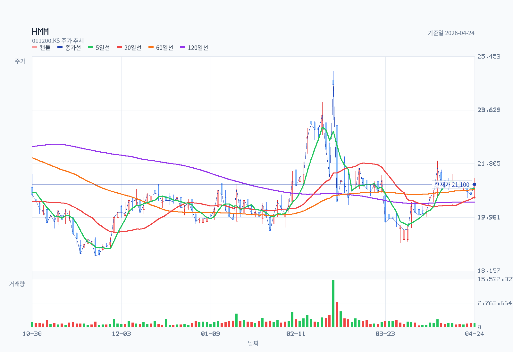
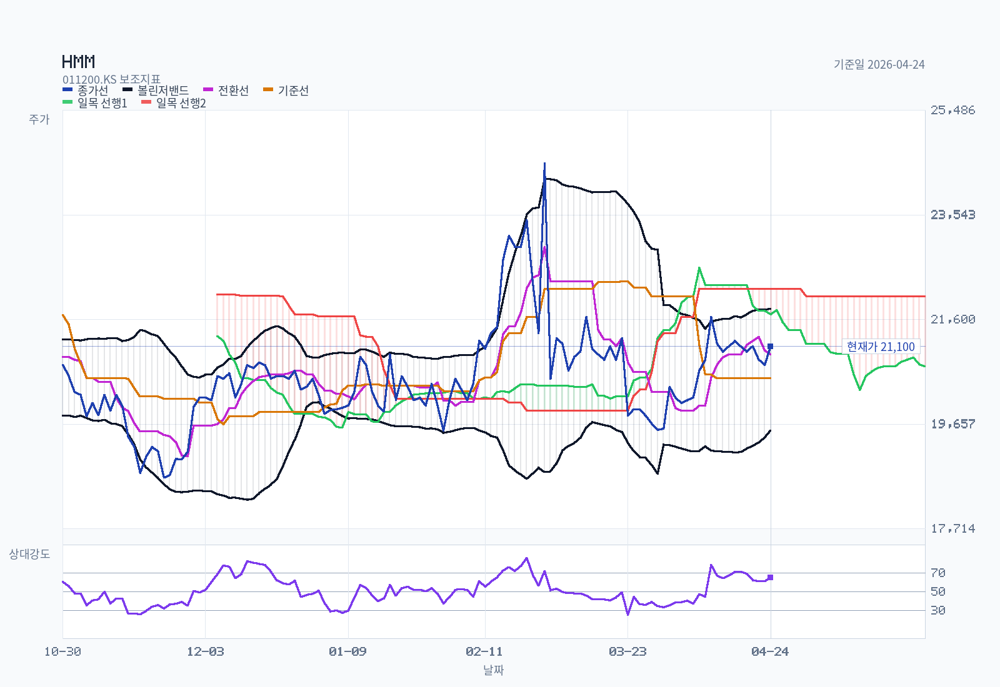
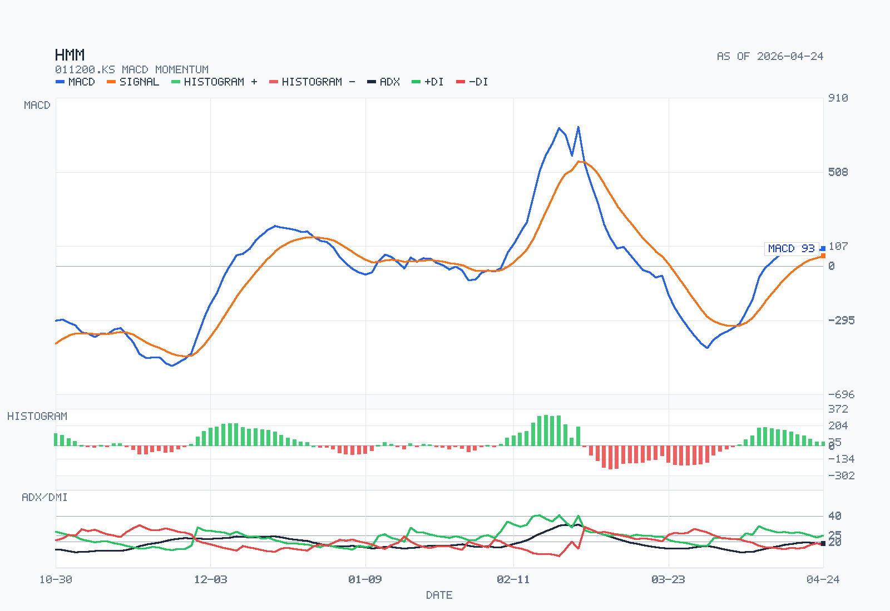

# Advanced Chart Analysis: 011200.KS

- Name: HMM
- Latest date: 2026-04-24
- Latest close: 21100.00
- Moving-average structure: mixed
- Bollinger read: upper-half
- Ichimoku read: below-cloud
- RSI state: neutral
- MACD state: bullish / above-zero
- ADX state: weak-trend / bullish / flat
- Volume regime: normal
- Chart-only flow: range-bound or base-building

## Chart Images

The main chart uses OHLC candlesticks with upper and lower wicks, plus MA5, MA20, MA60, MA120, and volume. The overlay chart separates Bollinger Bands, Ichimoku cloud lines, and RSI14, and reserves 26 forward slots for the projected cloud. The momentum chart focuses on MACD, signal, histogram, and ADX/DMI so crossovers, momentum acceleration, and trend strength are easier to see.

## Indicators

| Metric | Value |
| --- | --- |
| MA 5 | 20960.00 |
| MA 20 | 20671.00 |
| MA 60 | 20926.50 |
| MA 120 | 20500.92 |
| Bollinger Upper | 21795.06 |
| Bollinger Middle | 20671.00 |
| Bollinger Lower | 19546.94 |
| Bollinger Width | 10.88% |
| Tenkan | 20950.00 |
| Kijun | 20505.00 |
| Current Cloud A | 21697.50 |
| Current Cloud B | 22170.00 |
| Future Cloud A | 20727.50 |
| Future Cloud B | 22030.00 |
| RSI 14 | 64.71 |
| MACD | 93.07 |
| Signal | 53.74 |
| Histogram | 39.33 |
| MACD State | bullish / above-zero |
| Histogram State | expanding |
| ADX 14 | 18.73 |
| +DI | 25.02 |
| -DI | 17.47 |
| ADX State | weak-trend / bullish / flat |
| Avg Volume 20 | 1236772 |
| Volume vs Avg 20 | 111.1% |
| 20D Breakout Level | 21900.00 |
| 20D Breakdown Level | 19110.00 |

## Read

- Trend structure: moving averages are mixed, so trend confirmation is still limited.
- Volatility: price is in the upper half of the Bollinger range, and band width is stable.
- Cloud read: price is below the current cloud, tenkan is above kijun, and the projected cloud is bearish.
- Momentum and participation: RSI14 is neutral at 64.71; MACD remains above signal, and MACD is above zero; histogram momentum is expanding; ADX still reads as a weak-trend environment, and trend strength is flat; volume is close to the 20-day average.
- Practical checklist: nearest support watch is 20,501; first recovery check is 21,698, then 21,900; 20-day breakout level sits at 21,900; 20-day breakdown level sits at 19,110; chart-only flow is range-bound or base-building.
