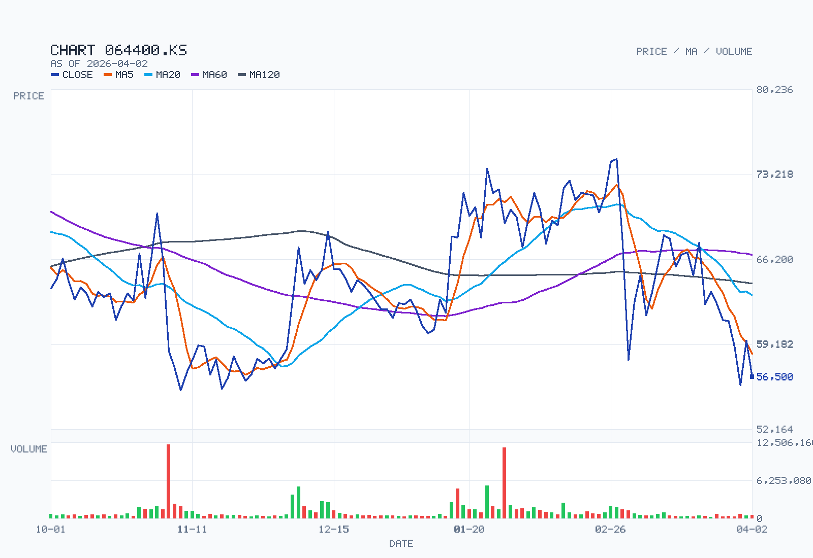
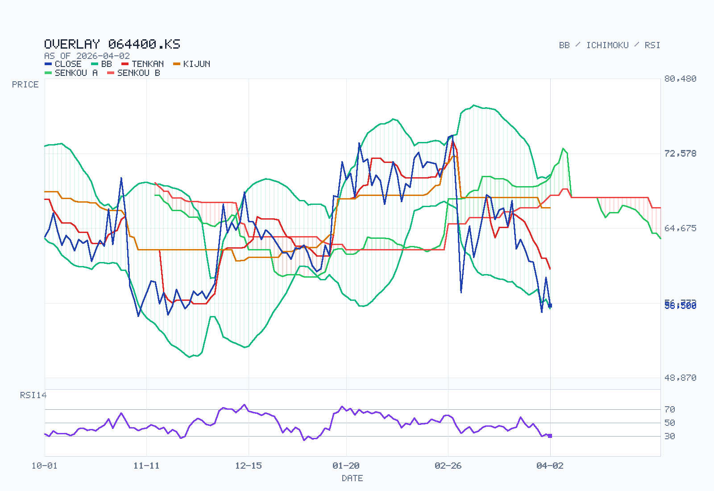

# LG CNS 분석 예시

기준일: 2026-04-02
최근 업데이트일: 2026-04-02

## 결론 요약

- 한 줄 판단: LG CNS는 `좋은 회사가 조정을 거친 구간`에 가깝고, 지금 판단은 `중장기 관점 긍정`, `단기 타이밍 보수적`이다.
- 왜 긍정적인가: `클라우드&AI` 비중이 이미 높고, 순현금 `약 1.29조원`으로 재무가 강하며, 데이터센터·AI 인프라 사업이 실제 수주와 장기 계약으로 연결되고 있다.
- 왜 아직 조심해야 하는가: `LG전자`, `LG화학` 중심 고객 집중도가 여전히 크고, 차트는 `below-cloud` 약세 구간이라 추세 확인은 아직 부족하다.
- 지금 이 종목을 보는 핵심 포인트: `non-captive 매출 확대`, `데이터센터 장기 계약의 수익성`, `분기 실적과 현금창출력 유지 여부`.

## Summary

LG CNS는 2026년 4월 2일 기준으로 보면 `나쁜 회사가 싸진 주식`이라기보다 `좋은 회사가 IPO 초기 프리미엄을 상당 부분 덜어낸 주식`에 가깝다. 2025년 연간 매출 `6조 1,295억원`, 영업이익 `5,558억원`, 순현금 `약 1.29조원`, 배당수익률 `3.27%`를 감안하면 현재 주가 `56,500원`은 3월 중순보다 훨씬 다루기 쉬운 가격대다.

내 해석은 `사업 품질은 여전히 좋다`, `밸류는 3월보다 매력적이다`, `하지만 리레이팅의 상단은 아직 캡티브 고객 구조와 non-captive 확장 속도가 결정한다`이다. 그래서 현재 LG CNS는 `질 좋은 IT 서비스/AX 종목의 조정 구간`으로 볼 수 있지만, 차트는 아직 약세라 `실적과 수주 확인형 접근`이 더 맞다.

## Business and Thesis

LG CNS는 클라우드 전환, AI 기반 디지털 혁신, 스마트팩토리·스마트물류, 금융·공공 시스템 구축, 데이터센터 설계·구축·운영(DBO)을 함께 하는 AX 중심 IT 서비스 회사다. 2025년 기준 실적의 중심축은 `클라우드&AI`, `스마트 엔지니어링`, `Digital Business Service` 세 부문이다.

투자 포인트는 세 가지다. 첫째, `클라우드&AI`가 이미 전사 매출의 절반을 넘는 주력 사업이 됐다는 점이다. 둘째, 2025년 말 기준 순차입금이 `-1조 2,896억원`인 순현금 구조라 다운사이드 방어력이 높다. 셋째, 2026년 3~4월에도 `AI 박스`, 인도네시아 AI 데이터센터 구축, 삼송 데이터센터 대형 계약처럼 AI 인프라와 데이터센터 사업 확장 뉴스가 이어지고 있다.

반대로 시장이 멀티플 상단을 열어주지 않는 이유도 분명하다. 최신 공식 IR과 최근 확인 가능한 감사보고서 기준으로 LG CNS는 여전히 `LG전자`, `LG화학` 비중이 큰 캡티브 구조를 갖고 있고, non-captive 성장의 질이 아직 완전히 숫자로 입증됐다고 보기는 어렵다. 따라서 현재 논리는 `독립 SaaS형 초고성장주`가 아니라 `현금창출력 좋은 고품질 IT 서비스 회사 + AI/데이터센터 옵션`에 가깝다.

## Revenue Mix

- 제품/사업부: 2025년 연간 매출은 `클라우드&AI 3조 5,872억원`, `스마트 엔지니어링 1조 1,935억원`, `Digital Business Service 1조 3,488억원`이었다. 전사 매출 `6조 1,295억원` 대비 비중은 각각 `58.5%`, `19.5%`, `22.0%`다.
- 지역 믹스: 최신 분기 IR에서는 지역별 외부매출이 분리 공시되지 않았다. 현재 접근 가능한 최신 공식 재무서류 기준으로는 2024년 연결조정 전 매출이 한국 `5.808조원`, 해외 합산 `0.920조원`이다. 방향성상 국내 비중이 높고 해외는 보완적 성장축으로 읽는 편이 맞다.
- 고객 집중도: 현재 접근 가능한 최신 공식 고객집중도 공시는 2024년 감사보고서다. 이 기준 10% 이상 매출처는 `LG전자 1.557조원`, `LG화학 1.442조원`이다. 2024년 연결 매출 `5.983조원` 대비 각각 약 `26.0%`, `24.1%` 수준이며, 둘을 합치면 약 `50.1%`다.

클라우드 매출을 더 뜯어보면, 공식 자료는 `클라우드 단독` 고객별 매출을 공시하지 않고 `AI·클라우드` 합산 숫자만 제시한다는 점을 먼저 인정해야 한다. 따라서 `어느 고객에게 클라우드 매출이 정확히 얼마 발생했는가`는 현재 공개 자료만으로 확정할 수 없다.

다만 `어떻게`와 `누구한테`는 비교적 명확하다. LG CNS 공식 클라우드 페이지 기준 수익화 방식은 `클라우드 컨설팅`, `전환 및 구축`, `애플리케이션 현대화`, `클라우드 AI/Data`, `운영 및 관리`다. 즉 인프라 리셀링보다 `엔터프라이즈 전환 프로젝트 + 운영 매니지드 서비스` 성격이 강하다. 회사는 2025년 1분기 실적 설명에서 수요처로 `게임사`, `물류사`, `금융사`를 직접 언급했고, 공식 사례로는 `대한항공` 클라우드 전환, `코린도 그룹` 클라우드 ERP 전환이 확인된다. 여기에 데이터센터 사업의 `DBO`, `코로케이션`, `하이브리드 클라우드`가 실질적인 클라우드 매출 축으로 붙는다.

정리하면 LG CNS의 클라우드 매출은 `LG그룹 캡티브 시스템 운영`만으로 설명되는 구조가 아니라 `금융`, `공공`, `게임`, `물류`, `제조`, `항공`, `해외 대기업`까지 포함한 B2B 전환·구축·운영 매출의 합으로 보는 편이 맞다. 다만 공식 공시가 `AI·클라우드`를 묶어 보여주기 때문에, 시장이 궁금해하는 `pure cloud 반복형 매출 비중`과 `non-captive cloud 고객 비중`은 여전히 추가 확인이 필요한 영역이다.

`캡티브 vs non-captive` 관점으로 좁혀 보면 해석은 더 명확해진다. `캡티브` 쪽은 회사 전체 기준으로 `LG전자`, `LG화학` 고객 집중도가 여전히 높다는 점에서 분명한 기반 매출 축으로 봐야 한다. 다만 이 안에서 `클라우드`가 정확히 얼마인지는 공식 자료가 따로 나뉘어 있지 않다. 반대로 `non-captive` 쪽은 이름이 공개된 `대한항공` 퍼블릭 클라우드 전환, `코린도 그룹` 클라우드 ERP 전환, 금융권 마이데이터·AI/데이터 플랫폼 구축, 공공 AX 사업, 게임·물류 업종 클라우드 전환 수요로 확인된다. 즉 LG CNS의 클라우드 사업은 `캡티브 매출이 존재하는 구조`는 맞지만, 성장 설명은 점점 `외부 대형 고객의 전환·운영 수요 확대` 쪽으로 이동하고 있다.

이 매출 구조가 의미하는 바는 분명하다. LG CNS는 이미 `AI·클라우드 회사`로 재분류할 수 있을 정도의 사업 비중을 확보했지만, 동시에 `대형 그룹 고객 안정성`과 `고객 집중도 할인`이 함께 붙는 회사다. 현재 멀티플의 방향은 결국 `클라우드&AI 성장`보다 `캡티브 의존도 완화`가 얼마나 같이 가느냐가 좌우한다.

## What The Latest Results Say

2025년 연간 연결 기준 매출은 `6조 1,295억원`, 영업이익은 `5,558억원`, 당기순이익은 `4,422억원`이었다. 전년 대비 각각 `+2.5%`, `+8.4%`, `+21.2%`다. 2025년 4분기만 보면 매출 `1조 9,357억원`, 영업이익 `2,160억원`, 당기순이익 `1,806억원`으로 수익성은 더 좋아졌다.

사업부별 해석도 깔끔하다. `클라우드&AI`는 2025년 연간 `+7.0%` 성장했고, 회사는 그 배경으로 `국내 AIDC 구축 및 코로케이션 사업 성장`, `AI/Data 플랫폼 구축 증가`, `클라우드 기반 AI 서비스 확대`를 제시했다. `스마트 엔지니어링`은 연간 `-3.5%`였지만, 회사는 IR에서 `non-captive 방산/에너지 신규 고객 확대`와 `captive 대형 프로젝트 종료 영향`을 같이 설명했다. `Digital Business Service`는 연간 `-3.2%`였지만 4분기에는 `+4.5%`로 반등했고, 금융 대형 사업의 본격 개발 단계 진입을 주요 배경으로 제시했다.

실적 이후 나온 회사 행보도 현재 투자 논리와 맞닿아 있다. LG CNS는 2026년 3월 11일 `6개월 내 구축 가능한 모듈형 AI 데이터센터`인 `AI 박스`를 공개했고, 2026년 3월 31일에는 인도네시아 자카르타에서 `약 1,000억원 규모` AI 데이터센터 인프라 구축 사업 수주를 발표했다. 이어 2026년 4월 1일에는 삼송 데이터센터 관련 대형 코로케이션 및 위탁운영 계약 소식이 보도됐다. 해석하면 LG CNS의 성장 서사는 단순 SI 업종 방어주보다 `AI 인프라 + 데이터센터 운영 역량`으로 점점 옮겨가고 있다.

## Street / Alternative Views

- `Street view`: 삼성증권과 신한투자증권 요약 보도는 4Q25를 `관계사 둔화를 대외 수주와 클라우드&AI가 완충한 분기`로 읽는다. 이 해석은 본문에서 본 `captivity discount remains, but non-captive growth matters more`와 방향이 같다. 다만 `대외 수주 확대`의 정확한 고객 믹스와 반복 매출화 정도는 공식 공시에서 `not separately disclosed`다.
- `Street view`: 외부 시장 코멘트는 `오픈AI 협력`, `AI PoC 수요`, `피지컬 AI` 같은 신사업 옵션 가치를 계속 강조한다. 이 포인트는 상장 초기 프리미엄을 설명하는 데는 유용하지만, 현재 공시가 확정해 주는 것은 아직 `기존 사업의 현금창출력`과 `데이터센터 수주 확대`까지다. 즉 시장 기대는 공식 숫자보다 한 발 앞서 있다.
- `Specialist media`: ZDNet은 삼송 데이터센터 계약을 장기 매출 기반으로 해석해 데이터센터 사업의 재평가 논리를 강화한다. 다만 계약 기간별 매출 인식 구조와 운영 단계 마진은 아직 `not separately disclosed`라서, 기사 해석을 그대로 숫자로 환산할 수는 없다.
- `Bottom line`: outside view는 LG CNS를 `캡티브 SI`보다 `non-captive AX + infra option`에 더 가깝게 평가하려 하지만, 현재 filing이 확정해 주는 것은 아직 `높은 고객 집중도`, `견조한 현금창출력`, `외부 수주 확대 조짐`까지다. 그래서 멀티플 상단은 결국 `non-captive mix disclosure`와 `반복형 데이터센터 수익성`이 열어줘야 한다.

## Current Valuation Snapshot

| Metric | Value | Date | Note |
| --- | --- | --- | --- |
| Current price | 56,500 KRW | 2026-04-02 | 네이버증권 KRX 장마감 |
| Market cap | 5.4741tn KRW | 2026-04-02 | 종가와 상장주식수 `96,885,948주` 기준 |
| Trailing PER | 12.42x | 2026-04-02 | 네이버증권 최근 4분기 기준 |
| Forward PER | 11.00x | 2026-04-02 | 네이버증권 2026E 컨센서스 기준 |
| EV/EBITDA | 8.69x | 2026-04-01 | FnGuide 가치지표 기준 |
| PBR | 1.87x | 2026-04-02 | 네이버증권 최근 4분기 기준 |
| FCF yield | about 12.4% | Mixed date | 2024 감사보고서 영업현금흐름에서 유형·무형 CAPEX를 차감한 값과 2026-04-02 시총으로 계산한 참고치 |
| EV/Sales | about 0.68x | Mixed date | 2026-04-02 EV와 2025 매출 `6.1295조원`으로 계산한 참고치 |
| Trailing dividend yield | 3.27% | 2026-04-02 | 네이버증권 최근 결산배당 기준 |
| ROE | 17.35% | 2025.12 | 네이버증권 최근 4분기 기준 |
| Net cash | about 1.290tn KRW | 2025-12-31 | 4Q25 IR의 현금성자산 `1조 6,794억원`에서 차입금 `3,898억원`을 차감한 값 |

현재 밸류는 3월 중순보다 훨씬 설득력이 좋아졌다. 같은 날 네이버증권 동종업종 비교 기준으로 LG CNS의 trailing PER `12.42x`는 `삼성SDS 15.34x`보다 낮고, `현대오토에버 140.75x`보다 훨씬 낮다. 반면 PBR `1.87x`는 `삼성SDS 1.17x`보다 높다. 이것은 시장이 LG CNS를 `현금창출력과 ROE가 더 높은 회사`로 보되, `고객 집중도와 실적 가시성` 때문에 절대 프리미엄을 크게 열어주지는 않는다는 뜻이다.

중요한 건 현재 주가가 이미 `52주 최고 100,800원`에서 크게 내려와 있고 `52주 최저 47,000원`에 더 가까운 위치라는 점이다. 지금 LG CNS는 `고평가 성장주`보다 `좋은 사업이 멀티플 조정을 거친 품질주` 쪽에 더 가깝다. 다만 삼성SDS 대비 PBR 프리미엄이 완전히 사라진 것은 아니라서 `완전한 딥밸류`로 보기는 어렵다.

## Historical Valuation Bands

LG CNS는 `2025년 상장` 종목이라 3~5년의 의미 있는 공모시장 멀티플 시계열이 아직 없다. 비상장 시기의 재무는 존재하지만, 상장 전에는 `시장가격`이 없어 P/E, EV/EBITDA, P/B 밴드를 정직하게 길게 그릴 수 없다.

그래서 이 종목은 지금 억지로 장기 밴드를 그리는 것보다 다음 세 질문이 더 중요하다.

- 현재 trailing PER `12.4x`가 `캡티브 구조가 큰 IT 서비스 회사` 기준으로 싼 구간인지
- PBR `1.87x`가 ROE `17.35%`를 감안할 때 삼성SDS 대비 정당화되는지
- AI 인프라와 데이터센터 사업이 실제 이익 성장으로 이어져 상장 초기 멀티플 압축을 되돌릴 수 있는지

현 단계에서 가장 정직한 밸류 읽기는 `장기 밴드`보다 `peer relative valuation`, `ROE`, `순현금 구조`, `non-captive 확대 속도`다.

## Chart and Positioning

위 두 이미지는 `2026-04-02`까지의 1년 일봉을 사용해 생성했다. 첫 번째 이미지는 `종가`, `5/20/60/120일선`, `거래량`을, 두 번째 이미지는 `종가`, `볼린저밴드`, `일목균형표`, `RSI14`를 보여준다. 기준 종가는 `56,500원`, `5일선 58,380원`, `20일선 63,250원`, `60일선 66,583원`, `120일선 64,208원`, `볼린저 상단 70,354원`, `볼린저 하단 56,146원`, `전환선 60,350원`, `기준선 66,850원`, `현재 구름대 A 70,100원`, `현재 구름대 B 68,150원`, `RSI14 30.07`, `거래량/20일 평균 119.7%`였다.

차트 해석은 3월 20일 때보다 분명히 약해졌다. 현재 주가는 `5일선, 20일선, 60일선, 120일선` 아래에 있고 일목균형표 기준으로도 `below-cloud`다. RSI가 `30.07`까지 내려와 과매도권에 가까워졌지만, 이것은 `반등 가능성`이지 `추세 전환 확인`은 아니다.

실전 레벨로 보면 `56,100원~55,400원`대가 단기 지지 구간이고, 이탈 시에는 `52주 저점 47,000원` 테스트 가능성까지 열어둬야 한다. 위로는 `60,350원` 전환선, `63,250원` 20일선, `66,850원` 기준선, `68,150원~70,100원` 구름대가 순차 저항이다. 차트만 놓고 보면 현재 흐름은 `저점 통과 후 강한 추세 재개`가 아니라 `아직 약세 추세 안의 반등 대기 구간`이며, chart-only flow는 `bearish continuation`에 가깝다.

## Governance and Structure

- 최대주주는 `(주)LG 44.96%`다.
- 2대 주주는 `크리스탈코리아(유) 8.28%`다.
- `국민연금 5.70%`, `우리사주조합 3.05%`가 뒤를 잇는다.
- 2026년 3월 기준 이사회는 `7명`이고, 이 중 `사외이사 4명`이다.
- 이사회 의장은 `사외이사 이호영`이고, 대표이사는 `현신균`이다. 의장과 CEO가 분리돼 있다.

거버넌스 구조는 분명한 플러스가 있다. 회사는 공식 거버넌스 페이지에서 감사위원회 위원 전원을 사외이사로 구성하고, 내부거래위원회 위원 전원도 사외이사로 구성한다고 밝히고 있다. 이사회 의장 역시 기타비상무나 CEO가 아니라 `사외이사`가 맡고 있어 형식적 독립성은 상당히 괜찮은 편이다.

`제39기 정기 주주총회 결과`도 긍정적이다. 회사 IR 정보 페이지 기준으로 `전자주주총회 제도 도입`, `집중투표제 배제 조항 삭제`, `독립이사 명칭 변경`, 감사위원 선임 관련 정관 변경 안건이 모두 원안가결됐다. 이는 `형식상 지배구조 정비`에 그치지 않고 소수주주 친화적 방향으로 규칙을 다듬고 있다는 신호로 읽을 수 있다.

다만 소수주주 관점에서 완전히 편한 구조는 아니다. 지분 구조보다 더 중요한 건 `경제적 독립성`인데, 최신 공식 고객집중도 공시에서 여전히 `LG전자`, `LG화학` 비중이 크다. 즉 LG CNS는 `거버넌스의 형식`은 좋아지고 있지만 `사업모델의 캡티브 성격`은 아직 강하다.

## Catalysts

- 2026년 1분기 실적에서 `클라우드&AI` 성장과 영업이익률이 유지되는지
- 삼송 데이터센터 코로케이션·운영 계약이 실제 장기 매출과 이익으로 어떻게 반영되는지
- 인도네시아 AI 데이터센터 구축 수주가 동남아 추가 수주로 이어지는지
- `AI 박스`가 제품 발표를 넘어 실제 고객 수주와 설치 사례로 확장되는지
- 삼성SDS 대비 할인 축소 또는 현대오토에버 대비 프리미엄 재정립이 가능한지

## Risks

- `LG전자`, `LG화학` 중심 고객 집중도가 오래 유지될 가능성
- 스마트 엔지니어링의 프로젝트 편차와 그룹사 투자 사이클 둔화
- AI 인프라·데이터센터 기대가 실제 이익화보다 앞서가 있을 가능성
- 순현금과 배당 매력이 있어도 시장이 `독립 소프트웨어 기업` 멀티플을 계속 주지 않을 가능성
- 차트상 주요 추세선과 구름대를 회복하지 못하면 단기 수급 약세가 길어질 가능성

## What Would Change My Mind

더 좋아지려면 `non-captive 고객 비중이 실제 숫자로 확대`, `클라우드&AI 성장률이 전사 평균을 꾸준히 상회`, `데이터센터와 AI 인프라 수주가 반복형 매출로 연결`, `1분기와 2분기에도 현금창출력과 마진이 안정적`이어야 한다.

더 나빠지려면 `캡티브 매출 의존이 더 심화`, `AI 인프라 뉴스가 실제 실적으로 이어지지 않음`, `수주와 이익률이 동시에 둔화`, `주가가 52주 저점권을 다시 시험하면서도 펀더멘털 반등 근거가 약함`이 확인되면 된다.

## Additional Research Questions

- 2025년과 2026년의 `non-captive` 매출 비중은 실제로 얼마나 올라가고 있는가? 왜 중요한가: 현재 멀티플 상단은 `LG그룹 캡티브 회사`에서 `독립 성장형 AX 회사`로 얼마나 이동하는지에 달려 있다.
- 삼송 데이터센터 장기 계약의 수익성은 구축 단계와 운영 단계에서 각각 얼마나 다른가? 왜 중요한가: 데이터센터 사업이 매출만 큰지, 이익률도 높은지에 따라 밸류 프레임이 달라진다.
- `AI 박스`는 파일럿을 넘어 실제 상용 고객 레퍼런스를 얼마나 빨리 확보하는가? 왜 중요한가: 제품 발표만으로는 스토리지만, 반복 수주가 붙으면 사업 모델이 된다.
- 최신 공식 공시 기준으로 상위 고객 집중도는 2024년 대비 완화되고 있는가? 왜 중요한가: 고객 집중도 완화가 확인돼야 시장이 캡티브 할인 폭을 줄일 수 있다.
- 2025년 감사보고서 기준 영업현금흐름과 CAPEX는 어떻게 변했는가? 왜 중요한가: 현재 LG CNS 투자 논리의 핵심 중 하나가 `고품질 현금창출력`이기 때문이다.

## Update Log

### 2026-04-02

- `Revenue Mix`에 `클라우드 매출은 누구한테서 어떻게 발생하나` 설명을 추가했다.
- `캡티브 vs non-captive` 관점으로 LG CNS 클라우드 고객 구조를 재정리했다.
- 공식 자료 기준 `클라우드 단독 고객별 매출`은 비공개이며, 공개 범위는 `AI·클라우드` 합산 매출과 일부 외부 고객 사례라는 점을 명시했다.
- `Street / Alternative Views` 섹션을 추가해 sell-side와 전문매체가 보는 `non-captive 성장`, `신사업 옵션`, `데이터센터 장기 매출` 논점을 분리했다.

## Sources

- [네이버증권 LG씨엔에스](https://finance.naver.com/item/main.naver?code=064400)
- [FnGuide LG CNS](https://comp.fnguide.com/SVO2/ASP/SVD_Main.asp?gicode=A064400)
- [LG CNS 2025년 4분기 경영실적 발표 PDF](https://www.lgcns.com/content/dam/lgcns/resources/company/ir/investors-activity/earnings-announcement/LG-CNS_4Q25_Earnings_KR.pdf)
- [LG CNS 2024 4Q Consolidated Financial Statement](https://www.lgcns.com/content/dam/lgcns/resources/company/ir/ir-resources/en/2024_4Q_Consolidated%20financial%20statement_ENG.pdf)
- [LG CNS 주주현황/배당정보](https://www.lgcns.com/kr/company/ir/shareholder)
- [LG CNS 거버넌스](https://www.lgcns.com/kr/company/esg/governance)
- [LG CNS IR 정보](https://www.lgcns.com/kr/company/ir/ir-info)
- [LG CNS, 6개월만에 짓는 AI 데이터센터 ‘AI 박스’ 출시](https://www.lgcns.com/kr/newsroom/press/detail.aidc-2603-2)
- [LG CNS, 국내 기업 최초로 해외에 AI데이터센터 짓는다](https://www.lgcns.com/kr/newsroom/press/detail.250806001)
- [ZDNet Korea, LG CNS 삼송 데이터센터 최소 7800억 매출 확보](https://zdnet.co.kr/view/?no=20260401155018)
- [LG CNS 클라우드 서비스](https://www.lgcns.com/kr/service/modern-it-infra-on-cloud/cloud)
- [LG CNS 데이터센터 서비스](https://www.lgcns.com/business/cloud/datacenter/)
- [LG CNS 2025년 1분기 실적 보도자료](https://www.lgcns.com/kr/newsroom/press/detail.ko_0906)
- [LG CNS 2025년 3분기 실적 보도자료](https://www.lgcns.com/kr/newsroom/press/detail.20251030001)
- [LG CNS, 코린도 그룹 클라우드 ERP 전환](https://www.lgcns.com/kr/newsroom/press/detail.20251103001)
- [클라우드 속 고객 데이터, LG CNS가 철통 경계한다](https://www.lgcns.com/kr/newsroom/press/detail.ko_0749)
- [뉴스핌 2026-01-28 삼성증권 리포트 브리핑](https://www.newspim.com/news/view/20260128000552)
- [뉴스핌 2026-01-28 신한투자증권 리포트 브리핑](https://www.newspim.com/news/view/20260128000617)
- [파이낸셜뉴스 2026-01-16 연합뉴스 시황 기사, 신영증권 코멘트 인용](https://www.fnnews.com/ampNews/202601161600122878)
