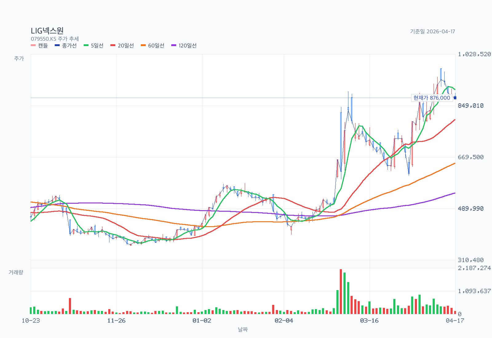
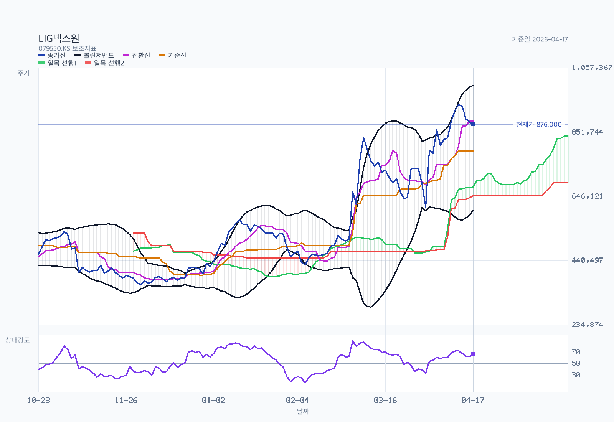
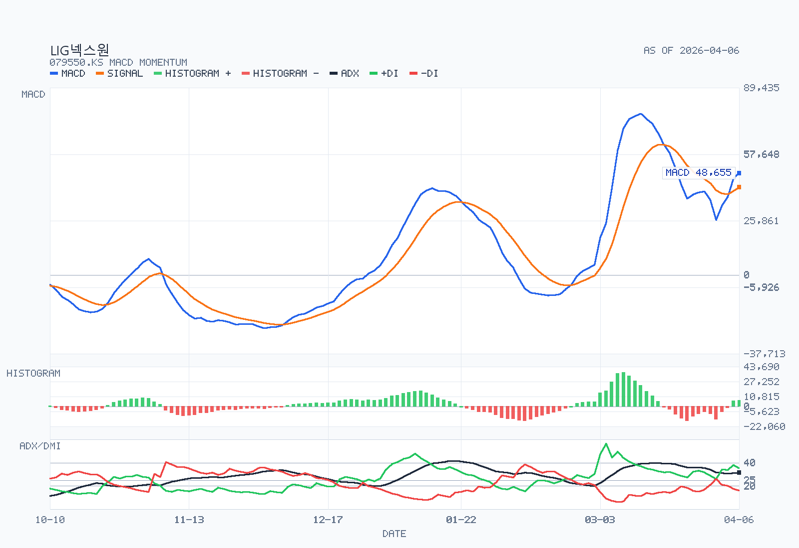

# LIG넥스원 분석 예시

기준일: 2026-04-06

## Decision Frame

- 현재 판단: `좋은 회사지만 지금 가격은 보수적으로 접근`.
- 지금 가장 중요한 질문: `backlog가 실제로 얼마나 빨리 매출과 현금으로 전환되는가`, `고객 및 지역 집중도 리스크가 얼마나 빨리 완화되는가`, `현재 주가가 옵션가치까지 얼마나 선반영했는가`.
- 왜 아직 바로 강하게 못 가는가: 본업과 backlog는 강하지만 valuation이 이미 높은 기대를 상당 부분 반영하고 있다.

## Summary

LIG넥스원은 지금도 `좋은 방산 성장주`라는 판단이 맞다. audited DART 기준 2025년 매출 `4조 3,069억원`, 영업이익 `3,194억원`, 공식 backlog `26조 2,526억원`은 질적으로 강하다. 사업부도 `PGM 47.2%`에만 기대는 구조가 아니라 `C4I 24.7%`, `AEW 13.1%`가 같이 받쳐 주는 다축 성장이다.

다만 이번 DART deep-read로 이전보다 더 중요해진 약점도 있다. 첫째, 고객집중도가 생각보다 높다. `A고객 46.4%`, `B고객 12.1%`로 10% 이상 고객 두 곳 합계가 `58.4%`다. 둘째, 지역 믹스는 `국내 80.1% / 해외 19.9%`라 아직 수출기업 이미지에 비해 내수 비중이 높다. 셋째, backlog는 크지만 `영업활동현금흐름 -5,598억원`이라 현금전환은 좋지 않았다. 넷째, 2026-04-06 종가 `810,000원` 기준 trailing PER은 `69.8배`, P/B는 `12.46배`로 이미 매우 비싸다.

결론은 간단하다. `좋은 회사`라는 점은 official filing으로 더 강하게 확인됐지만, `쉬운 가격`은 아니다. 지금 LIG넥스원은 `backlog와 프리미엄 기술 옵션`을 믿고 비싼 멀티플을 감수하는 종목이지, 저평가를 사는 종목은 아니다.

## Business and Thesis

LIG넥스원은 국내 대표 방산 전자체계 회사다. 정밀타격 `PGM`, 감시정찰 `ISR`, 항공전자·전자전 `AEW`, 지휘통제·통신 `C4I`, 기타 무인화·미래전 영역을 함께 가진다. 사업 포트폴리오가 육·해·공을 모두 걸치기 때문에 단일 플랫폼 회사보다 수주 소스가 다양하다.

투자 포인트는 세 가지다. 첫째, 2025년 성장의 중심은 `천궁-II 수출 + 정밀타격 양산`이지만 DART 본문상 `KF-21 최초양산`, `TMMR 2차 양산`, `인도네시아 수출 사업`도 같이 기여했다. 둘째, 공식 계약잔액 `26.25조원`은 매출 대비 `6.10배`라 중기 매출 가시성이 높다. 셋째, 팔란티어 MOU 같은 신규 옵션이 붙으면서 시장이 단순한 내수 방산주보다 `통합방공/무인화/전자전 프리미엄`을 얹어 보기 시작했다.

반대로 약점도 분명하다. 고객 A/B 합계가 `58.4%`라 고객집중도가 높고, 해외 매출 비중은 아직 `19.9%`에 그친다. 그리고 2025년은 이익이 좋았지만 현금흐름은 약했다. 즉 `backlog가 크다 -> 바로 현금이 잘 돈다`는 서사는 filing으로 확인되지 않는다.

## Revenue Mix

- 제품/사업부:
  2025년 audited 기준 `PGM 47.2%`, `C4I 24.7%`, `AEW 13.1%`, `ISR 12.1%`, `기타 2.9%`다.
- 지역 믹스:
  `국내 80.1%`, `해외 19.9%`다. 수출이 중요한 성장축인 것은 맞지만 현재 매출 구조는 여전히 국내 비중이 높다.
- 고객 집중도:
  10% 이상 외부고객이 두 곳 있으며 `A고객 46.4%`, `B고객 12.1%`, 합계 `58.4%`다. 고객 실명은 공시에서 `not separately disclosed`다.

여기서 가장 중요한 변화는 고객집중도가 이제 `미확인`이 아니라 `공식 확인 항목`이라는 점이다. 즉 LIG넥스원을 프리미엄 방산주로 보더라도, 특정 대형 고객과 대형 프로젝트 의존도는 무시하면 안 된다.

## What The Latest Results Say

2025년 연결 매출은 `4조 3,069억원`, 영업이익은 `3,194억원`, 총당기순이익은 `2,375억원`이었다. 지배기업소유주지분 순이익은 `2,534억원`, EPS는 `11,604원`이다. DART MD&A는 성장 배경으로 `UAE향 천궁-II 수출사업의 안정적 진행`, `국내 연구개발 사업`, `정밀타격 대규모 양산사업`을 적시했다.

사업부별로 보면 `PGM +58.4%`, `AEW +42.4%`, `C4I +9.8%`, `ISR -3.3%`였다. 이건 LIG넥스원을 단순히 미사일 한 축으로만 볼 수 없다는 뜻이다. 정밀타격이 메인 엔진이지만 전자전과 지휘통제도 같이 커지고 있다.

backlog는 `26조 2,526억원`으로 크다. 숫자 자체는 매우 좋다. 다만 filing이 같이 보여주는 다른 그림도 있다. `계약자산 1조 707억원`, `계약부채 3조 8,335억원`, `영업활동현금흐름 -5,598억원`은 2025년이 `이익 성장`과 `현금전환`이 같은 방향으로 움직인 해는 아니었다는 뜻이다. 결국 앞으로 봐야 할 것은 backlog의 규모보다 `매출 전환 속도`와 `현금 회수 질`이다.

## DART Recheck

| 주장 | 상태 | 확인값 또는 판단 | 출처 | 비고 |
| --- | --- | --- | --- | --- |
| 2025년 audited 실적은 강했다 | confirmed | 매출 `4,306,936백만원`, 영업이익 `319,442백만원` | 사업보고서 MD&A | 공식 확정 |
| LIG넥스원은 PGM 단일축 회사가 아니다 | confirmed | C4I `24.7%`, AEW `13.1%` 비중 확인 | 사업보고서 `최근 3사업년도 매출 구성 현황` | 다축 성장 |
| 고객집중도는 아직 확인되지 않았다 | contradicted | A/B 고객 합계 `58.4%` | 사업보고서 `10% 이상 외부고객` | 실명만 미공개 |
| 특수관계자 매출 의존도는 높다 | contradicted | strict 특수관계자 매출 비중 `0.03%` | 사업보고서 `특수관계자 거래` | 매출보다 매입 구조 확인 필요 |
| backlog 확대와 현금전환이 동시에 좋다 | partially supported | backlog `26.25조원`은 확인, CFO `-5,598억원` | 사업보고서 `계약잔액`, `현금흐름표` | 혼합 신호 |
| 수출 비중이 이미 절반 수준이다 | contradicted | 해외 `19.9%`, 국내 `80.1%` | 사업보고서 `지역별 매출현황` | 아직 내수 비중 우위 |

## Street / Alternative Views

- `Specialist media`: 2026-02-02 녹색경제신문은 LIG넥스원을 `사상 최대 실적`과 `고스트로보틱스/추가 해외수주` 관점에서 봤다. 이건 filing과도 맞닿아 있다. backlog와 실적은 매우 좋지만, 주가가 더 가려면 해외 추가 수주와 옵션 사업의 실체화가 필요하다는 해석이다.
- `Official company news`: 2026-03-25 팔란티어와의 UAE 통합방공망 및 무인체계 솔루션 개발협력 MOU는 시장이 좋아할 만한 뉴스다. 다만 이건 `양산 매출`이 아니라 `기술/사업 옵션`이다.
- `What looks ahead of the filing`: 현재 주가는 시장이 backlog와 장기 옵션을 이미 많이 반영하고 있다는 신호다. filing이 보여준 강점은 분명하지만, 주가가 반영하는 기대는 그보다 한 발 앞서 있다.

## Current Valuation Snapshot

| Metric | Value | Date | Note |
| --- | --- | --- | --- |
| Current price | `810,000원` | 2026-04-06 | chart API 종가 |
| Market cap | `약 17.82조원` | 2026-04-06 | 현재가 × 발행주식수 |
| Trailing PER | `69.8x` | 2026-04-06 / 2025 실적 | `810,000 / EPS 11,604` |
| Forward PER | `not cleanly verifiable` | 2026-04-06 | 공식 컨센서스 부재 |
| P/B | `12.46x` | 2026-04-06 / 2025말 지배주주지분 | `pbr 12.46x`, `17.82조원 / 1.430조원` |
| EV/EBITDA | `not cleanly verifiable` | Mixed date | 순차입금 기준일 미정합 |
| FCF yield | `약 -4.7%` | 2025 CF / 2026-04-06 MCAP | audited CFO와 capex 기반 근사 |
| Dividend yield | `약 0.36%` | 2026-04-06 | `2,950 / 810,000` |
| Backlog / Sales | `6.10x` | 2025말 / 2025 매출 | 공식 backlog 기준 |

이 표가 말해주는 건 단순하다. LIG넥스원은 filing 기준으로도 좋은 사업이지만, 시장은 이미 `좋은 사업 + 미래 옵션` 가격을 요구하고 있다. 특히 trailing PER `69.8배`, P/B `12.46배`는 편안한 진입 밸류라고 보기 어렵다.

## Historical Valuation Bands

현재 공식 소스와 이 세션의 접근 범위만으로는 `3~5년 PER/PBR/EV/EBITDA 시계열`을 깨끗하게 재구성하지 못했다. 그래서 이번 메모는 장기 밴드보다 다음 네 가지를 더 중시한다.

- audited 실적과 backlog가 실제로 강한가
- 고객/지역 집중도가 멀티플 할인 요인인가
- 현금전환이 개선될 여지가 있는가
- 주가가 이미 옵션 가치까지 많이 선반영했는가

즉 지금의 LIG넥스원은 `밴드 하단에서 싼 주식`이 아니라 `높은 질의 방산 성장주에 얼마나 비싼 가격을 지불할지`를 묻는 종목이다.

## Chart and Positioning

차트는 `2026-04-06` 종가 기준으로 다시 생성했다. 현재 종가는 `810,000원`, `MA5 771,800원`, `MA20 724,800원`, `MA60 596,633원`, `MA120 511,908원`이다. 볼린저 상단은 `844,354원`, RSI14는 `58.35`, MACD는 `bullish / above-zero`, ADX14는 `31.62`다.

해석은 `강한 상승 추세`다. 가격은 모든 주요 이평선 위에 있고, 일목 기준 `above-cloud`, MACD도 우상향이다. 다만 `20일 breakout level 893,000원`을 아직 넘지 못했고, 아래로는 `604,000원` 부근이 추세 훼손의 첫 강한 경계선이다. 차트만 보면 `bullish continuation`이지만, fundamentals보다 더 앞서 달려간 가격이라는 점은 같이 봐야 한다.

## Governance and Structure

- 2026-03-31 주총 후 이사 총수는 `7명`, 사외이사는 `4명`, 비율은 `57.1%`다.
- 감사위원회 위원이 되는 사외이사 `김승주`가 신규선임됐고, `차상훈`은 사내이사로 재선임됐다.
- 결산배당은 `2,950원`으로 확정됐다.
- `집중투표제 배제 조항 삭제`, `사명 변경`, `사채 발행 규모 확대`가 가결됐다.
- 2025년말 자기주식은 `154,750주`, 보유비율은 `0.70%`다.

거버넌스 평가는 중립 이상이다. 형식상 개선 신호는 있다. 다만 이 종목의 핵심은 지배구조보다 `높은 수주잔고가 이익과 현금으로 얼마나 잘 전환되는가`에 더 가깝다.

## Catalysts

- 1Q26에서 backlog의 매출 전환이 실제로 이어지는지
- 영업활동현금흐름이 2025년 적자에서 개선되는지
- 추가 해외 수주와 UAE향 사업 확장이 이어지는지
- 팔란티어 협력이 실질 수주나 프로그램으로 연결되는지
- AEW/C4I 비중 확대가 계속되는지

## Risks

- 고객 A/B 집중도가 높아 특정 프로그램 의존 리스크가 크다
- 해외 매출 비중이 아직 `19.9%`라 `수출 프리미엄` 서사가 현재 구조보다 앞서 있을 수 있다
- backlog는 크지만 2025년 CFO가 `-5,598억원`이라 현금전환 리스크가 남아 있다
- trailing PER `69.8배`, P/B `12.46배`는 기대가 꺾일 때 밸류 압축이 클 수 있다
- 옵션 사업이 실제 이익 기여로 이어지지 않으면 멀티플 정당화가 약해질 수 있다

## Uncomfortable Questions

- 시장은 backlog를 거의 현금처럼 취급하고 있는데, 실제로는 working capital과 현금회수 타이밍이 더 큰 변수 아닌가?
- 고객 A와 B 집중도가 여전히 높은데, 지금 valuation은 그 의존도를 과소평가하고 있지 않은가?
- 해외 매출 비중이 아직 20% 내외인데, 시장은 이미 글로벌 방산 prime처럼 가격을 매기고 있지 않은가?
- MOU와 차세대 옵션 스토리가 실제 계약과 마진으로 연결되지 않으면 지금 멀티플은 얼마나 정당화되나?

## Decision-Changing Issues

1. backlog의 현금화 속도와 2026년 영업현금흐름 회복 여부.
2. 고객 및 지역 집중도 완화의 실제 진전.
3. 높은 멀티플을 정당화할 추가 해외 수주와 옵션 사업의 현실화.

## Structured Stance

더 좋아지려면 `backlog -> 매출 -> 현금` 전환이 실제로 개선돼야 한다. 즉 1Q26 이후에도 두 자릿수 성장과 함께 현금흐름이 따라와야 한다. 그리고 해외 매출 비중이 구조적으로 올라가면 현재 멀티플이 더 정당화될 수 있다.

더 나빠지려면 세 가지면 충분하다. 고객집중 리스크가 실적 변동성으로 드러나거나, backlog는 큰데 현금이 계속 안 돌거나, 주가가 먼저 반영한 옵션 사업이 실제 계약으로 이어지지 않는 경우다.

## Follow-up Research Prompts

- A고객과 B고객의 실질 정체는 어느 프로그램/고객군에 대응하는가?
  why it matters: 고객집중 리스크의 성격이 정부/수출/단일 프로그램 중 무엇인지가 다르다.
- 2026년 해외 매출 비중은 `19.9%`에서 얼마나 올라갈 수 있는가?
  why it matters: 현재 멀티플은 수출 확대를 상당 부분 선반영하고 있다.
- 2025년 영업활동현금흐름 적자의 주요 원인은 일시적 운전자본인지 구조적 현금소모인지?
  why it matters: backlog의 질은 결국 현금전환으로 검증된다.
- AEW와 C4I의 성장 기여가 2026~2027년에도 유지되는가?
  why it matters: PGM 단일축이 아니어야 프리미엄 멀티플이 유지된다.
- 팔란티어 협력과 무인화 옵션이 실제 수주로 연결되는 시점은 언제인가?
  why it matters: 현재 주가는 미래 옵션에도 값을 매기고 있다.

## Sources

- [DART 사업보고서 KRX 뷰어](https://kind.krx.co.kr/external/2026/03/23/001725/20260323007318/11011.htm)
- [정기주주총회 결과](https://kind.krx.co.kr/external/2026/03/31/001667/20260320001823/91482.htm)
- [2025년 4분기 영업(잠정) 실적 IR 페이지](https://www.ligdefenseaerospace.com/eng/ir/irReportView.do?bbs_no=7326)
- [팔란티어 MOU 회사소식](https://www.ligdefenseaerospace.com/news/nex1newsView.do?bbs_no=7341)
- [녹색경제신문 기사](https://www.greened.kr/news/articleView.html?idxno=336500)
- [Yahoo Finance chart API](https://query1.finance.yahoo.com/v8/finance/chart/079550.KS?range=1y&interval=1d)
