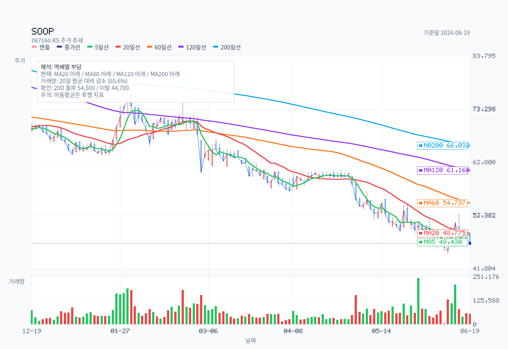
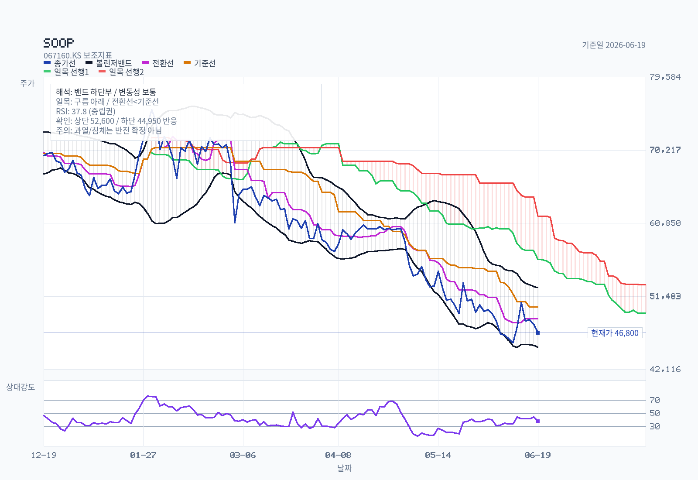
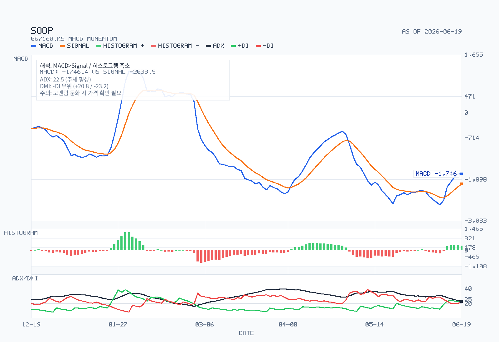
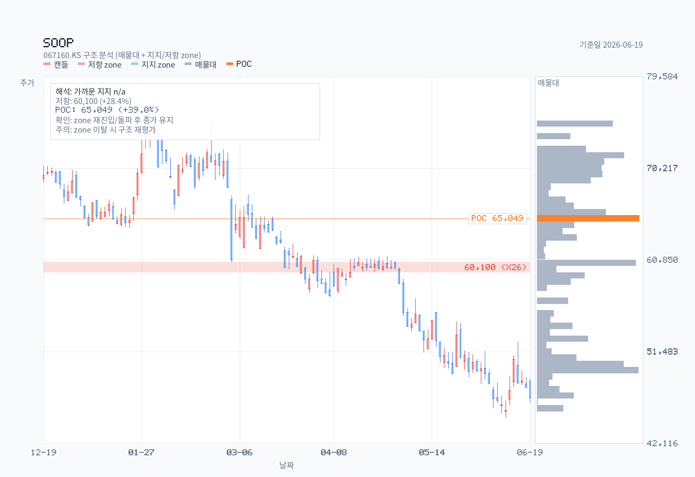

# SOOP (구 아프리카TV) 투자 메모

- 기준일: 2026-06-21
- 최근 업데이트일: 2026-06-21
- 티커: 067160
- 시장: KOSDAQ
- 대상: SOOP 보통주 (구 아프리카TV, 2024년 사명·서비스명 SOOP 전환)
- 산출 모드: full memo
- 우선 렌즈: 경쟁 구도(치지직) × 글로벌 확장, 12~24개월

## Summary

SOOP은 "**숫자상 명백히 싸지만(PER 약 4.9배, 순현금 시총의 46%, 배당수익률 약 7.2%), 본업인 별풍선(기부경제) 성장 엔진이 식었음을 시장이 먼저 가격에 반영하고 있는** 딥밸류 플랫폼"이다. 핵심 질문은 단순하다 — 이 정체가 치지직(네이버)에 구조적으로 점유율을 내주는 시작인가, 아니면 과매도된 캐시카우의 일시 정체인가.

DART 1차 확인 결과 FY2025 연결 매출은 4,665억원(+12.9%), 영업이익 1,248억원(+10.0%)으로 외형은 성장했지만, 그 성장은 **전부 광고(+57.6%, 2025년 4월 편입한 플레이디 효과)에서 나왔고 핵심인 플랫폼(별풍선) 매출은 +1.4%로 정체**했다. 더 중요한 신호는 2026년 1분기다 — 플랫폼 매출이 **-12.8% YoY로 역성장 전환**했고 연결 영업이익률은 26.8%→20.0%로 압축됐다. 메리츠증권은 2026-02-13 목표주가를 110,000→76,000원으로 내리며 "명확한 사업 반전 포인트가 필요한 때"라고 평가했다.

현재가 46,800원(2026-06-19) 기준 단순 시총은 약 5,380억원이다. 컨센서스 목표주가 중앙값은 100,000원(범위 76,000~110,000)이지만 최신·최저 TP(메리츠 76,000)와 차트(전 이평선 아래, 하락 지속)는 시장의 실제 무게추가 보수적임을 보여준다. **현 스탠스는 `중립적 관찰 / 별풍선 안정화·글로벌 수익화·자사주 소각 중 하나가 숫자로 확인되면 딥밸류 매수 전환 검토`다.**

## Decision Frame

| 판단축 | 현재 판정 | 왜 중요한가 |
| --- | --- | --- |
| 경쟁(치지직) | 부정적 우위 | 별풍선 매출이 FY25 정체→Q1'26 -12.8% 역성장. 치지직과의 양강구도에서 핵심 수익원이 깎이기 시작한 신호. |
| 글로벌 확장 | 미입증 | 태국 법인 가동 중이나 베트남 법인은 2025-09 청산. "글로벌 앱 출시" 단계로 매출 기여·수익화는 아직 숫자 없음. |
| 이익의 질 | 약화 | 연결 OP는 플레이디 M&A로 +10%지만 별도 OP는 1,111억으로 감익(메리츠). 본업 이익은 줄고 있다. |
| 밸류에이션 | 딥밸류이나 촉매 부족 | PER 4.9배·순현금 46%·배당 7.2%는 강한 하방. 다만 성장 둔화가 멈춘 증거 없이는 저평가가 오래 지속될 수 있다. |
| 주주환원 | 강한 하방 보강 | DPS 850→1,500→3,380원(2년 4배), 배당성향 35%. 단 자사주 소각은 아직 미실현. |
| 차트 | 하락 지속 | 종가 46,800 < MA200 66,032, 전 이평 아래·RSI 37.8. 추세 반전 신호 없음. |

## Research Brief

- Security: 067160 / KOSDAQ / 보통주(우선주 없음). 라이브 스트리밍 1인 미디어 플랫폼 운영회사. 2024년 3월 사명 '주식회사 숲', 10월 서비스명 'SOOP' 전환. 지주회사·우선주 분석 아님.
- 혼동 주의: 도메스틱 앱 리브랜딩(아프리카TV→SOOP)과 글로벌 앱 'SOOP'은 같은 상장 운영사 소속. 태국 법인(AfreecaTV CO., LTD.)은 종속회사.
- User goal: DART·차트·증권사 컨센서스·네이버 블로거 시각을 모두 반영해, 치지직 경쟁과 글로벌 확장을 두 축으로 현 딥밸류가 가치 함정인지 기회인지 판단(12~24개월).
- Workflow(실행 완료): `kr-stock-dart-analysis → kr-stock-chart → kr-analyst-report-* → kr-naver-* → kr-stock-data-pack → kr-stock-analysis`. Naver pass: yes(배당의민족·뉴목 추출). Analyst pass: yes(한경 PDF 5건).

## Business and Thesis

SOOP의 본질은 **별풍선(기부경제선물)이라는 독특한 후원 모델에 의존하는 국내 1위 라이브 스트리밍 커뮤니티**다. 메리츠 분석상 별풍선 매출과 영업이익의 상관계수는 0.82로, 후원 매출이 곧 이익이다.

**경쟁(치지직) 축** — 핵심 사실은 별풍선의 둔화다. 플랫폼 매출은 FY2023→FY2024 +26%에서 FY2024→FY2025 **+1.4%로 급감속**했고, **2026년 1분기 -12.8% 역성장으로 전환**했다. 치지직(네이버)이 2023년 말 출범해 2024년 본격화한 시점과 정확히 겹친다. 회사는 사업보고서에서 "경쟁사들의 공격적인 시장 진입에도 불구하고 독보적 지위 유지"라고 서술하지만(경쟁사명 비표기), 핵심 수익원의 역성장은 점유율·트래픽 압박이 매출에 도달했다는 1차 증거다. LS증권은 버추얼 스트리머(베스트 1→13→121→400명 추정)가 이탈을 방어한다고 봤다 — "버추얼이 막아준다".

**글로벌 축** — 성장 서사의 한 축이지만 아직 숫자가 없다. 태국 법인은 가동 중이고(최영우 각자대표가 태국법인 대표 겸직) "신규 글로벌 앱 정식 출시" 단계지만, **베트남 법인은 2025년 9월 청산**됐다. LS증권의 "글로벌이 뚫어준다" 프레임은 옵션 가치이지 현재 실적이 아니다. 글로벌 매출 기여도는 DART에 별도 분리 미기재.

**이익의 질(투자 논지의 핵심)** — 연결 영업이익 +10%는 착시가 있다. 2025년 4월 디지털 광고대행 (주)플레이디(지분 70.38%, 자산 1,400억)를 편입하면서 광고 매출이 +57.6% 뛴 것이고, **별도(본업) 영업이익은 1,111억원으로 오히려 감익**(메리츠)했다. 즉 M&A가 본업 둔화를 가린 구조다. 투자 논지는 "딥밸류는 진짜지만, 별풍선이 바닥을 잡기 전에는 저평가가 해소되지 않는다"는 쪽이다.

## Revenue Mix

연결 부문 매출 (단위: 백만원). 출처: DART 사업보고서(2025.12)·분기보고서(2026.03) 'II. 사업의 내용'.

| 부문 | FY2024 | 비중 | FY2025 | 비중 | YoY |
| --- | ---: | ---: | ---: | ---: | ---: |
| 플랫폼(별풍선·구독 + 퀵뷰 등 기능성아이템) | 326,533 | 79.0% | 331,007 | 70.9% | **+1.4%** |
| 광고 및 콘텐츠제작 | 81,724 | 19.8% | 128,788 | 27.6% | **+57.6%** |
| 기타(당구·소셜트레이딩·임대 등) | 4,921 | 1.2% | 6,775 | 1.5% | +37.7% |
| 합계 | 413,178 | 100% | 466,570 | 100% | +12.9% |

분기 전환 (연결, 백만원):

| 부문 | Q1 2025 | 비중 | Q1 2026 | 비중 | YoY |
| --- | ---: | ---: | ---: | ---: | ---: |
| 플랫폼(별풍선·구독·퀵뷰) | 84,860 | 78.8% | 74,028 | 69.8% | **-12.8%** |
| 광고 및 콘텐츠 | 21,865 | 20.3% | 30,523 | 28.8% | +39.6% |
| 기타 | 약 970 | 0.9% | 1,467 | 1.4% | — |
| 합계 | 약 107,690 | 100% | 106,018 | 100% | 약 -1.6% |

- 지역/고객: 글로벌(태국 등) 매출은 별도 세그먼트로 미분리. 별풍선 후원의 Top 100 스트리머 편중을 메리츠가 리스크로 지적(매출 집중도 정성 근거).
- 핵심: 외형 성장은 전부 광고(플레이디 연결)이고 별풍선 핵심 매출은 정체→역성장. 믹스가 고마진 후원에서 저마진 광고로 이동 중.

## What The Latest Results Say

연결 실적 (단위: 백만원):

| 항목 | FY2023 | FY2024 | FY2025 | Q1 2026 |
| --- | ---: | ---: | ---: | ---: |
| 매출액 | 344,016 | 413,178 | 466,570 | 106,018 |
| 영업이익 | 90,309 | 113,506 | 124,840 | 21,221 |
| 당기순이익 | 74,624 | 102,423 | 103,744 | 22,481 |
| 영업이익률 | 26.2% | 27.5% | 26.8% | 20.0% |

- FY2025: 외형 +12.9%, OP +10.0%지만 순이익은 +1.3%로 둔화. 회사 서술 "견조한 실적"(IV. 경영진단).
- **Q1 2026이 분수령**: 매출 1,060억(약 -1.6% YoY), 연결 OP 212억, **OPM 20.0%로 압축**(FY25 26.8%). 별풍선 -12.8% 역성장이 직접 원인.
- 별도 vs 연결: 별도 OP 1,111억 감익(메리츠 인용) vs 연결 OP 1,248억 증익 — 플레이디 M&A가 본업 둔화 은폐.
- 현금흐름: 영업현금흐름 1,214억(-22.9% YoY), 투자활동 유출 1,846억(+330.9%, 플레이디 인수+금융상품).
- 규제: 게임콘텐츠 광고 회계 총액→순액 변경, 2025-10-01 금융위 과징금 약 14.8억(소액이나 회계 플래그).

상세 DART 추출: [dart-analysis.md](dart-analysis.md), 데이터 팩: [data-pack.md](data-pack.md).

## DART Recheck

| 핵심 주장 | 판정 | 근거 |
| --- | --- | --- |
| 별풍선(플랫폼) 성장이 정체·역성장 중이다 | confirmed | 부문표: FY25 +1.4%, Q1'26 -12.8% YoY (DART 1차) |
| 외형 성장은 광고/플레이디 M&A 효과다 | confirmed | 광고 +57.6%, 플레이디 2025-04 70.38% 편입 (DART 1차) |
| 본업(별도) 이익은 줄고 있다 | partially supported | 별도 OP 1,111억 감익은 메리츠 인용. 연결 증익은 DART 확인. 별도 FY 수치 DART 직접 재확인 필요 |
| 순현금·배당으로 하방이 두텁다 | confirmed | 순현금 약 2,480억, DPS 3,380원, 성향 35.3% (DART 1차) |
| 자사주 소각 촉매가 임박했다 | not supported | 자기주식 변동 0, 소각 공시 없음 (DART 1차). 리테일 기대일 뿐 |
| 글로벌이 실적을 견인하기 시작했다 | not supported | 글로벌 매출 미분리, 베트남 청산. "출시 단계" 서술뿐 |
| 치지직이 점유율을 가져가고 있다 | inference | 회사는 경쟁사명 비표기. 별풍선 역성장이 정황 증거. MUV 1차 수치 미확보 |

## Street / Alternative Views

### Sell-side View (증권사 컨센서스)

한경 컨센서스 PDF 원문 5건 추출. 목표주가가 있는 3건 기준 **중앙값 100,000원, 평균 95,333원, 범위 76,000~110,000원, 투자의견 BUY 1 / HOLD 2**.

- **메리츠증권(이효진), 2026-02-13, HOLD, TP 76,000** — Street 최신·최저. TP를 110,000(2025-02)→100,000(2025-04)→76,000(2026-02)으로 연속 하향. "명확한 사업 반전 포인트가 필요한 때." 4Q25P 영업이익 컨센 -15%, 2026E 영업이익 컨센 -13% 하회 전망. 별풍선/구독 Top 100 편중과 별풍선-영업이익 상관 0.82가 핵심 리스크.
- **LS증권(정우성), 2025-04-16** — "버추얼이 막아주고, 글로벌이 뚫어주고." 버추얼 스트리머 확대로 이탈 방어 + 글로벌 옵션. 단 OPM 28.2%→26.7%→23.5%→21.6% 하락 추세도 지적.
- **한국IR협의회, 2025-04-07** — 2024 역대 최대 실적, 2025E 매출 4,912억/OP 1,262억(실제 4,665억/1,248억으로 소폭 하회 → 컨센이 다소 낙관적).

요약: 중앙값(100,000)은 과거 리포트가 끌어올린 값이고, **시간순 무게추는 메리츠 76,000원 중립권으로 내려와 있다.**

### Independent View (네이버 독립 시각)

투자 관련 양질 블로거 2명(배구 전문 ho690711은 SOOP 수퍼스 배구단 콘텐츠라 가중치 하향).

- **배당의민족(peopleofdividend)** — 딥밸류·배당. "**해외 진출이 안 되어도 그만일 정도로 싸다**" + "게임 광고 플랫폼으로서의 가치". 촉매로 **상법 개정發 자사주 소각** 기대(본 메모 DART 확인상 미실현). 2021말 249,100원→2026 6만원대 급락을 기회로 해석.
- **뉴목(meindu)** — "**현금은 넘치지만 성장 엔진은 식었다**"는 균형 진단. Q1'26 플랫폼 69.8%/광고 28.8% 믹스 변화·플레이디 편입을 정확히 짚음.

흥미로운 점은 **리테일 강세론(싸다)과 sell-side 약세론(반전 필요)이 같은 사실—별풍선 정체 + 순현금 + 저PER—을 정반대로 해석**한다는 것. 이 메모의 판단은 "둘 다 맞고, 별풍선 안정화 여부가 승부를 가른다"는 쪽이다. 상세: [analyst-report-insight.md](analyst-report-insight.md), [naver-insights.md](naver-insights.md).

## Current Valuation Snapshot

| 항목 | 값 | source date | 코멘트 |
| --- | ---: | --- | --- |
| Price (최근 종가) | 46,800원 | 2026-06-19 | Yahoo 067160.KS |
| Market cap (단순 시가총액) | 약 5,380억원 | 2026-06-19 | 11,494,767주 기준 |
| Trailing PER | 약 4.9배 | 2026-03-19 | EPS 9,556원(자사주 제외), FY2025 사업보고서 |
| PBR (P/B) | 약 1.0배 | 2026-03-19 | 자본 5,032억 / 자사주 제외 시총 4,987억 |
| EV/EBITDA | < 2.3배 | 2026-03-19 | EV 약 2,900억 / EBIT 1,248억(EBITDA는 더 낮음) |
| 순현금 | 약 2,480억원 | 2026-03-19 | 시총의 약 46% |
| DPS / 배당수익률 | 3,380원 / 약 7.2% | 2026-03-19 | 성향 35.3%, 현재가 기준 |
| 12M Fwd PER | 보류 | 2026-02-13 | 컨센 EPS 미확보. 2026E OP 컨센 -13% 하회(메리츠) 시 forward 이익 하향 위험 |

순현금 46%·PER 5배·배당 7%는 표면적으로 극단적 저평가다. 하지만 플랫폼 비즈니스에서 멀티플을 결정하는 것은 장부가가 아니라 **핵심 트래픽·후원 매출의 방향성**이다. 별풍선이 역성장하는 동안에는 저PER이 "가치 함정"으로 오래 지속될 수 있다.

## Historical Valuation Bands

3~5년 정식 멀티플 시계열은 단일 클린 소스로 미확보. 아래는 DART EPS/BPS(연결)와 시세 범위로 산출한 **근사 밴드**(라벨: approximate, 교차검증 필요).

| 시점 | 대략 주가 | EPS(연결) | 근사 PER | BPS(총주식) | 근사 PBR |
| --- | ---: | ---: | ---: | ---: | ---: |
| 2024년 중반 고점 | 약 117,000원 | 9,489원(FY24) | 약 12.3배 | 약 33,300원 | 약 3.5배 |
| 2026-06-19 현재 | 46,800원 | 9,556원(FY25) | 약 4.9배 | 약 43,800원 | 약 1.0배 |

- 해석: EPS는 FY24→FY25 거의 유지(9,489→9,556)인데 주가는 약 -60%. 즉 **이익이 아니라 멀티플(PER 12배→5배, PBR 3.5배→1.0배)이 붕괴**한 디레이팅. 시장은 미래 이익 둔화(별풍선 역성장)를 선반영 중이라는 해석과 일치.
- 배당의민족 블로그는 2021년 말 주가 249,100원을 인용(당시 PER은 20배 이상 추정) — 장기 디레이팅 폭의 참고치.

## Chart and Positioning

2026-06-19 종가 46,800원은 MA5 48,430 / MA20 48,775 / MA60 54,737 / MA120 61,160 / MA200 66,032 **전 이평선 아래**, 이평 배열도 하락 정렬(strong-bearish). Bollinger 하단부(하단 44,950), RSI14 37.84, MACD -1,746(0선 아래), 일목 구름 아래. 2024년 중반 약 117,000원에서 약 -60% 자리.

### Rule Screen

- Minervini Trend Template: `fail` — 종가가 MA200(66,032)을 크게 하회, 이평 하락 정렬, 52주 고가 대비 -25% 이내 미충족.
- KRX 52주 신고가 리더십 점수: `fail` — 52주 저가권, 리더십 아님.
- RS percentile: 이번 실행 벤치마크 미산출(정성적으로 명백한 시장 열위주).
- 20일 돌파 확인선: 54,500원 / 20일 이탈 확인선: 44,700원 / 저항존 59,600~60,600(26회 터치).

차트만 보면 추세 추종 매수 구간이 아니다. 44,700원 이탈 시 추가 하락, 54,500원 회복 전에는 기술적 바닥 확인 어렵다.

## Governance and Structure

- **최대주주**: (주)쎄인트인터내셔널 2,961,109주 / **25.76%**. 대표이사 서수길이 쎄인트인터내셔널 지분 85.43% 보유(창업자 실질 지배). 경영권 분쟁 없음.
- **이사회/대표**: 각자대표 서수길(2024-12-06 복귀) + 최영우(2025-03-28 선임, 태국법인 대표 겸직). 정찬용 대표 사임. 대표 교체가 잦은 편.
- **자기주식**: 837,863주(발행주식의 7.29%) 보유, **당기 취득·소각 변동 0**. 상법 개정에 따른 소각 기대가 리테일에 있으나 미실현.
- **자본배치 모호성**: 순현금 2,480억을 두고 (a)자사주 소각/배당 vs (b)비핵심 다각화(바이오에센셜 신설·SOOP 수퍼스 배구단 인수)가 경합. 우선순위 불명확이 디스카운트 요인.
- **규제 플래그**: 광고 회계 총액→순액 변경, 2025-10-01 금융위 과징금 14.8억.

## Catalysts

- 별풍선/구독(플랫폼) 매출 YoY 감소폭 축소·플러스 전환 — 가장 직접적 리레이팅 트리거.
- 글로벌(태국 등) 앱 MAU·결제·매출 기여가 IR 수치로 최초 공개.
- 자기주식 837,863주(7.29%) 소각 결정(현재 미실현, 상법 개정 흐름).
- 플레이디 시너지로 광고가 본업 둔화를 실제 상쇄하는 숫자 확인.
- 추가 배당 상향(현 성향 35%)·환원정책 명문화.
- 치지직 대비 MUV/트래픽 지표 안정화·반전.

## Risks

- **구조적 점유율 상실**: 별풍선 역성장이 일시가 아니라 치지직發 시청자·스트리머 이탈의 시작이면 순현금·저PER은 가치 함정이 된다.
- **이익의 질 악화**: 본업(별도) 감익을 M&A로 가리는 구조가 반복되면 연결 성장 신뢰도가 낮아진다.
- **글로벌 미실현**: 베트남 청산처럼 글로벌이 비용만 남기고 철수하면 성장 옵션 소멸.
- **마진 압축**: 연결 OPM 26.8%→Q1 20.0%. 저마진 광고 믹스 확대·스트리머 유치 비용이 마진을 추세적으로 낮출 수 있다.
- **촉매 부재 지속**: 자사주 소각이 계속 미뤄지면 딥밸류가 장기 미해소.
- 독립 블로거(강세)와 sell-side(약세)가 같은 저평가를 정반대 해석 — 시장이 이미 둔화를 충분히 반영했을 수도, 덜 반영했을 수도 있다(disconfirming 양방향).

## Uncomfortable Questions

(아키타입: 성숙기 네트워크 효과 플랫폼이 후발 대형 자본 진입에 직면한 케이스)

1. 별풍선 Q1'26 -12.8%는 계절성·기저효과인가, 치지직發 구조적 점유율 이전의 1차 분기인가? 다음 2개 분기가 가른다.
2. 별풍선-영업이익 상관 0.82가 사실이면, 광고로 매출을 키워도 이익률은 계속 내려가는 것 아닌가? 광고는 별풍선을 대체할 이익원인가?
3. 글로벌은 7년째 "도전 중"이다. 태국은 베트남(청산)과 무엇이 다른가? 수익화 시점·손익분기 규모를 회사는 제시할 수 있나?
4. 본업 감익을 플레이디로 가리는 회계 구조는 얼마나 더 반복 가능한가? 다음 성장은 또 다른 M&A 의존인가?
5. 순현금 2,480억은 누구를 위한 것인가 — 소각으로 주주에게 가나, 비핵심 다각화(바이오에센셜·배구단)로 쓰이나?
6. 창업자 25.76% 지배 구조에서 저평가를 해소할 환원 압력이 실제로 작동하는가?

## Decision-Changing Issues

| 순위 | 이슈 | 무엇이 바뀌면 판단이 달라지나 |
| ---: | --- | --- |
| 1 | 별풍선(플랫폼) YoY 추세 | Q2~Q3'26 감소폭 축소·반전 시 딥밸류 매수 논리 급강화. 추가 악화 시 가치 함정 확정. |
| 2 | 치지직 점유율/MUV | 외부 트래픽 데이터가 SOOP 안정화를 보이면 경쟁 디스카운트 축소. |
| 3 | 글로벌 수익화 | 태국 등 글로벌 매출·MAU 최초 공개 + 손익분기 경로 제시 시 성장 옵션 재평가. |
| 4 | 자사주 소각 | 837,863주(7.29%) 소각 결정 시 주당가치·심리 동시 개선. |
| 5 | 마진 방어 | 광고 믹스 확대에도 연결 OPM 20%대 초반 방어 시 이익 체력 신뢰 회복. |

## Structured Stance

현재 스탠스는 **`중립적 관찰 / 딥밸류 분할 매수는 별풍선 안정화 확인 후`**다. SOOP은 순현금 46%·PER 5배·배당 7%라는 명백한 하방을 갖췄지만, 투자 판단의 중심 변수는 밸류가 아니라 **별풍선 핵심 매출이 치지직 경쟁 속에서 바닥을 잡느냐**다. Q1'26 -12.8% 역성장과 별도 감익은 "아직 바닥이 아닐 수 있다"는 쪽의 증거다.

메모가 여기서 멈추는 이유: (1) 가장 중요한 별풍선 추세가 역성장 전환 직후라 2~3개 분기 데이터가 더 필요하고, (2) 글로벌 수익화 숫자가 전무하며, (3) 가장 강한 촉매(자사주 소각)가 미실현이기 때문이다.

매수로 기우는 조건: 별풍선 YoY 감소폭 축소/반전, 글로벌 매출의 첫 가시화, 또는 자사주 소각 결정 중 하나 이상이 숫자로 확인될 때. 반대로 별풍선이 두 자릿수 역성장을 잇고 연결 OPM이 10%대로 내려가면, PER 5배도 충분한 안전마진이 아니다 — 전형적 가치 함정 경로다.

## Follow-up Research Prompts

1. Q2 2026 분기보고서 공개 시 DART 부문표에서 플랫폼(별풍선) 매출 YoY를 재확인하고, Q1의 -12.8%가 추세인지 일시인지 판정한다.
2. SOOP 별도 손익계산서(분기·연간)를 DART에서 직접 추출해 본업 영업이익 추세를 플레이디 연결 효과와 분리한다.
3. 메리츠 "SOOP vs 치지직 월간 모바일 이용자수" 도표 원본과 모바일인덱스/와이즈앱 등 외부 MAU를 교차해 점유율 방향을 수치화한다.
4. 태국 법인(AfreecaTV CO., LTD.)·글로벌 앱의 매출·MAU·손익을 종속기업 주석에서 추적하고, 베트남 청산 사유를 확인한다.
5. 2026년 주총·이사회 공시에서 자기주식 837,863주의 소각/활용 결정과 추가 환원정책을 모니터링한다.
6. 광고 부문 마진(플레이디 포함)을 분해해, 광고 믹스 확대가 별풍선 대체 이익원이 될 수 있는지 OPM 시뮬레이션을 만든다.
7. 바이오에센셜·배구단(SOOP 수퍼스) 등 비핵심 투자의 자본배치 규모·명분을 정리해, 순현금이 환원 대신 다각화로 새는지 점검한다.

## Update Log

### 2026-06-21

- `/kr-stock-plan` 진입 후 full memo로 라우팅, 4개 채널(DART·차트·sell-side·Naver) 데이터 체인 실행.
- DART: 사업보고서(2025.12, 접수 2026-03-19) + 분기보고서(2026.03, 접수 2026-05-15) OpenDART 추출, Q1'26 별풍선 역성장(-12.8%) 1차 확인. [dart-analysis.md](dart-analysis.md)
- 차트: Yahoo 2y 일봉 5종 PNG·기술 요약(종가 46,800, 전 이평 아래). [chart-analysis.md](chart-analysis.md)
- Sell-side: 한경 PDF 5건 추출, 메리츠 TP 76,000 하향·LS "버추얼·글로벌" 프레임 반영. [analyst-report-insight.md](analyst-report-insight.md)
- Naver: 양질 블로그 2건(배당의민족·뉴목) 추출, 배구 블로그 1건 가중치 하향. [naver-insights.md](naver-insights.md)

## Sources

- DART 사업보고서(2025.12), 접수 2026-03-19: <https://dart.fss.or.kr/dsaf001/main.do?rcpNo=20260319001348>
- DART 분기보고서(2026.03), 접수 2026-05-15: <https://dart.fss.or.kr/dsaf001/main.do?rcpNo=20260515002654>
- DART 추출 상세(부문·배당·자기주식·종속기업·과징금): [dart-analysis.md](dart-analysis.md)
- 한경 컨센서스 PDF digest (메리츠/LS/한국IR협의회): [analyst-report-insight.md](analyst-report-insight.md)
- 네이버 블로그 digest (배당의민족/뉴목/한숲): [naver-insights.md](naver-insights.md)
- 시세: Yahoo Finance 067160.KS 일봉, 2026-06-19 종가 기준 [chart-data.json](chart-data.json)
- 데이터 팩(밸류에이션·외부시각 집계): [data-pack.md](data-pack.md)
