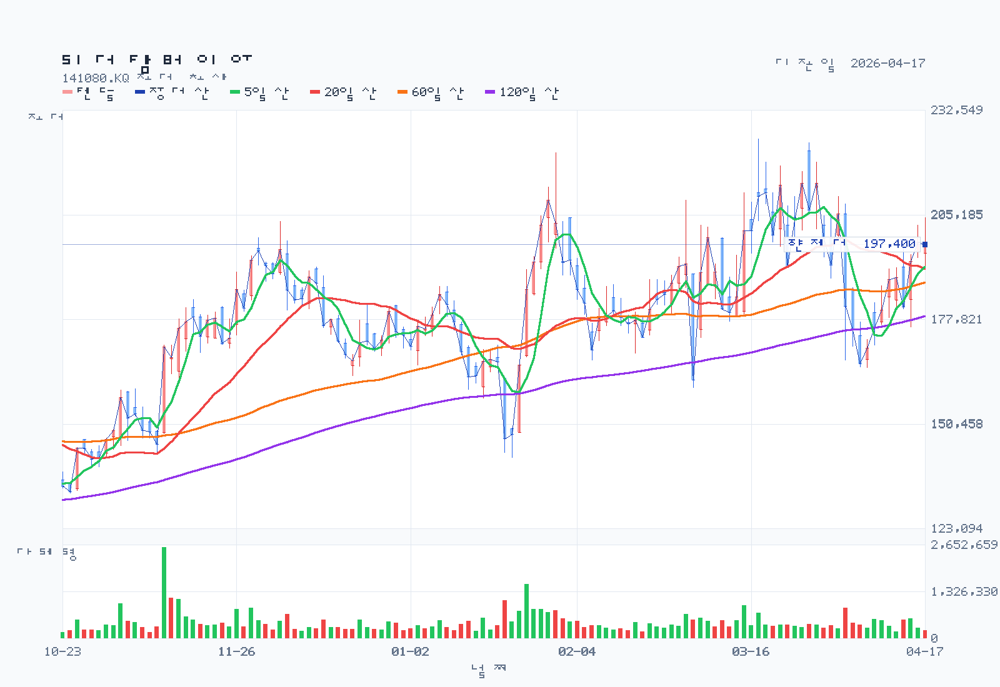
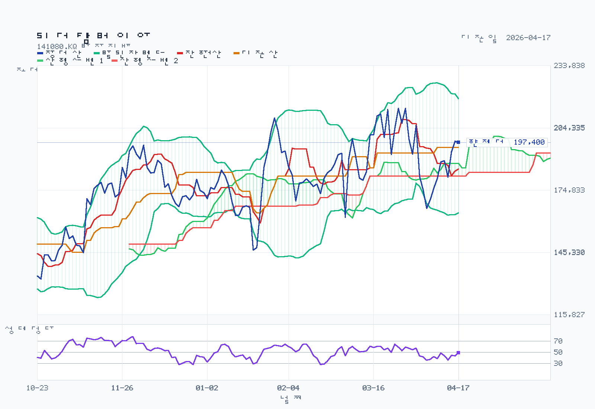
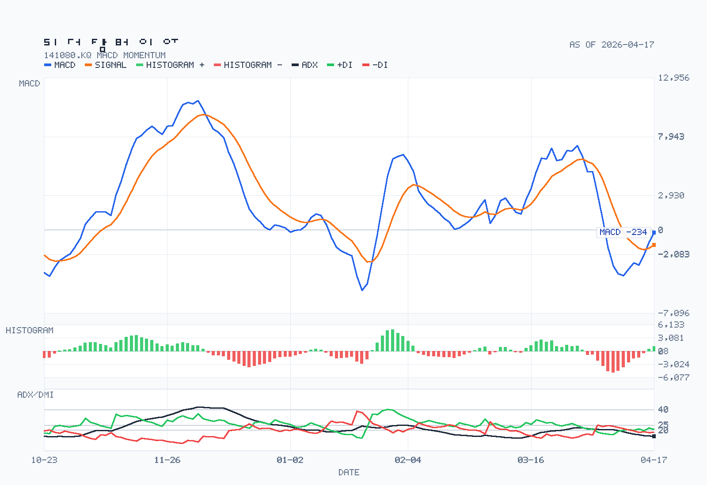

# 리가켐바이오 분석 예시

기준일: 2026-04-18

## Decision Frame

- 현재 판단: `플랫폼 질은 높게 보지만 지금은 추가 검증 후 보류`.
- 지금 가장 중요한 질문: `2025년 적자 확대를 감수할 만큼 파이프라인과 기술이전 구조가 빠르게 임상/마일스톤으로 전환되는가`, `현재 주가가 그 옵션가치를 얼마나 선반영했는가`.
- 왜 아직 강하게 못 가는가: `2025년 매출 1,416억원`은 나쁘지 않지만 `연구개발비 2,169억원`, `영업손실 -1,065억원`, `영업현금흐름 -1,245억원`이 보여주듯 아직은 `기술가치`가 `실적가치`를 압도하는 구간이다.
- 무엇이 먼저 확인돼야 하나: `LCB02A IND 이후 실제 임상 진입 속도`, `LCB71/LCB14의 중간 데이터 또는 파트너 진척`, `2026년 마일스톤 유입과 현금소진 통제`.

## Summary

리가켐바이오는 2026년 4월 18일 기준으로 여전히 `국내 최고급 ADC 플랫폼 옵션주`에 가깝다. DART 기준 2025년 매출의 `85.6%`가 기술이전에서 나왔고, 파이프라인도 `LCB14`, `LCB71`, `LCB02A`, `LCB97`처럼 명확한 축이 있다. 다만 같은 filing이 보여주는 현실은 더 거칠다. `영업손실 -1,065억원`, `순손실 -916억원`, `영업현금흐름 -1,245억원`이어서 지금 리가켐바이오는 `현재 이익`보다 `미래 임상과 마일스톤`에 가격이 붙는 종목이다.

결론은 단순하다. `질 좋은 플랫폼`이라는 점은 인정하지만, `쉽게 살 수 있는 가격`은 아니다. 현금 버퍼는 꽤 두껍지만, 2026~2027년 이벤트가 어긋나면 멀티플 압축이 커질 수 있다.

## Business and Thesis

리가켐바이오는 항체-약물접합체(`ADC`) 플랫폼과 후보물질을 기반으로 글로벌 제약사에 기술이전하고, 자체 및 파트너 임상을 통해 가치가 커지는 구조의 신약개발사다. 핵심은 `당장 얼마 버느냐`보다 `플랫폼이 반복적으로 deal을 만들고 임상 진입률을 높이느냐`다.

강점은 세 가지다. 첫째, 사업보고서상 유효한 라이선스아웃 계약 풀이 넓다. `Ono`, `SOTIO`, `Janssen`, `Iksuda`, `Pyxis` 등과 이어지는 구조는 단일 파이프라인 실패가 곧 회사 전체 실패로 직결되지 않게 해준다. 둘째, `LCB14`는 중국 `임상 3상`, 글로벌 `임상 1상`, `LCB71`은 `임상 1b상`까지 가 있어 최소한 일부 자산은 전임상 단계에 머물러 있지 않다. 셋째, `2026-04-14` 공시로 `LCB02A`가 글로벌 `1/2상 IND` 제출 단계로 올라오면서 `Topo1i payload` 확장 스토리가 생겼다.

약점도 명확하다. 리가켐바이오는 아직 `상업화된 반복 매출 기업`이 아니다. 2025년 매출이 늘었어도 손실이 더 크게 늘었다. 결국 이 회사는 `좋은 기술을 가진 적자 성장주`이고, 투자 포인트는 `기술의 질`이 아니라 `기술이 임상과 마일스톤으로 얼마나 빨리 전환되느냐`다.

## Revenue Mix

- 제품/사업 구조:
  2025년 연결 영업수익은 `기술이전 1,212억원`, `의약사업부문 204억원`이다. 비중으로는 `85.6% / 14.4%`다.
- 지역 믹스:
  수출 `85.6%`, 내수 `14.4%`다. 기술이전이 곧 해외 파트너 매출이라는 점에서 사실상 `수출 계약 매출` 회사다.
- 고객 집중도:
  `not separately disclosed`다. 즉 계약 상대방 리스트는 많지만, `2025년 실제 매출 인식` 기준의 고객 집중도는 공시로 잠기지 않았다.

핵심은 `매출이 많아 보인다`가 아니라 `매출의 대부분이 반복형 제품 판매가 아니라 계약/마일스톤 성격`이라는 점이다. 이건 upside도 크지만 quarter-to-quarter 변동성도 크다.

## What The Latest Results Say

2025년 연결 기준 영업수익은 `1,415.5억원`, 영업손실은 `-1,064.9억원`, 당기순손실은 `-915.5억원`이었다. 지배주주순손실은 `-742.8억원`, 기본 EPS는 `-2,042원`이다. 2024년 대비 매출은 늘었지만 수익성은 크게 악화됐다.

가장 중요한 원인은 연구개발비다. 연결 기준 연구개발비는 `2,170.98억원`으로 전년 `1,133.27억원` 대비 급증했고, `연구개발비/매출액 비율`은 `153.37%`였다. 영업손실 확대를 일시적 noise로 보기 어려운 이유다. 2025년 리가켐바이오는 `버는 회사`보다 `강하게 투자하는 회사`에 훨씬 가깝다.

현금흐름도 보수적으로 봐야 한다. 영업현금흐름은 `-1,245.3억원`이었고, 유형/무형 CAPEX를 더한 단순 FCF는 `약 -1,306억원`이다. 대신 연말 현금및현금성자산 `986억원`, 기타유동금융자산 `3,903억원`, 기타비유동금융자산 `41억원`으로 금융자산 풀은 `약 4,931억원`이다. 즉 `지금 당장 자금난`은 아니지만 `이벤트가 늦어질수록 burn`은 무시하기 어렵다.

## DART Recheck

| 주장 | 상태 | 확인값 또는 판단 | 출처 | 비고 |
| --- | --- | --- | --- | --- |
| 리가켐바이오는 기술이전 중심 사업모델이다 | confirmed | 기술이전 매출 `1,212억원`, 비중 `85.6%` | 사업보고서 `4. 매출 및 수주상황` | 2025 기준 |
| 2025년에도 본업 수익성은 견조하다 | contradicted | 영업손실 `-1,065억원` | 사업보고서 `2-2. 연결 손익계산서` | 적자 확대 |
| 현금 버퍼는 아직 충분하다 | partially supported | 금융자산 풀 `약 4,931억원`, CFO `-1,245억원` | 사업보고서 `연결 재무상태표`, `현금흐름표` | 버퍼는 크지만 burn도 큼 |
| 핵심 파이프라인은 이미 대부분 임상 단계다 | partially supported | `LCB14`, `LCB71` 임상, `LCB97`, `LCB02A`는 2025말 전임상 | 사업보고서 `6. 주요계약 및 연구개발활동` | 자산별 편차 큼 |
| 고객 집중도는 공시로 확인 가능하다 | not separately disclosed | 관련 표 미확인 | 사업보고서 전체 점검 | 추정 금지 |
| 2025말 기준 LCB02A는 이미 임상 단계다 | contradicted | 사업보고서 기준 `전임상`, 이후 `2026-04-14` IND 제출 | 사업보고서 / 회사 공시정보 | 기준시점 구분 필요 |

## Street / Alternative Views

- `Specialist media`: 조선비즈는 `천억 적자에도 2천억 R&D 베팅`이라는 프레임으로 리가켐바이오를 해석했다. 이 해석은 DART와도 맞는다. 실제 2025 손익은 나빴지만 회사는 후퇴보다 파이프라인 재정비와 추가 기술도입 쪽을 선택했다.
- `Company-linked interpretation`: `2026-04-14` LCB02A 글로벌 `1/2상 IND` 제출 기사와 공시는 회사가 `payload diversification`을 강조하고 있음을 보여준다. 이건 단순 보도자료가 아니라, 지금 밸류가 왜 다시 붙는지를 설명하는 핵심 이벤트다.
- `What still runs ahead of the filing`: 시장은 누적 기술이전 계약 규모와 파이프라인 수를 보고 `플랫폼 기업 프리미엄`을 준다. 그러나 filing이 직접 보여주는 것은 아직 `반복형 이익`이 아니라 `높은 투자와 큰 변동성`이다.
- `Independent view`: `kr-naver-blogger` 자동 후보화는 현재명 기준으로 비었지만, `kr-naver-insight`를 alias(`레고켐바이오`, `리가켐바이오사이언스`)와 수동 blogger ID로 다시 돌리자 `foreconomy`, `onejejuwave`, `jojzzang77`에서 `11건`이 잡혔다. 네이버 장문 블로그의 공통 톤은 `ADC 쇼티지`, `시간은 우리 편`, `LCB84/LCB71/LCB14의 옵션가치`에 강하게 베팅하는 쪽이며, 특히 `onejejuwave`는 `2025년 가치 점프`와 `LCB84 임상 진전`을 핵심 모멘텀으로 본다. 다만 이런 시각은 filing보다 훨씬 낙관적이어서, 보조 자료로는 유용하지만 최종 판단은 DART와 계약 진척으로 다시 눌러봐야 한다. 관련 산출물은 `naver-posts.json`, `naver-insights.md`에 남겼다.

## Current Valuation Snapshot

| Metric | Value | Date | Note |
| --- | --- | --- | --- |
| Current price | `197,400원` | 2026-04-17 | chart API 종가 |
| Market cap | `약 7.23조원` | 2026-04-17 | 현재가 × 발행주식수 |
| Trailing PER | `N.M.` | 2026-04-17 / 2025 실적 | EPS `-2,042원` |
| Forward PER | `not cleanly verifiable` | 2026-04-18 | 공식 컨센서스 부재 |
| PBR / P/B | `약 14.2배` | 2026-04-17 / 2025말 | 지배지분 기준 |
| EV/EBITDA | `N.M.` | Mixed date | 손실권이라 배수 해석 부적절 |
| FCF yield | `약 -1.8%` | 2025 CF / 2026-04-17 MCAP | 단순 FCF 기준 |
| ROE | `약 -14.6%` | 2025 결산 | 지배주주순손실 / 지배지분 |
| Net cash | `strong but not standardized` | 2025-12-31 | 금융자산 풀 대비 부채 부담 낮음 |

이 표가 말하는 건 단순하다. 리가켐바이오는 `실적형 가치주`가 아니라 `임상/기술이전 옵션주`다. PER과 EV/EBITDA가 제대로 작동하지 않는 이유도 여기 있다. 지금 시장은 `현재 적자`보다 `미래 milestone`에 값을 매기고 있다.

## Historical Valuation Bands

이번 메모에서는 `3~5년 PER/EV/EBITDA/PBR 밴드`를 강하게 쓰지 않았다. 이유는 세 가지다.

- `PER`, `EV/EBITDA`는 손실 구간이 길어 시계열 비교가 왜곡되기 쉽다.
- 사업모델이 `의약 유통`이 아니라 `ADC 기술이전 플랫폼`으로 더 선명해지면서 과거 멀티플의 의미가 약해졌다.
- 현재 주가를 설명하는 핵심은 밴드 하단/상단보다 `임상과 마일스톤의 옵션가치`다.

따라서 이 종목은 `역사적 평균 대비 싸다/비싸다`보다 `어떤 이벤트가 지금 가격을 정당화하느냐`로 보는 편이 낫다.

## Chart and Positioning

차트는 `2026-04-17` 종가 기준으로 다시 생성했다. 현재 종가는 `197,400원`, `MA5 191,640원`, `MA20 191,050원`, `MA60 187,462원`, `MA120 178,673원`이다. 볼린저 중단은 `191,050원`, RSI14는 `49.26`, MACD는 `bullish / below-zero`, ADX14는 `14.01`이다.

### Rule Screen

- Minervini Trend Template: `incomplete`
- KRX 52주 신고가 리더십 점수: `partial` (`20/35 visible points`)

| 항목 | 상태 | 세부 |
| --- | --- | --- |
| Minervini / 현재가 > SMA50/SMA150/SMA200 | pass | 현재가 `197,400` / SMA50 `188,704` / SMA150 `172,459` / SMA200 `163,819` |
| Minervini / SMA150 > SMA200 | pass | 장기 정배열 유지 |
| Minervini / SMA50 > SMA150 and SMA200 | pass | 중기 추세 우위 |
| Minervini / SMA200 최근 20거래일 상승 | pass | `163,819 > 155,860` |
| Minervini / RS percentile >= 70 | pass | `RS percentile 78.2` |
| Leadership / 추세·거래량 확인 | `10/15` | 거래량은 `20일 평균의 57.9%`로 약함 |

해석은 `정배열은 유지되지만 모멘텀 확신은 아직 약한 반등 구간`이다. `2026-04-02` 계약 해지 공시로 급락한 뒤 회복 중이며, 단기 지지선은 `187,575원`, 강한 경계선은 `165,200원`, 본격 재돌파 체크는 `224,000원`이다. 차트만 보면 `bullish continuation` 쪽이지만 거래량이 가볍고 ADX가 낮아 `이벤트 의존 반등` 성격이 강하다.

## Governance and Structure

- 최대주주등은 `PAN ORION CORP. LIMITED 외` `29.63%`다. 오리온 계열 자본이 들어오면서 `창업자 단독` 구조는 아니다.
- 대표이사 `김용주`가 이사회 의장을 겸직한다. 창업자 리더십은 강점일 수 있지만, 소수주주 관점에서는 견제 장치가 약할 수 있다.
- 이사회는 `사내 5명`, `사외 2명`으로 사외 비중이 `28.6%`에 그친다. 바이오 성장주치고 아주 나쁜 구조는 아니지만, 독립성 프리미엄을 줄 정도도 아니다.
- 사내이사 중 `허인철`, `김형석`, `담서원`은 오리온 계열 인사다. 이는 사업적 후원과 재무 안정성에는 긍정적일 수 있지만, 자본 배분 우선순위가 항상 minority-friendly라고 단정하긴 어렵다.
- 자기주식은 `170,790주`, 보유비율 `0.47%`로 크지 않다. 배당은 의미 있는 주주환원 축으로 보기 어렵다.

## Catalysts

- `LCB02A` IND 승인과 첫 환자 투여 일정 확정
- `LCB71` 임상 1b 업데이트와 추가 파트너 이벤트
- `LCB14` 중국/글로벌 임상 진전
- `2026` 추가 기술이전 또는 milestone 유입
- 2025년 대비 손실 폭과 현금소진 속도 완화 여부

## Risks

- 매출의 대부분이 기술이전 성격이라 분기 변동성이 매우 크다
- `영업손실 -1,065억원`, `영업현금흐름 -1,245억원`이 지속되면 현금 버퍼도 빠르게 줄 수 있다
- 핵심 파이프라인 임상이 지연되거나 실패하면 현재 밸류 프레임이 흔들린다
- 시장이 누적 계약 headline을 실제 반복 현금흐름처럼 과대평가할 수 있다
- 오리온/창업자 중심 거버넌스는 전략적으로는 강하지만 minority check 측면에서는 제한적일 수 있다

## Uncomfortable Questions

- 시장은 `누적 기술이전 계약 규모`를 너무 쉽게 `현금화 가능 가치`로 착각하고 있지 않은가?
- `LCB14`, `LCB71`, `LCB02A` 중 어느 하나가 어긋나도 현재 멀티플이 유지될 수 있는가?
- 2025년 적자 확대가 `미래를 위한 투자`인지, 아니면 플랫폼 확장 과정의 구조적 비용상승인지 아직 확신할 수 있는가?
- 오리온이 들어오며 재무 안정성은 좋아졌지만, 소수주주에게 중요한 건 `성장`인지 `희석 없는 성장`인지 아닌가?

## Decision-Changing Issues

1. `2026~2027` 마일스톤 유입이 실제로 현금 burn을 상쇄하는지.
2. `LCB02A`, `LCB71`, `LCB14` 중 최소 하나가 임상적으로 확실한 de-risking을 보여주는지.
3. 기술이전 매출이 `headline`이 아니라 `반복 가능한 사업모델`로 보일 만큼 deal cadence가 이어지는지.
4. 추가 증자 없이 현재 현금 풀로 핵심 이벤트까지 갈 수 있는지.

## Structured Stance

현재 스탠스는 `추가 검증 후 보류`다. 이유는 명확하다. 리가켐바이오는 질 낮은 바이오주가 아니라 오히려 `질 좋은 플랫폼주`에 가깝다. 그러나 현재 가격은 이미 `좋은 기술`을 넘어 `좋은 임상 결과와 좋은 deal cadence`까지 꽤 많이 기대하고 있다.

더 좋아지려면 `LCB02A 임상 진입`, `LCB71/LCB14 추가 진전`, `2026년 milestone 유입`이 확인돼야 한다. 더 나빠지려면 그 반대면 충분하다. 즉 리가켐바이오는 지금 `싼 주식`이 아니라 `맞아야 더 갈 수 있는 주식`이다.

## Follow-up Research Prompts

- `LCB02A`의 IND 제출 이후 실제 승인 및 첫 환자 투여 일정은 얼마나 빠른가?
  why it matters: 현재 밸류의 새로운 상방 논리는 이 자산의 임상 진입 속도와 연결돼 있다.
- `LCB71`과 `LCB14` 중 어느 자산이 가장 먼저 valuation de-risking을 만들 수 있는가?
  why it matters: 플랫폼 가치는 결국 대표 자산의 임상 진전이 증명한다.
- 2026년 기술이전 마일스톤 인식 가능 금액과 시점은 어느 정도로 볼 수 있는가?
  why it matters: 적자와 burn을 버틸 수 있는지 판단하려면 이벤트 시점이 중요하다.
- `2025` 대규모 연구개발비 증가는 어떤 프로그램에 가장 많이 투입됐는가?
  why it matters: 비용이 미래 가치로 연결되는지 확인해야 한다.
- 오리온 지분과 이사회 영향력이 향후 증자, 계약, 파이프라인 우선순위에 어떤 식으로 작동할까?
  why it matters: 성장주일수록 거버넌스는 upside보다 downside에서 더 크게 작동한다.

## Sources

- [사업보고서](https://dart.fss.or.kr/dsaf001/main.do?rcpNo=20260323001538)
- [사업보고서 4. 매출 및 수주상황](https://dart.fss.or.kr/report/viewer.do?rcpNo=20260323001538&dcmNo=11168406&eleId=13&offset=158354&length=18266&dtd=dart4.xsd)
- [사업보고서 6. 주요계약 및 연구개발활동](https://dart.fss.or.kr/report/viewer.do?rcpNo=20260323001538&dcmNo=11168406&eleId=15&offset=181567&length=100238&dtd=dart4.xsd)
- [사업보고서 2-2. 연결 손익계산서](https://dart.fss.or.kr/report/viewer.do?rcpNo=20260323001538&dcmNo=11168406&eleId=19&offset=322170&length=285567&dtd=dart4.xsd)
- [사업보고서 4. 주식의 총수 등](https://dart.fss.or.kr/report/viewer.do?rcpNo=20260323001538&dcmNo=11168406&eleId=7&offset=33480&length=65648&dtd=dart4.xsd)
- [사업보고서 1. 임원 및 직원 등의 현황](https://dart.fss.or.kr/report/viewer.do?rcpNo=20260323001538&dcmNo=11168406&eleId=135&offset=5316316&length=43274&dtd=dart4.xsd)
- [회사 주가정보](https://ligachembio.com/invest/stock.php?lang=k)
- [회사 공시정보](https://ligachembio.com/invest/disclosure.php?lang=k)
- [조선비즈 2026-04-08](https://biz.chosun.com/science-chosun/bio/2026/04/08/MGCBAYOFFVHLZO4IH6GRDWD25M/?outputType=amp)
- [한국경제 2026-04-14](https://www.hankyung.com/article/202604149355P)
- [FnGuide 지분분석](https://comp.fnguide.com/SVO2/ASP/SVD_shareanalysis.asp?NewMenuID=109&gicode=A141080)
