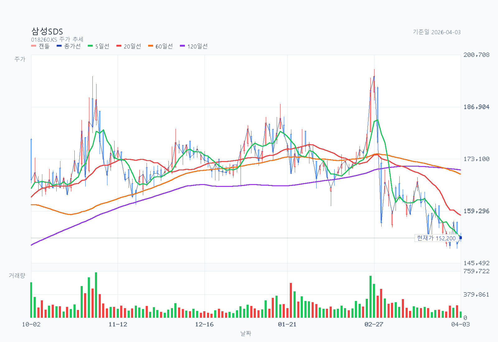
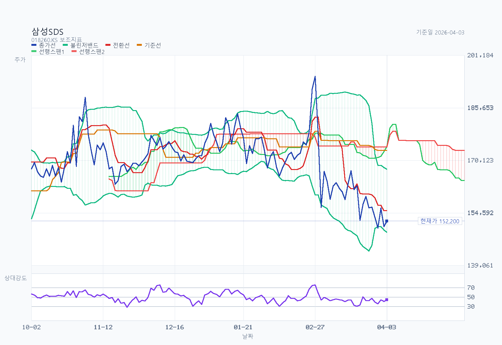

# 삼성SDS

## Summary

기준일: `2026-04-04`

삼성SDS는 `클라우드·생성형AI가 커지고 있는 IT서비스 회사`이지만, 아직 `물류 매출 비중이 더 큰 혼합형 사업구조`를 갖고 있다. `2025년 매출 13조 9,299억원`, `영업이익 9,571억원`으로 실적은 방어적이었고, 핵심 포인트는 `클라우드 연매출 2조 6,802억원`, `IT서비스 내 클라우드 비중 41%`까지 올라왔다는 점이다. 반면 주가는 `2026-04-03 종가 152,200원` 기준으로 중기 하락 추세가 아직 살아 있어, 지금은 `AI/클라우드 구조 전환의 펀더멘털`과 `차트/센티먼트 약세`가 동시에 존재하는 구간으로 보는 편이 맞다.

## Business and Thesis

삼성SDS는 크게 `IT서비스`와 `물류` 두 축으로 구성된다. IT서비스 안에서는 `클라우드(CSP/MSP/SaaS·AI)`가 가장 중요한 성장축이고, 물류는 `4PL 기반 디지털 물류`와 `첼로스퀘어`가 핵심이다. 최근 회사가 반복해서 강조하는 방향은 `기업 AX`, `AI 풀스택`, `OpenAI 파트너십`, `AI 데이터센터`, `DBO`다.

투자 포인트는 세 가지다. 첫째, IT서비스 안에서 저성장 전통 SI/ITO 비중이 줄고 `클라우드와 생성형AI` 비중이 커지고 있다. 둘째, `물류 부문`은 외부 변수가 크지만 첼로스퀘어 같은 플랫폼형 매출이 누적되면 예전보다 질이 좋아질 수 있다. 셋째, `2026-03-19 기업가치 제고 계획`이 AI 인프라 투자, 배당 확대, 현금성 자산 활용을 명시하면서 자본배치 스토리도 붙기 시작했다.

반대로 제약도 분명하다. 물류 비중이 여전히 절반을 넘기 때문에 `AI 클라우드 pure-play`처럼 밸류에이션을 받기 어렵고, 실제 실적은 해상 운임과 물동량, 고객 IT투자 사이클에 계속 흔들린다.

## Revenue Mix

### 연간 구조

| 항목 | 2025 매출 | 비중 | 기준 | 비고 |
| --- | --- | --- | --- | --- |
| 전체 매출 | `13조 9,299억원` | `100.0%` | 회사 공식 잠정실적 | 2026-01-22 발표 |
| IT서비스 | `6조 5,435억원` | `47.0%` | 회사 공식 잠정실적 | 전년 대비 `+2.2%` |
| 물류 | `7조 3,864억원` | `53.0%` | 회사 공식 잠정실적 | 전년 대비 `-0.5%` |
| 클라우드 | `2조 6,802억원` | 전체의 `19.2%` | 회사 공식 잠정실적 | 전년 대비 `+15.4%` |
| 비클라우드 IT서비스 | `3조 8,633억원` | 전체의 `27.7%` | `IT서비스 - 클라우드` 파생 | ERP, SCM, SI, ITO 등 포함 |

핵심은 `클라우드가 전체 매출의 19.2%`, `IT서비스 매출의 41.0%`까지 커졌다는 점이다. 즉 삼성SDS는 아직 `물류가 더 큰 회사`이지만, IT서비스 내부만 보면 `클라우드 중심 회사`로 구조가 바뀌고 있다.

### 분기별 구조 변화

| 구분 | 1Q25 | 2Q25 | 3Q25 | 4Q25 | 비고 |
| --- | --- | --- | --- | --- | --- |
| 전체 매출 | `3조 4,898억원` | `3조 5,120억원` | `3조 3,913억원` | `3조 5,368억원` | 계절성보다 물류 영향이 큼 |
| IT서비스 매출 | `1조 6,004억원` | `1조 6,784억원` | `1조 5,957억원` | `not separately disclosed` | 4Q는 연간 수치만 확보 |
| 물류 매출 | `1조 8,894억원` | `1조 8,336억원` | `1조 7,956억원` | `not separately disclosed` | 4Q는 연간 수치만 확보 |
| 클라우드 매출 | `6,529억원` | `6,652억원` | `6,746억원` | `not separately disclosed` | 4Q는 연간 수치만 확보 |

분기 데이터를 보면 `클라우드 매출은 꾸준히 증가`, 반면 `물류 매출은 1Q 조기선적 효과 이후 2Q~3Q 둔화`가 뚜렷하다. 회사의 체질이 좋아지고는 있지만, 아직 연결 실적을 좌우하는 것은 `물류 변동성`이다.

### 지역·고객·집중도

- 지역별 매출 비중: `not separately disclosed`
- 주요 고객별 매출 비중: `not separately disclosed`
- 다만 회사는 삼성그룹 핵심 계열 IT 수요를 바탕으로 성장해 왔고, 최근에는 `공공·금융·제조 대외사업`과 `첼로스퀘어` 확대로 외부 비중 확대를 강조하고 있다.

## What The Latest Results Say

`2025년` 실적의 핵심은 `낮은 전사 성장률 속에서도 클라우드가 구조적으로 커졌다`는 점이다. 전체 매출은 `+0.7%`, 영업이익은 `+5.0%`였는데, 그 안쪽을 보면 `IT서비스 +2.2%`, `클라우드 +15.4%`, `물류 -0.5%`였다. 즉 성장의 엔진은 명확히 `클라우드/AI` 쪽이었다.

분기 흐름도 비슷하다. `1Q25`에는 미국 상호관세 발효 전 조기 선적 수요 덕분에 물류가 강했고, `2Q25`에는 공공 클라우드 확대와 생성형 AI 수주가 반영됐다. `3Q25`에는 물류가 `-7.4% YoY`로 둔화했지만, 클라우드는 `6,746억원`으로 증가세를 유지했다. `4Q25`에는 전사 매출이 `-2.9% YoY`로 줄었지만 영업이익은 `+6.9% YoY`였다. 해석상 `저마진 물류보다 고부가 IT서비스·클라우드 비중`이 서서히 좋아진 것으로 읽힌다.

회사가 직접 제시한 2026 방향성도 분명하다. `AI 인프라(GPUaaS, 데이터센터, DBO)`, `AI 플랫폼(OpenAI 리셀러, FabriX)`, `AI 솔루션(Brity Copilot/Works)`을 묶은 `AI 풀스택`을 통해 대외사업 비중을 키우겠다는 것이다. `2026-03-19 기업가치 제고 계획`은 이 방향을 자본배치와 묶어서 보여준 첫 문서라는 점에서 의미가 있다.

## Street / Alternative Views

- `Confirmed by filing / company source`: 2025년 실적은 `물류 정체 + 클라우드 성장` 구도였다. 클라우드 연매출 `2조 6,802억원`, IT서비스 내 비중 `41%`, 배당 `주당 3,190원`, AI 데이터센터·DBO·OpenAI 파트너십 확대 계획은 모두 회사 공식 자료에 있다.
- `Street view`: 시장은 삼성SDS를 완전한 AI 소프트웨어주보다는 `현금이 많고 배당이 붙는 IT서비스/물류 복합주`로 보는 경향이 강하다. 그래서 AI 뉴스가 나와도 밸류에이션 리레이팅은 제한적이라는 시각이 많다.
- `Specialist media`: `국가 AI 컴퓨팅센터`, `구미 AI 데이터센터`, `OpenAI 리셀러 계약`은 삼성SDS의 `AI 인프라+플랫폼` 옵션 가치를 키운다는 해석이 많다. 다만 아직 이게 실적에 얼마나 빨리 반영될지는 불확실하다.
- `Independent view`: 지금 스토리는 `클라우드 회사로 변하는 삼성SDS`에 가깝지, 이미 완전히 변한 삼성SDS는 아니다. 따라서 투자 아이디어는 `구조 전환의 중간 구간`에 베팅하는 것에 가깝다.

## Current Valuation Snapshot

아래 표에서 `현재가`와 `시가총액`은 `2026-04-03` 종가 기준이고, 일부 멀티플은 `2026-02-13` 제3자 스냅샷(Valueline)에서 price-adjusted derivation을 사용했다.

| 항목 | 값 | 기준일 | 출처 | 비고 |
| --- | --- | --- | --- | --- |
| 현재가 | `152,200원` | 2026-04-03 | 1년 일봉 데이터 | 최신 종가 |
| 발행주식수 | `약 77,378천주` | 2026-02-13 snapshot | Valueline 시가총액·주가 역산 | 제3자 스냅샷 기준 |
| 시가총액 | `11.78조원` | 2026-04-03 | 현재가 × 발행주식수 | 파생 |
| Trailing PER | `약 15.35배` | 2026-04-03 price-adjusted | Valueline 2026-02-13 PER `17.19배` 조정 | 제3자 스냅샷 기반 파생 |
| Forward PER | `not separately disclosed` |  |  | 현재 source set 기준 |
| P/B | `약 1.22배` | 2026-04-03 price-adjusted | Valueline 2026-02-13 P/B `1.37배` 조정 | 제3자 스냅샷 기반 파생 |
| EV/EBITDA | `not separately disclosed` |  |  | 현재 source set 기준 |
| FCF yield | `not separately disclosed` |  |  | 현금흐름·CAPEX 상세 재구성이 추가로 필요 |
| 현금배당 | `주당 3,190원` | 2026-01-22 결정 | 회사 공식 발표 | 전년 `2,900원` 대비 `+10%` |
| 배당수익률 | `약 2.10%` | 2026-04-03 | DPS / 현재가 | 파생 |

절대적으로 비싸다고 보긴 어렵다. 다만 `AI/클라우드 pure-play` 프리미엄을 받기엔 물류 비중이 너무 크고, 반대로 전통적 SI주로만 보기엔 클라우드 질적 변화가 진행 중이다. 현재 밸류에이션은 `완전한 낙관도, 완전한 실망도 아닌 중간값`에 가깝다.

## Historical Valuation Bands

현재 확보한 공식·준공식 source set만으로는 `3~5년 EV/EBITDA / PER / P/B 시계열`을 신뢰도 있게 재구성하지 못했다. 따라서 이 메모에서는 밴드 차트 대신 현재 스냅샷 해석만 유지한다.

- 가능한 해석: 현재 P/B가 `1배 초중반` 수준이라는 점은 성장주보다는 `현금창출+사업전환` 혼합주에 가까운 평가를 시사한다.
- 보완 필요: KRX/FnGuide/직접 수집한 연도별 멀티플 시계열이 있으면 밴드 섹션을 별도로 업데이트할 수 있다.

## Chart and Positioning

위 두 이미지는 `2026-04-05`에 재생성했고, 데이터 기준은 `2026-04-03`까지의 1년 일봉이다. PNG 상단 제목에는 종목명 `삼성SDS`가 직접 표시되도록 생성했다. 첫 번째 이미지는 `캔들스틱`, `종가선`, `5/20/60/120일선`, `거래량`을, 두 번째 이미지는 `종가선`, `볼린저밴드`, `일목균형표`, `RSI14`를 보여준다.

차트 지표는 `5일선 152,440원`, `20일선 158,200원`, `60일선 169,092원`, `120일선 170,217원`, `볼린저 상단 167,536원`, `볼린저 하단 148,864원`, `전환선 155,250원`, `기준선 173,100원`, `현재 구름대 A 174,225원`, `현재 구름대 B 174,150원`, `RSI14 44.30`, `거래량/20일 평균 60.2%`, `20일 돌파 레벨 168,500원`, `20일 이탈 레벨 149,300원`이었다.

해석은 아직 `약세 지속` 쪽이다. 현재 주가는 `5일선`, `20일선`, `60일선`, `120일선` 아래에 있고, 일목균형표 기준으로도 `below-cloud`다. RSI는 `44.30`으로 과매도는 아니지만 추세 전환 신호도 아니다. 단기적으로는 `149,300원` 부근 방어 여부, 상단으로는 `158,200원`과 `168,500원` 회복 여부가 중요하다. 차트만 놓고 보면 지금은 `선행 매수보다 확인 매수`가 더 맞는 자리다.

## Governance and Structure

- 지배구조: 삼성SDS는 삼성그룹 계열의 운영회사다. 현 source set에서는 최신 대주주 지분표를 직접 회수하지 못했지만, 시장은 여전히 `그룹 계열 IT서비스 회사` 프레임으로 본다.
- 이사회 구성: 회사 영문 거버넌스 페이지 기준 이사회는 `사내이사 3인(이준희, 안정태, 이호준)`과 `사외이사 4인(신현한, 이인실, 문무일, 이재진)`으로 구성된다.
- 이사회 의장: `이준희 대표이사`가 이사회 의장을 겸임한다. 따라서 경영진과 이사회 의장이 분리된 구조는 아니다.
- 감사위원회: `신현한`, `이인실`, `문무일` 등 사외이사 3인으로 구성된다.
- 주주환원: 회사는 `2026-01-22` 이사회 결의로 배당금을 `주당 3,190원`으로 `10% 인상`했다. `기업가치 제고 계획`에서도 배당규모 확대를 명시했다는 점은 긍정적이다.
- 왜 중요한가: 삼성SDS는 성장주 내러티브를 말하지만 시장은 여전히 `그룹 계열 IT서비스 회사`로 본다. 따라서 소수주주 입장에서는 `현금 활용`, `배당 확대`, `AI 투자와 주주환원의 균형`, 그리고 `사외이사 중심 견제의 실효성`이 핵심 관전 포인트다.

## Catalysts

- `1Q26 실적발표`: 클라우드 성장 지속과 물류 회복 여부가 동시에 확인되는 첫 체크포인트
- `기업가치 제고 계획` 후속 실행: 배당 확대, AI 투자, 현금 활용이 실제 액션으로 이어지는지
- `OpenAI 리셀러` 및 `FabriX/Brity` 대외 레퍼런스 확대
- `국가 AI 컴퓨팅센터`, `구미 AI 데이터센터`, `DBO` 관련 수주/착공/고객 발표
- 첼로스퀘어 고객 증가가 매출/이익 질 개선으로 이어지는지

## Risks

- 물류 부문 비중이 여전히 절반 이상이라 해상 운임·관세·물동량 영향이 크다
- 클라우드/AI 성장률이 높아도 절대 규모가 아직 전사 리레이팅을 단독으로 이끌 만큼 충분치 않을 수 있다
- AI 인프라 투자 확대가 자본효율 저하로 이어질 수 있다
- 삼성그룹 내부 수요 의존도가 시장이 기대하는 만큼 빠르게 낮아지지 않을 수 있다
- 차트상 중기 하락 추세가 살아 있어 실적 개선에도 주가 반응이 늦을 수 있다

## What Would Change My Mind

- `bullish 강화`: 클라우드 매출이 `연 3조원 이상`으로 커지고, IT서비스 내 비중이 `45~50%`까지 올라가며, 물류 둔화에도 전사 이익이 안정적으로 늘어나면 더 강하게 볼 수 있다.
- `neutral -> bearish`: 물류 둔화가 심해지고 클라우드 성장도 한 자릿수로 둔화해 `전사 매출/이익 정체`가 이어지면 구조 전환 프리미엄은 약해진다.
- `valuation rerating 확인`: AI 데이터센터·OpenAI·공공 AI 프로젝트가 단순 뉴스가 아니라 실적 기여로 확인되면 멀티플 확장 논리가 강해진다.
- `기술적 관점 개선`: 주가가 `20일선`과 `168,500원`을 회복하고 거래량이 동반되면 수급 해석도 달라질 수 있다.

## Additional Research Questions

- `클라우드 2.68조원 중 CSP/MSP/SaaS 비중은 얼마나 되는가?`
  why it matters: 클라우드 내부 믹스에 따라 삼성SDS의 질적 밸류에이션이 달라진다.
- `OpenAI 리셀러 계약이 2026년 매출에 실제로 얼마나 반영될 수 있는가?`
  why it matters: AI 플랫폼 스토리가 뉴스에 그칠지 실적으로 이어질지 판단해야 한다.
- `AI 데이터센터와 DBO 사업의 투자규모, 수익률, 회수기간은 어느 수준인가?`
  why it matters: 성장투자가 자본효율을 높일지 훼손할지 가르는 포인트다.
- `첼로스퀘어 매출과 영업레버리지는 어느 단계에 와 있는가?`
  why it matters: 물류 부문이 단순 운임 변동 사업인지 플랫폼 사업으로 진화하는지 판단할 수 있다.
- `삼성 계열 내부 매출 비중은 최근 몇 년간 실제로 낮아지고 있는가?`
  why it matters: 대외사업 확대가 구조적 변화인지 확인해야 한다.
- `순현금 규모와 활용 우선순위는 배당·M&A·CAPEX 중 어디에 가까운가?`
  why it matters: value-up 계획의 실효성을 좌우한다.
- `현 이사회 구조에서 소수주주 관점의 견제장치는 충분한가?`
  why it matters: 그룹 계열사 할인 해소 가능성을 평가하는 데 필요하다.
