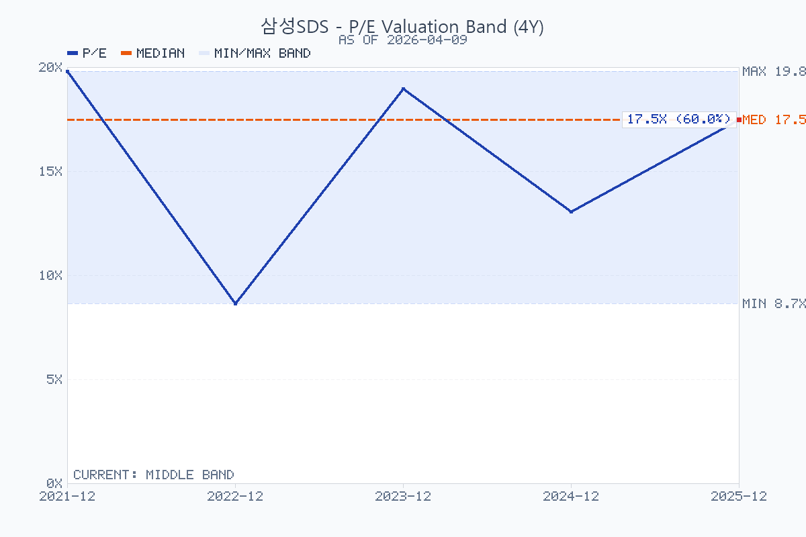
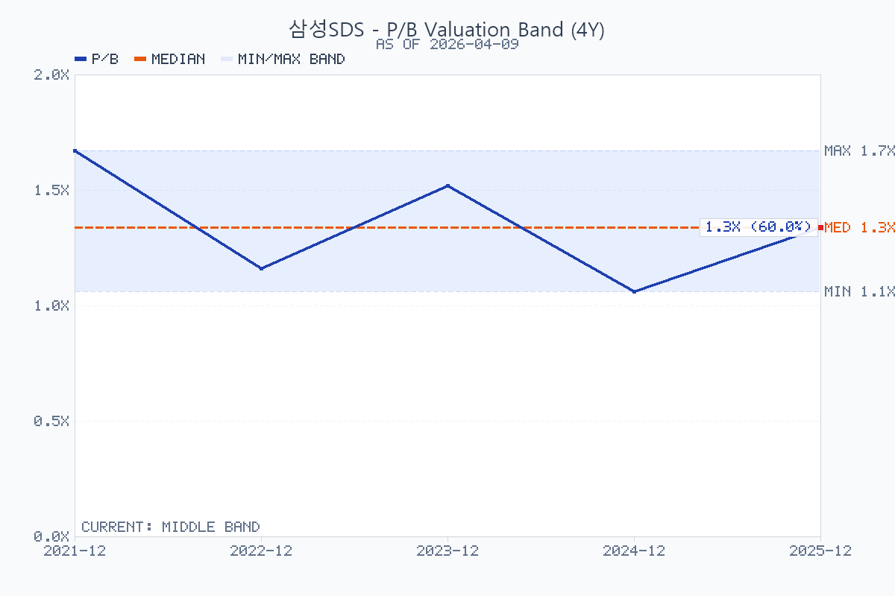

# 삼성SDS

## Summary

기준일: `2026-04-09`
최근 업데이트일: `2026-04-15`

삼성SDS는 `클라우드·생성형AI가 커지고 있는 IT서비스 회사`이지만, 아직 `물류 매출 비중이 더 큰 혼합형 사업구조`를 갖고 있다. `2025년 매출 13조 9,299억원`, `영업이익 9,571억원`으로 실적은 방어적이었고, 핵심 포인트는 `클라우드 연매출 2조 6,802억원`, `IT서비스 내 클라우드 비중 41%`까지 올라왔다는 점이다. 반면 주가는 `2026-04-09 종가 148,300원` 기준으로 다시 단기 저점권을 시험하고 있어, 지금은 `AI/클라우드 구조 전환의 펀더멘털`과 `차트/센티먼트 약세`가 동시에 존재하는 구간으로 보는 편이 맞다.

`2026-04-15` KKR 전환사채 공시 이후 판단은 한 단계 바뀐다. 1.22조원 CB는 희석 우려가 있지만, 전환가액 `180,000원`, 주가하락 리픽싱 없음, 원칙적 6년 양도 제한, KKR의 6년 자문 역할을 감안하면 단순 재무조달보다 `AI 인프라/M&A 실행력에 대한 외부 검증`에 가깝다. 다만 오늘 종가 `178,600원` 기준 trailing PER는 약 `18.2배`까지 올라왔고, 이제는 뉴스 프리미엄이 실적과 자본효율로 확인돼야 하는 구간이다.

## Decision Frame

- `핵심 질문`: KKR은 왜 삼성SDS에 투자했는가? 공시상으로는 2.5% 쿠폰과 전환권이 결합된 장기 CB이고, 회사 설명상으로는 AI 인프라·AX·M&A·글로벌 진출에 KKR 네트워크를 붙이는 전략적 자본이다.
- `긍정적 변화`: KKR은 전환가 `180,000원`에 가까운 주가에서 6년 장기 협력 구조를 받아들였다. 이는 삼성SDS의 순현금, 그룹 수요 기반, AI 인프라 옵션, M&A 여지에 대한 외부 투자자 검증으로 읽을 수 있다.
- `남은 검증`: 조달자금의 공시상 세부 사용 목적은 아직 `운영자금`으로만 넓게 적혀 있다. AI 데이터센터, 피지컬 AI, 스테이블코인, M&A가 실제 ROIC를 높이는지는 후속 공시와 집행 내역으로 확인해야 한다.
- `현재 결론`: `추가 검증 후 긍정 보류`. 이벤트 자체는 리레이팅 재료지만, 주가가 하루 만에 전환가 근처로 올라왔기 때문에 지금부터는 실행 리스크와 희석을 같이 봐야 한다.

## Business and Thesis

삼성SDS는 크게 `IT서비스`와 `물류` 두 축으로 구성된다. IT서비스 안에서는 `클라우드(CSP/MSP/SaaS·AI)`가 가장 중요한 성장축이고, 물류는 `4PL 기반 디지털 물류`와 `첼로스퀘어`가 핵심이다. 최근 회사가 반복해서 강조하는 방향은 `기업 AX`, `AI 풀스택`, `OpenAI 파트너십`, `AI 데이터센터`, `DBO`다.

투자 포인트는 세 가지다. 첫째, IT서비스 안에서 저성장 전통 SI/ITO 비중이 줄고 `클라우드와 생성형AI` 비중이 커지고 있다. 둘째, `물류 부문`은 외부 변수가 크지만 첼로스퀘어 같은 플랫폼형 매출이 누적되면 예전보다 질이 좋아질 수 있다. 셋째, `2026-03-19 기업가치 제고 계획`이 AI 인프라 투자, 배당 확대, 현금성 자산 활용을 명시하면서 자본배치 스토리도 붙기 시작했다.

반대로 제약도 분명하다. 물류 비중이 여전히 절반을 넘기 때문에 `AI 클라우드 pure-play`처럼 밸류에이션을 받기 어렵고, 실제 실적은 해상 운임과 물동량, 고객 IT투자 사이클에 계속 흔들린다.

## Revenue Mix

### 연간 구조

| 항목 | 2025 매출 | 비중 | 기준 | 비고 |
| --- | --- | --- | --- | --- |
| 전체 매출 | `13조 9,299억원` | `100.0%` | 회사 공식 잠정실적 | 2026-01-22 발표 |
| IT서비스 | `6조 5,435억원` | `47.0%` | 회사 공식 잠정실적 | 전년 대비 `+2.2%` |
| 물류 | `7조 3,864억원` | `53.0%` | 회사 공식 잠정실적 | 전년 대비 `-0.5%` |
| 클라우드 | `2조 6,802억원` | 전체의 `19.2%` | 회사 공식 잠정실적 | 전년 대비 `+15.4%` |
| 비클라우드 IT서비스 | `3조 8,633억원` | 전체의 `27.7%` | `IT서비스 - 클라우드` 파생 | ERP, SCM, SI, ITO 등 포함 |

핵심은 `클라우드가 전체 매출의 19.2%`, `IT서비스 매출의 41.0%`까지 커졌다는 점이다. 즉 삼성SDS는 아직 `물류가 더 큰 회사`이지만, IT서비스 내부만 보면 `클라우드 중심 회사`로 구조가 바뀌고 있다.

### 분기별 구조 변화

| 구분 | 1Q25 | 2Q25 | 3Q25 | 4Q25 | 비고 |
| --- | --- | --- | --- | --- | --- |
| 전체 매출 | `3조 4,898억원` | `3조 5,120억원` | `3조 3,913억원` | `3조 5,368억원` | 계절성보다 물류 영향이 큼 |
| IT서비스 매출 | `1조 6,004억원` | `1조 6,784억원` | `1조 5,957억원` | `not separately disclosed` | 4Q는 연간 수치만 확보 |
| 물류 매출 | `1조 8,894억원` | `1조 8,336억원` | `1조 7,956억원` | `not separately disclosed` | 4Q는 연간 수치만 확보 |
| 클라우드 매출 | `6,529억원` | `6,652억원` | `6,746억원` | `not separately disclosed` | 4Q는 연간 수치만 확보 |

분기 데이터를 보면 `클라우드 매출은 꾸준히 증가`, 반면 `물류 매출은 1Q 조기선적 효과 이후 2Q~3Q 둔화`가 뚜렷하다. 회사의 체질이 좋아지고는 있지만, 아직 연결 실적을 좌우하는 것은 `물류 변동성`이다.

### 지역·고객·집중도

- 지역별 매출 비중: `not separately disclosed`
- 주요 고객별 매출 비중: `not separately disclosed`
- 다만 회사는 삼성그룹 핵심 계열 IT 수요를 바탕으로 성장해 왔고, 최근에는 `공공·금융·제조 대외사업`과 `첼로스퀘어` 확대로 외부 비중 확대를 강조하고 있다.

## What The Latest Results Say

`2025년` 실적의 핵심은 `낮은 전사 성장률 속에서도 클라우드가 구조적으로 커졌다`는 점이다. 전체 매출은 `+0.7%`, 영업이익은 `+5.0%`였는데, 그 안쪽을 보면 `IT서비스 +2.2%`, `클라우드 +15.4%`, `물류 -0.5%`였다. 즉 성장의 엔진은 명확히 `클라우드/AI` 쪽이었다.

분기 흐름도 비슷하다. `1Q25`에는 미국 상호관세 발효 전 조기 선적 수요 덕분에 물류가 강했고, `2Q25`에는 공공 클라우드 확대와 생성형 AI 수주가 반영됐다. `3Q25`에는 물류가 `-7.4% YoY`로 둔화했지만, 클라우드는 `6,746억원`으로 증가세를 유지했다. `4Q25`에는 전사 매출이 `-2.9% YoY`로 줄었지만 영업이익은 `+6.9% YoY`였다. 해석상 `저마진 물류보다 고부가 IT서비스·클라우드 비중`이 서서히 좋아진 것으로 읽힌다.

회사가 직접 제시한 2026 방향성도 분명하다. `AI 인프라(GPUaaS, 데이터센터, DBO)`, `AI 플랫폼(OpenAI 리셀러, FabriX)`, `AI 솔루션(Brity Copilot/Works)`을 묶은 `AI 풀스택`을 통해 대외사업 비중을 키우겠다는 것이다. `2026-03-19 기업가치 제고 계획`은 이 방향을 자본배치와 묶어서 보여준 첫 문서라는 점에서 의미가 있다.

## DART Recheck

| 주장 | 상태 | 확인값 또는 판단 | 출처 | 비고 |
| --- | --- | --- | --- | --- |
| 2025년 실적은 물류 정체보다 클라우드 성장으로 방어됐다 | confirmed | 2025년 매출 `13조 9,299억원`, 영업이익 `9,571억원`, 클라우드 `2조 6,802억원`, 클라우드 YoY `+15.4%` | 2025 연간 실적발표 / DART 분석 | 물류 매출은 `-0.5%` |
| 삼성SDS는 아직 물류 비중이 더 큰 회사다 | confirmed | IT서비스 `47.0%`, 물류 `53.0%` | 2025 연간 실적발표 / DART 분석 | AI pure-play로 보기 어렵다 |
| 삼성그룹 내부 수요 의존도가 높다 | partially supported | FY2025 특수관계자 매출 기준 약 `70.0%`, 대규모기업집단 계열회사까지 확장 시 약 `81.6%` | 2025 연결 감사보고서 주석 33(2) / 기존 DART 분석 | 계산 기준을 혼동하면 안 됨 |
| KKR 관련 CB는 단기 리픽싱형 조달이 아니다 | confirmed | 전환가 `180,000원`, 주가하락 조정 `-`, 원칙적 6년 양도 제한 | DART 주요사항보고서, `2026-04-15` | 단기 희석보다 장기 자본 성격 |
| CB 조달자금은 AI/M&A에 명시 배정됐다 | partially supported | DART는 `운영자금`; 회사 보도자료는 AI 인프라, AX, 신사업, M&A 언급 | DART / 삼성SDS 보도자료 | 세부 금액 배분은 미공시 |

## Street / Alternative Views

- `Confirmed by filing / company source`: 2025년 실적은 `물류 정체 + 클라우드 성장` 구도였다. 클라우드 연매출 `2조 6,802억원`, IT서비스 내 비중 `41%`, 배당 `주당 3,190원`, AI 데이터센터·DBO·OpenAI 파트너십 확대 계획은 모두 회사 공식 자료에 있다.
- `Confirmed by filing`: `2026-04-15` 주요사항보고서는 `1.22조원` 무기명식 무보증 사모 전환사채, 표면/만기이자율 `2.5%`, 만기 `2032-04-30`, 전환가 `180,000원`, 전환가능주식 `6,777,777주`, 기발행주식 대비 `8.76%`, 납입일 `2026-04-30`, 대상자 `Startech AI L.P.`를 확인한다. 전환가액은 기준주가의 `118.265%`로 정해졌고, 주가하락에 따른 리픽싱은 없다.
- `Company source`: 삼성SDS는 KKR 운용 펀드자금 `1.2조원`과 기존 현금성 자산 `6.4조원`을 바탕으로 AI 인프라 투자, AX 경쟁력 강화, 글로벌 거점, 피지컬 AI·스테이블코인 등 신사업, M&A를 추진하겠다고 설명했다. KKR은 M&A, 자본활용, 글로벌 성장 기회 발굴에서 6년 동안 자문 역할을 맡는다고 밝혔다.
- `Street / market read`: 공시 당일 주가는 `178,600원`으로 `+17.89%` 마감했고 장중 고가는 `183,800원`이었다. 시장은 단기 희석보다 `전략적 자본 + AI 인프라/M&A 옵션`을 더 크게 반영했다.
- `Street view`: 시장은 삼성SDS를 완전한 AI 소프트웨어주보다는 `현금이 많고 배당이 붙는 IT서비스/물류 복합주`로 보는 경향이 강하다. 그래서 AI 뉴스가 나와도 밸류에이션 리레이팅은 제한적이라는 시각이 많다.
- `Specialist media`: `국가 AI 컴퓨팅센터`, `구미 AI 데이터센터`, `OpenAI 리셀러 계약`은 삼성SDS의 `AI 인프라+플랫폼` 옵션 가치를 키운다는 해석이 많다. 다만 아직 이게 실적에 얼마나 빨리 반영될지는 불확실하다.
- `Independent view`: `kr-naver-blogger`/`kr-naver-insight`를 `삼성SDS` 기준으로 실행했지만 `2026-04-15` 기준 qualifying Naver long-form post는 확보하지 못했다. 따라서 이번 KKR 해석은 독립 블로그 의견이 아니라 DART 공시, 회사 보도자료, 공시 당일 시장 반응을 중심으로 둔다.

## Current Valuation Snapshot

아래 표에서 `현재가`와 `시가총액`은 `2026-04-15` 종가 기준이다. `Trailing PER`와 `P/B`는 `2025년 연간 EPS/BPS`를 기준으로 다시 계산했고, 발행주식수는 `77,377,800주`를 사용했다.

| 항목 | 값 | 기준일 | 출처 | 비고 |
| --- | --- | --- | --- | --- |
| 현재가 / price | `178,600원` | 2026-04-15 | 2년 일봉 데이터 / 아시아경제 종목 시세 | KKR 공시 당일 종가 |
| 발행주식수 | `77,377,800주` | 2025-12-31 기준 | DART / FnGuide | 보통주 기준 |
| 시가총액 / market cap | `약 13.82조원` | 2026-04-15 | 현재가 × 발행주식수 | 파생 |
| Trailing PER | `약 18.19배` | 2026-04-15 | 현재가 / 2025 EPS | EPS `9,819원` 기준 |
| Forward PER | `not separately disclosed` |  |  | 현재 source set 기준 |
| P/B / pbr | `약 1.39배` | 2026-04-15 | 현재가 / 2025 BPS | BPS `약 128,152원` 기준 |
| EV/EBITDA | `not separately disclosed` |  |  | 현재 source set 기준 |
| FCF yield | `not separately disclosed` |  |  | 현금흐름·CAPEX 상세 재구성이 추가로 필요 |
| 현금배당 | `주당 3,190원` | 2026-01-22 결정 | 회사 공식 발표 | 전년 `2,900원` 대비 `+10%` |
| 배당수익률 | `약 1.79%` | 2026-04-15 | DPS / 현재가 | 파생 |
| KKR CB 전환가 | `180,000원` | 2026-04-15 공시 | DART 주요사항보고서 | 2026-04-15 종가 대비 `+0.8%` |
| 잠재 희석 | `6,777,777주` | 2026-04-15 공시 | DART 주요사항보고서 | 기발행주식 대비 `8.76%`, 전환 후 기준 약 `8.06%` |

절대적으로 과열이라고 단정하기는 어렵지만, `2026-04-15` 급등 이후에는 싸다는 논리는 약해졌다. trailing `PER 18.2배`, `P/B 1.39배`는 다시 5년 밴드 중상단에 가까워졌고, KKR CB의 전환가 `180,000원`이 단기 기준선이 됐다. 이제 투자 판단은 `AI/AX/M&A 집행으로 EPS와 ROIC가 실제로 올라가느냐`에 더 많이 걸려 있다.

## Historical Valuation Bands

최근 5년 연도말 기준 `PER`와 `P/B`는 재구성 가능했다. `2021~2024`는 FnGuide 연간 투자지표의 수정주가·EPS·BPS를 사용했고, `2025`는 `2025-12-30 종가 171,500원`과 `2026-03-30 연결 감사보고서` 기준 EPS/BPS로 계산했다. `EV/EBITDA`는 일관된 5년 시계열을 이번 source set에서 확보하지 못해 제외했다.

| 연도말 | 종가 | EPS | BPS | PER | P/B | 출처 |
| --- | --- | --- | --- | --- | --- | --- |
| 2021-12-30 | `156,500원` | `7,899원` | `93,442원` | `19.81배` | `1.67배` | FnGuide 투자지표 |
| 2022-12-29 | `123,000원` | `14,213원` | `106,294원` | `8.65배` | `1.16배` | FnGuide 투자지표 |
| 2023-12-28 | `170,000원` | `8,962원` | `111,913원` | `18.97배` | `1.52배` | FnGuide 투자지표 |
| 2024-12-30 | `127,800원` | `9,783원` | `120,638원` | `13.06배` | `1.06배` | FnGuide 투자지표 |
| 2025-12-30 | `171,500원` | `9,819원` | `약 128,152원` | `17.47배` | `1.34배` | Yahoo 종가 + DART 파생 |

- `PER` 5년 범위는 `8.65배~19.81배`였다. `2026-04-15` 현재 trailing `18.19배`는 다시 밴드 상단에 가까운 구간이다.
- `P/B` 5년 범위는 `1.06배~1.67배`였다. `2026-04-15` 현재 `1.39배`는 2024년 저점권이 아니라 2025년 말과 비슷한 중상단 구간이다.
- 해석상 핵심은 삼성SDS가 `순수 AI/클라우드 고멀티플`로 평가되기보다, `현금창출력은 좋지만 물류 비중이 큰 혼합형 IT서비스 회사`로 거래된다는 점이다.

## Chart and Positioning

위 세 이미지는 `2026-04-15`에 재생성했고, 데이터 기준은 `2026-04-15`까지의 2년 일봉이다. PNG 상단 제목에는 종목명 `삼성SDS`가 직접 표시되도록 생성했다. 첫 번째 이미지는 `캔들스틱`, `종가선`, `5/20/60/120일선`, `거래량`을, 두 번째 이미지는 `종가선`, `볼린저밴드`, `일목균형표`, `RSI14`를, 세 번째 이미지는 `MACD`, `시그널`, `히스토그램`, `ADX/DMI`를 보여준다.

### Rule Screen

- Minervini Trend Template: `incomplete` (RS percentile unavailable)
- KRX 52주 신고가 리더십 점수: `partial` (`46/80` visible points, RS percentile unavailable)

| 항목 | 상태 | 세부 |
| --- | --- | --- |
| 현재가 > SMA50/SMA150/SMA200 | pass | 현재가 `178,600원`, SMA50 `163,844원`, SMA150 `167,942원`, SMA200 `166,995원` |
| SMA150 > SMA200 | pass | SMA150 `167,942원`, SMA200 `166,995원` |
| SMA50 > SMA150 and SMA200 | fail | SMA50 `163,844원`이 SMA150/SMA200 아래 |
| SMA200 20거래일 상승 | pass | 현재 `166,995원`, 20거래일 전 `165,497원` |
| 현재가 >= 52주 저가의 130% | pass | 현재가/52주 저가 `163.0%` |
| 현재가 >= 52주 고가의 75% | pass | 현재가/52주 고가 `91.6%` |
| RS percentile >= 70 | unavailable | RS cache 미사용 |

차트 지표는 `종가 178,600원`, `5일선 155,160원`, `20일선 155,060원`, `60일선 165,975원`, `120일선 169,361원`, `볼린저 상단 168,508원`, `볼린저 하단 141,612원`, `전환선 164,950원`, `기준선 164,950원`, `현재 구름대 A 175,950원`, `현재 구름대 B 175,950원`, `미래 구름대 A 164,950원`, `미래 구름대 B 171,500원`, `RSI14 68.97`, `MACD -1,720`, `시그널 -3,784`, `히스토그램 2,065`, `ADX14 24.60`, `+DI 44.63`, `-DI 20.27`, `거래량/20일 평균 629.0%`, `20일 돌파 레벨 168,200원`, `20일 이탈 레벨 146,100원`이었다.

해석은 `이벤트성 추세 반전 시도`다. 주가는 `5일선`, `20일선`, `60일선`, `120일선` 위로 단번에 회복했고, 볼린저 상단을 넘었으며, 일목균형표상 현재 구름대도 상향 돌파했다. 다만 RSI는 `68.97`로 과열권에 가까워졌고, MACD는 시그널 위로 올라왔지만 아직 0선 아래다. 차트만 놓고 보면 `180,000원` 전환가와 장중 고가 `183,800원`을 안착 돌파하는지가 단기 확인점이고, 실패하면 `168,200원`, 그 아래 `164,950원` 부근이 1차 방어선이다.

## Governance and Structure

- 지배구조: 삼성SDS는 삼성그룹 계열의 운영회사다. 현 source set에서는 최신 대주주 지분표를 직접 회수하지 못했지만, 시장은 여전히 `그룹 계열 IT서비스 회사` 프레임으로 본다.
- 이사회 구성: 회사 영문 거버넌스 페이지 기준 이사회는 `사내이사 3인(이준희, 안정태, 이호준)`과 `사외이사 4인(신현한, 이인실, 문무일, 이재진)`으로 구성된다.
- 이사회 의장: `이준희 대표이사`가 이사회 의장을 겸임한다. 따라서 경영진과 이사회 의장이 분리된 구조는 아니다.
- 감사위원회: `신현한`, `이인실`, `문무일` 등 사외이사 3인으로 구성된다.
- 주주환원: 회사는 `2026-01-22` 이사회 결의로 배당금을 `주당 3,190원`으로 `10% 인상`했다. `기업가치 제고 계획`에서도 배당규모 확대를 명시했다는 점은 긍정적이다.
- 왜 중요한가: 삼성SDS는 성장주 내러티브를 말하지만 시장은 여전히 `그룹 계열 IT서비스 회사`로 본다. 따라서 소수주주 입장에서는 `현금 활용`, `배당 확대`, `AI 투자와 주주환원의 균형`, 그리고 `사외이사 중심 견제의 실효성`이 핵심 관전 포인트다.

## Catalysts

- `1Q26 실적발표`: 클라우드 성장 지속과 물류 회복 여부가 동시에 확인되는 첫 체크포인트
- `기업가치 제고 계획` 후속 실행: 배당 확대, AI 투자, 현금 활용이 실제 액션으로 이어지는지
- `OpenAI 리셀러` 및 `FabriX/Brity` 대외 레퍼런스 확대
- `국가 AI 컴퓨팅센터`, `구미 AI 데이터센터`, `DBO` 관련 수주/착공/고객 발표
- 첼로스퀘어 고객 증가가 매출/이익 질 개선으로 이어지는지

## Risks

- 물류 부문 비중이 여전히 절반 이상이라 해상 운임·관세·물동량 영향이 크다
- 클라우드/AI 성장률이 높아도 절대 규모가 아직 전사 리레이팅을 단독으로 이끌 만큼 충분치 않을 수 있다
- AI 인프라 투자 확대가 자본효율 저하로 이어질 수 있다
- KKR CB가 전환되면 기발행주식 대비 `8.76%`의 잠재 희석이 생긴다. 희석을 정당화하려면 조달자금이 EPS와 ROIC 개선으로 연결돼야 한다.
- 공시상 조달자금 세부 사용 목적은 `운영자금`으로만 표시돼 있어, 실제 M&A·AI 인프라 투자 집행의 규모와 수익률은 아직 확인되지 않았다.
- 삼성그룹 내부 수요 의존도가 시장이 기대하는 만큼 빠르게 낮아지지 않을 수 있다
- 급등 당일 거래량이 20일 평균의 `629%`까지 늘어 단기 차익실현 압력도 커졌다.

## Uncomfortable Questions

Archetype: `Captive IT Services / SI / Digital Transformation + Digital Logistics hybrid`

- KKR이 검증한 것은 삼성SDS의 AI 사업성인가, 아니면 안정적 그룹 수요와 현금이 있는 회사의 저위험 CB 구조인가?
- 내부그룹 매출 비중이 높은 회사가 글로벌 AI/AX 회사로 리레이팅되려면 대외 고객 레퍼런스가 어느 정도 필요하며, 현재 공시는 그 수준을 충분히 보여주는가?
- AI 데이터센터와 DBO가 CAPEX-heavy 인프라 사업이 된다면, 시장이 기대하는 소프트웨어형 멀티플을 받을 수 있는가?
- 피지컬 AI·스테이블코인 같은 신사업 언급은 실제 역량 확장인가, 아니면 value-up 문서에서 흔히 보이는 넓은 옵션 나열인가?
- 1.22조원 CB의 희석을 정당화하려면 어떤 M&A나 AI 인프라 프로젝트가 필요한가, 그리고 삼성SDS가 그 딜을 좋은 가격에 집행할 수 있는가?
- 전환가 `180,000원` 부근에서 주가가 막히면 이번 이벤트는 전략적 검증보다 단기 수급 이벤트로 재해석될 위험이 있는가?

## Decision-Changing Issues

1. `AI/AX 매출의 외부 고객 확장`: 그룹 내부 수요가 아니라 금융·공공·제조 대외 고객에서 반복 매출이 확인되면 리레이팅 근거가 강해진다.
2. `CB 자금의 구체적 집행`: M&A, 데이터센터, 피지컬 AI, 스테이블코인 중 어디에 얼마를 쓰는지 확인돼야 희석을 평가할 수 있다.
3. `자본효율`: AI 인프라 CAPEX가 ROIC를 낮추면 KKR 이벤트는 성장보다 자본비용 증가로 해석될 수 있다.
4. `물류 변동성`: 물류가 다시 연결 실적을 흔들면 클라우드/AI 성장률이 높아도 전사 이익 리레이팅이 제한된다.
5. `주가 기준선`: `180,000원` 전환가와 `183,800원` 공시 당일 고가 위에서 안착하지 못하면 이벤트 프리미엄이 빠르게 되돌릴 수 있다.

## Structured Stance

- `bullish 강화`: 클라우드 매출이 `연 3조원 이상`으로 커지고, IT서비스 내 비중이 `45~50%`까지 올라가며, 물류 둔화에도 전사 이익이 안정적으로 늘어나면 더 강하게 볼 수 있다.
- `neutral -> bearish`: 물류 둔화가 심해지고 클라우드 성장도 한 자릿수로 둔화해 `전사 매출/이익 정체`가 이어지면 구조 전환 프리미엄은 약해진다.
- `valuation rerating 확인`: AI 데이터센터·OpenAI·공공 AI 프로젝트가 단순 뉴스가 아니라 실적 기여로 확인되면 멀티플 확장 논리가 강해진다.
- `기술적 관점 개선`: 주가가 `180,000원` 전환가와 `183,800원` 장중 고가 위에서 안착하면 KKR 이벤트가 단순 갭 상승을 넘어 새 기준 가격으로 작동할 수 있다.

현재 스탠스는 `추가 검증 후 긍정 보류`다. KKR CB는 삼성SDS의 AI/AX 전환과 M&A 실행력에 대한 외부 검증이라는 점에서 긍정적이지만, 공시 당일 급등으로 밸류에이션 저평가 논리는 약해졌다. 다음 판단은 `CB 자금 사용처`, `AI 인프라 투자수익률`, `대외 AX 고객 확대`, `전환가 18만원 안착 여부`가 바꾼다.

## Follow-up Research Prompts

- `클라우드 2.68조원 중 CSP/MSP/SaaS 비중은 얼마나 되는가?`
  why it matters: 클라우드 내부 믹스에 따라 삼성SDS의 질적 밸류에이션이 달라진다.
- `OpenAI 리셀러 계약이 2026년 매출에 실제로 얼마나 반영될 수 있는가?`
  why it matters: AI 플랫폼 스토리가 뉴스에 그칠지 실적으로 이어질지 판단해야 한다.
- `AI 데이터센터와 DBO 사업의 투자규모, 수익률, 회수기간은 어느 수준인가?`
  why it matters: 성장투자가 자본효율을 높일지 훼손할지 가르는 포인트다.
- `첼로스퀘어 매출과 영업레버리지는 어느 단계에 와 있는가?`
  why it matters: 물류 부문이 단순 운임 변동 사업인지 플랫폼 사업으로 진화하는지 판단할 수 있다.
- `삼성 계열 내부 매출 비중은 최근 몇 년간 실제로 낮아지고 있는가?`
  why it matters: 대외사업 확대가 구조적 변화인지 확인해야 한다.
- `순현금 규모와 활용 우선순위는 배당·M&A·CAPEX 중 어디에 가까운가?`
  why it matters: value-up 계획의 실효성을 좌우한다.
- `KKR과 함께 검토할 M&A 후보군은 클라우드 MSP, AI 인프라, 피지컬 AI, 금융/스테이블코인 중 어디에 가까운가?`
  why it matters: CB 희석을 정당화할 수 있는 성장률과 자본효율이 분야마다 크게 다르다.
- `1.22조원 CB 조달자금과 기존 현금성 자산 6.4조원의 집행 우선순위와 내부 hurdle rate는 무엇인가?`
  why it matters: 이번 이벤트의 핵심은 조달 자체가 아니라 대규모 현금의 투자수익률이다.
- `현 이사회 구조에서 소수주주 관점의 견제장치는 충분한가?`
  why it matters: 그룹 계열사 할인 해소 가능성을 평가하는 데 필요하다.

## Update Log

### 2026-04-15 - KKR 전략적 협력 및 1.22조원 CB 발행

#### 공시 요약

| 항목 | 내용 | 출처 |
| --- | --- | --- |
| 공시 | 주요사항보고서(전환사채권발행결정) | DART, `2026-04-15` |
| 발행 규모 | `1,220,000,000,000원` | DART |
| 사채 종류 | 무기명식 무보증 사모 전환사채, 24회차 | DART |
| 표면/만기이자율 | `2.5% / 2.5%` | DART |
| 만기 | `2032-04-30` | DART |
| 납입일 | `2026-04-30` | DART |
| 전환가액 | `180,000원` | DART |
| 전환 가능 주식 | `6,777,777주` | DART |
| 희석률 | 기발행주식 대비 `8.76%`, 전환 후 기준 약 `8.06%` | DART 및 파생 |
| 인수인 | `Startech AI L.P.` | DART |
| 회사 설명상 전략 파트너 | KKR 운용 펀드 | 삼성SDS 보도자료 |

#### 왜 KKR이 투자했는가

1. `Downside`: 삼성SDS는 삼성그룹 IT서비스 기반 매출, 큰 현금성 자산, 안정적 이익을 가진 회사다. KKR 입장에서는 보통주 직접 매수보다 CB가 원금성 보호와 2.5% 쿠폰을 제공한다.
2. `Upside`: 전환가 `180,000원`은 공시 전 기준주가보다 프리미엄이 붙은 수준이지만, AI 인프라·AX·M&A 실행이 성공하면 equity upside를 가져갈 수 있다.
3. `Control without control`: KKR은 경영권을 사는 것이 아니라 6년 자문 역할과 전환권을 통해 M&A, 자본활용, 글로벌 성장 기회 발굴에 참여한다. 이는 PE식 operational value-up을 붙이되 삼성그룹 지배구조를 흔들지 않는 구조다.
4. `Strategic timing`: 삼성SDS는 2026년 들어 국가 AI컴퓨팅센터, 구미 AI 데이터센터, DBO, OpenAI 파트너십, AX 사업을 동시에 강조했다. KKR은 이 전환 구간에 자본과 네트워크를 제공하고, 성공 시 전환권으로 참여하는 구조를 택한 것으로 보인다.

#### DART Recheck

| 주장 | 상태 | 확인값 또는 판단 | 출처 | 비고 |
| --- | --- | --- | --- | --- |
| KKR 관련 투자 규모는 1.22조원이다 | confirmed | CB 권면총액 `1.22조원` | DART | 회사 보도자료는 약 `1.2조원`으로 표현 |
| 전환가액은 18만원이다 | confirmed | `180,000원/주` | DART | 기준주가의 `118.265%` |
| 전환 시 희석은 약 8%대다 | confirmed | `6,777,777주`, 기발행주식 대비 `8.76%`, 전환 후 기준 약 `8.06%` | DART 및 계산 | 공시 내 표기 기준이 다르므로 두 기준 병기 |
| 주가하락 리픽싱이 있다 | contradicted | 주가하락에 따른 전환가액 조정 항목은 `-` | DART | 배당, 주가/거래량 하락으로는 조정되지 않음 |
| KKR은 단기 차익 목적 투자자다 | partially supported against | 원칙적 6년 양도 제한, 6년 자문 역할 | DART / 삼성SDS | 단기 매매보다는 장기 전략 구조에 가까움 |
| 조달자금은 AI/M&A에 구체 배정됐다 | partially supported | DART는 `운영자금`; 회사 보도자료는 AI 인프라, AX, 글로벌 거점, 신사업, M&A 언급 | DART / 삼성SDS | 세부 금액 배분은 미공시 |

#### Sources

- DART 주요사항보고서(전환사채권발행결정), `2026-04-15`: https://dart.fss.or.kr/dsaf001/main.do?rcpNo=20260415000014
- 삼성SDS 보도자료, `2026-04-15`: https://www.samsungsds.com/kr/news/kkr-260415.html
- 아시아경제, `2026-04-15`: https://www.asiae.co.kr/article/2026041510203828574
- 연합뉴스, `2026-04-15`: https://www.yna.co.kr/amp/view/AKR20260415045151008
- Naver insight digest: [naver-insights.md](naver-insights.md)
