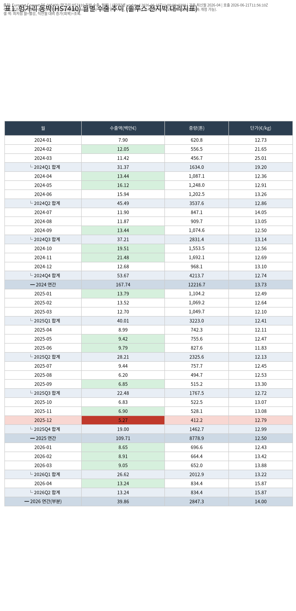
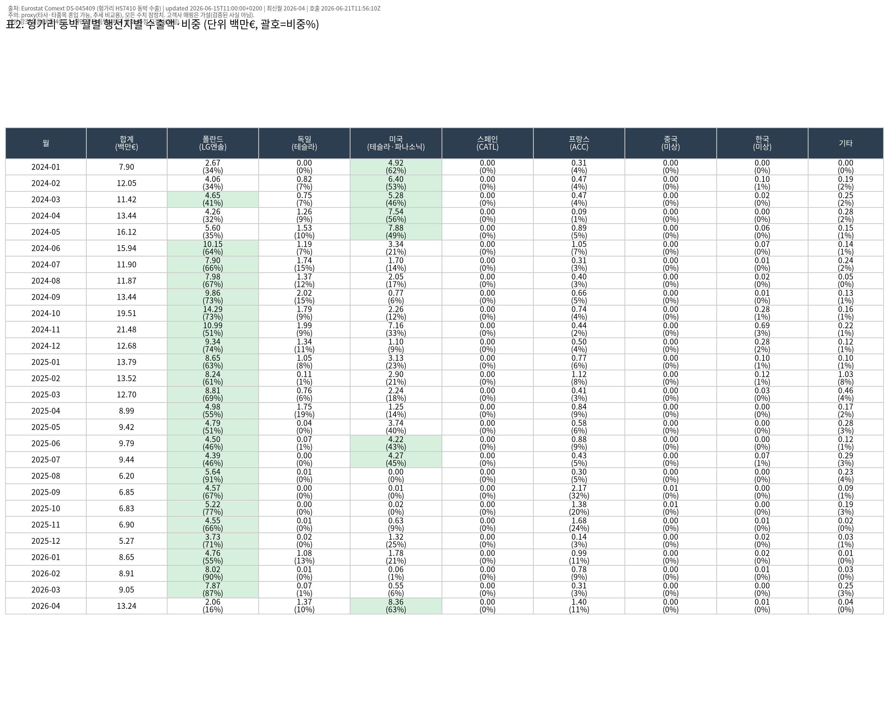
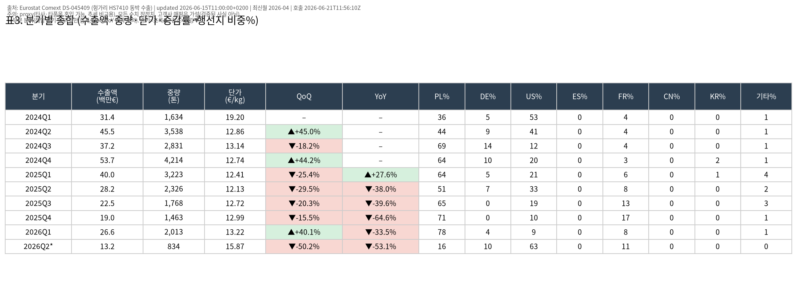
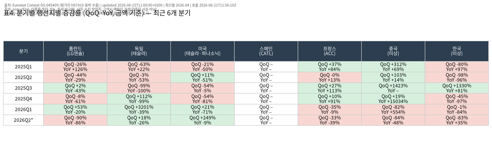

# 솔루스첨단소재(336370) 전지박 수출 대리지표(Proxy) 분기 업데이트 — 2026년 4월 기준

> **데이터 메타** · 데이터셋 updated: **2026-06-15 11:00 (+0200)** · 가용 최신월: **2026-04** · API 호출시각: **2026-06-21 11:56 UTC / 20:56 KST**
> **출처**: Eurostat Comext **DS-045409** (EU trade since 1988 by HS2-4-6 and CN8) — 헝가리(HU) 동박(HS **7410**) 수출(flow=2), 월별(freq=M).

## 한 줄 요약

**2026년 1분기(Jan–Mar) 헝가리 동박수출은 QoQ +40.1%로 '회복 진입'했으나 YoY는 여전히 −33.5%로 '급증(YoY 플러스 전환)'에는 못 미친다.** 회복 견인국은 **폴란드(추정 LG에너지솔루션, 1Q26 비중 77.6%)**, 이탈은 **프랑스(추정 ACC, QoQ −35%)**. 다만 **2026년 4월 단월은 €13.2M으로 전년동월 대비 +47.3%(YoY 플러스 첫 전환)·전월비 +46.4%** 급등했고, 이 단월 급등은 **미국(추정 테슬라·파나소닉, 4월 €8.4M·비중 63%, QoQ +249%)**가 견인 — 솔루스가 가이던스로 제시한 '2분기 전지박 물량 약 2배 확대'가 데이터에 나타나기 시작한 신호로 읽힌다.

---

## 1. 핵심 추세 (proxy 기준, 잠정치)

### 분기 추이 (수출액, 백만€)
| 분기 | 수출액 | QoQ | YoY | 해석 |
|---|---:|---:|---:|---|
| 2025Q1 | 40.0 | −25.4% | +27.6% | |
| 2025Q2 | 28.2 | −29.5% | −38.0% | 하강 |
| 2025Q3 | 22.5 | −20.3% | −39.6% | 하강 |
| 2025Q4 | **19.0** | −15.5% | −64.6% | **바닥(저점)** |
| **2026Q1** | **26.6** | **+40.1%** | **−33.5%** | **회복 진입(QoQ+), 급증 아님(YoY−)** |
| 2026Q2* | 13.2 | — | — | *4월 단월만 집계(분기 미완), QoQ/YoY 비교 왜곡 → 단월로만 해석 |

- **저점은 2025년 12월(€5.27M, 월별 표1 빨강)**. 이후 **2026-01(€8.65M) → 02(€8.91M) → 03(€9.05M) → 04(€13.24M)** 4개월 연속 증가(표1 초록).
- **회복 진입 vs 급증 구분**: 2026Q1은 QoQ가 플러스로 전환(회복 진입)했으나 YoY는 아직 마이너스(전년 동기 대비 위축). '급증(YoY 플러스 전환)'은 분기 기준으로는 아직 미발생이며, **2026년 4월 단월에서 YoY +47.3%로 처음 플러스 전환**했다(2분기 전체 확정 시 재확인 필요).

### 금액 회복 vs 물량 회복 (가격효과 분리)
| 구간 | 수출액(백만€) | 중량(톤) | 단가(€/kg) |
|---|---:|---:|---:|
| 2025Q4 (저점) | 19.0 | 1,462.7 | 12.99 |
| 2026Q1 | 26.6 | 2,012.9 | 13.22 |
| 2026-04 (단월) | 13.2 | 834.4 | 15.87 |

- **물량도 함께 회복**: 2026Q1 중량 2,012.9톤(QoQ +37.6%)으로 금액(+40.1%)과 동반 회복 → 단순 가격효과가 아닌 **실물 출하 회복**.
- **단가도 상승**: €12.99 → €13.22(분기) → €15.87(4월)/kg. 4월 단가 급등은 미국향(고부가 추정) 비중 확대와 믹스 변화 가능성. 금액 회복이 물량+단가 양쪽에서 나온다는 점은 긍정적 신호이나, 단월 단가는 변동성이 크므로 추세 확정 전 보류.

---

## 2. 행선지(추정 고객사)별 흐름

> **추정 고객사 매핑은 가설이며 검증된 사실이 아니다.** 헝가리 적출 통계에는 솔루스 외 타사·타품목이 섞일 수 있다.
> PL=LG에너지솔루션 · DE=테슬라 · US=테슬라/파나소닉 · ES=CATL · FR=ACC · CN/KR=미상

### 2026Q1 행선지 비중 (수출액 기준)
- **PL(폴란드/추정 LG엔솔) 77.6%** — 압도적 비중, QoQ +53%로 **분기 회복의 핵심 엔진**.
- US(미국/추정 테슬라·파나소닉) 9.0% (QoQ +21%), FR(프랑스/추정 ACC) 7.8% (QoQ **−35%, 이탈**), DE(독일/추정 테슬라) 4.4% (QoQ +3,201%이나 직전분기 기저가 0 수준이라 해석 주의).
- ES(CATL)·CN·KR은 사실상 0~미미.

### 2026년 4월 단월 — 견인국 교대
- **US 비중 63.1%(€8.36M), QoQ(분기→단월) +249%로 급등** → 4월 급등의 주역. 솔루스 실적설명의 "북미 고객사 수요 회복 + 신규 고객사 공급 시작"과 정합적(가설).
- PL은 4월 €2.06M으로 단월 비중이 낮아졌으나, 이는 분기 합계 대비 단월 비교라 변동성 큼(표4 QoQ −90%는 분기↔단월 왜곡).
- **이탈/약세**: FR(ACC)은 분기·단월 모두 QoQ 마이너스, CN·KR은 의미 있는 회복 신호 없음.

(상세 수치는 표3·표4 참조)

---

## 3. 솔루스 직전 분기 실적과 대조

**솔루스첨단소재 2026년 1분기(1Q26) 잠정실적** (2026년 4~5월 발표, 언론·증권사 리포트 기준):

| 항목 | 1Q26 | QoQ | YoY |
|---|---:|---:|---:|
| 연결 매출 | 1,926억원 | +13.6% | +22.2% |
| **전지박 매출** | **610억원** | **+47.0%** | — |
| 동박(회로박) 매출 | 1,045억원 | +9.7% | — |
| 영업손익 | −220억원 | (전분기 −219억, 적자 지속) | — |

- **방향 일치(정합)**: 솔루스 **전지박 매출 QoQ +47.0%** ↔ Eurostat 헝가리 동박수출 **2026Q1 QoQ +40.1%**. 두 지표 모두 **Q1 2026 회복 진입(QoQ 플러스 전환)**을 동일하게 가리킨다. proxy로서의 추세 연동성이 이번 분기에 비교적 잘 작동.
- **수익성은 아직 미회복**: 전지박 물량이 완전 회복되지 않아 고정비·전력단가 부담으로 영업적자(−220억) 지속. Eurostat YoY가 여전히 −33.5%인 점(아직 전년 수준 미달)과 일관 — '회복 진입'이지 '정상화/급증'은 아님.
- **가이던스 → 4월 데이터로 선확인**: 회사는 "2분기 전지박 공급 약 2배 확대(7개 고객사)"를 제시. Eurostat **4월 단월 +47.3% YoY·+46.4% MoM 급등**은 이 2분기 램프업이 데이터에 나타나기 시작한 정황(잠정). 2026Q2 전체 확정 시(8월 루틴) YoY 플러스 전환 여부를 재확인할 것.

> 비교 정렬: 이 루틴은 1Q26 실적발표 직후 시점 실행. 1Q26 실적이 커버하는 기간(2026-01~03) = Eurostat 2026Q1 데이터와 정확히 일치하므로 직접 대조 가능. 4월은 실적 미반영 선행 데이터(2Q26 일부)다.

---

## 4. 표 (PNG)

| 표 | 내용 | 파일 |
|---|---|---|
| 표1 | 월별 추이(수출액/중량/단가, 최저점·회복 색표시, 분기·연간 합계) | `table1-monthly-2026-04.png` |
| 표2 | 월별 행선지별 금액·비중(전 국가, 추정 고객사 헤더) | `table2-destination-2026-04.png` |
| 표3 | 분기별 종합(QoQ/YoY ▲▼, 행선지 비중 전체) | `table3-quarterly-2026-04.png` |
| 표4 | 분기별 행선지별 QoQ·YoY(견인/이탈 식별) | `table4-country-qoq-yoy-2026-04.png` |

---

## 5. 한계 및 가정 (반드시 함께 읽을 것)

- **Proxy 가정의 한계**: '헝가리 동박(HS7410) 수출 = 솔루스 전지박'은 가정이다. ① 헝가리 내 솔루스 외 타사·타품목(회로박 등 다른 동박 포함)이 혼입될 수 있고, ② Eurostat는 €·HS코드 기준, 솔루스 실적은 원화·전지박 부문 기준이라 **수준(level)이 아닌 추세(trend)로만** 비교해야 한다.
- **고객사 매핑은 가설**: 행선지국→고객사 매핑(PL=LG엔솔 등)은 검증된 사실이 아니다. 헝가리 내 타 적출 주체가 섞일 수 있다.
- **잠정치·개정 리스크**: Eurostat 역내 상세는 7~11주 지연되며 모든 수치는 **잠정치로 후속 개정 가능**. 특히 최신월(2026-04)은 개정폭이 클 수 있다.
- **부분 분기 왜곡**: 2026Q2는 4월 1개월만 집계됨 → 표3·표4의 2026Q2* QoQ/YoY는 분기↔단월 비교로 왜곡. 단월 지표로만 해석.

---

## 6. 레퍼런스 신뢰도 평가

| 항목 | 등급 | 코멘트 |
|---|---|---|
| 데이터 출처 신뢰도 | **A (높음)** | Eurostat Comext는 EU 공식 무역통계. API·메타데이터(updated 2026-06-15) 명확, 재현 가능. |
| Proxy 가정 타당성 | **B (보통)** | 이번 분기 솔루스 전지박 QoQ(+47%)와 Eurostat QoQ(+40.1%) 방향 정합으로 가산점. 단, 타사·타품목 혼입·통화/품목 불일치로 수준 비교는 불가. |
| 고객사 매핑 | **C (낮음, 가설)** | 행선지→고객사 추정은 미검증 가설. 해석 보조용으로만. |
| 결측·개정 리스크 | **B− (주의)** | 최신월(4월) 잠정·개정 가능성, 일부 국가(ES/CN/KR) 결측·미미. 2Q26 확정 시 재검증 필요. |
| 종합 | **B+** | 추세 방향성 판단에는 충분히 유용하나, 절대 수준·고객사 귀속은 신뢰도 낮음. |

---

### 출처
- Eurostat Comext DS-045409 API (헝가리 HS7410 수출, freq=M, flow=2). 호출 2026-06-21 11:56 UTC.
- 솔루스첨단소재 1Q26 실적: 딜사이트, 뉴스1, 굿모닝경제, IBK투자증권 리포트(2026-04~05) 등 언론·증권사 보도(잠정실적 기준).

*본 문서는 자동 분기 루틴 산출물이며 모든 수치는 잠정치입니다. 투자 판단의 책임은 이용자에게 있습니다.*
