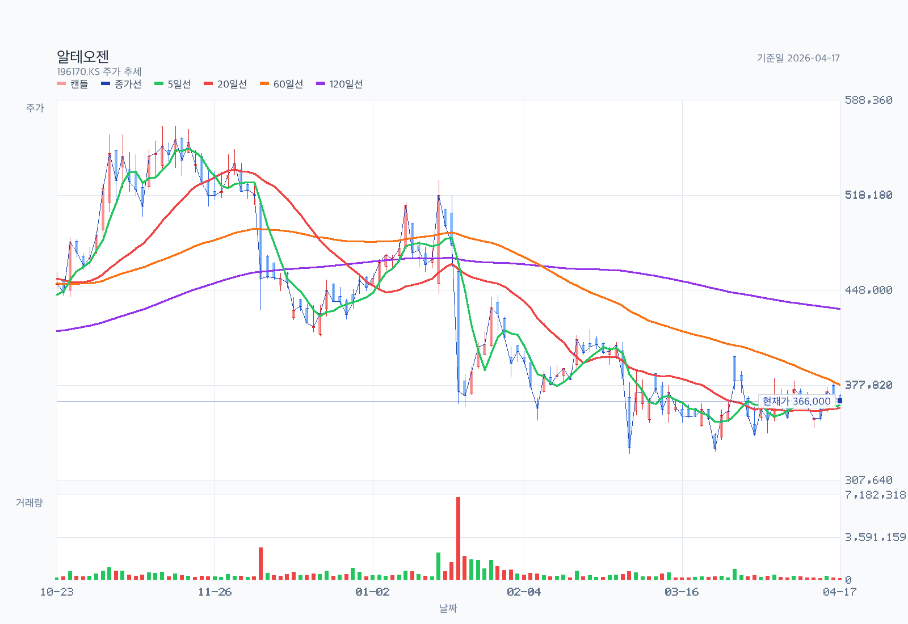
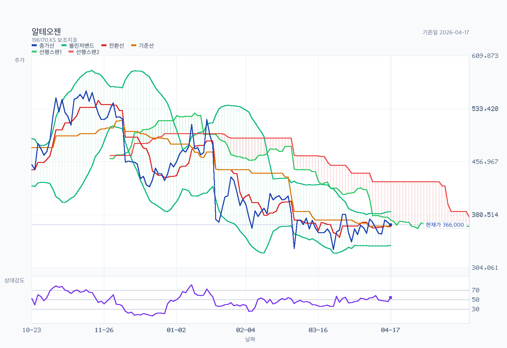
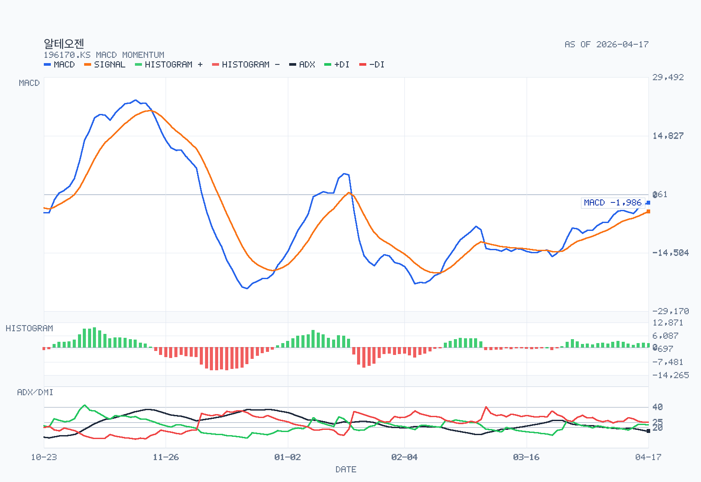

# Advanced Chart Analysis: 196170.KS

- Name: 알테오젠
- Latest date: 2026-04-17
- Latest close: 366000.00
- Moving-average structure: rebound-inside-downtrend
- Bollinger read: mid-band
- Ichimoku read: below-cloud
- RSI state: neutral
- MACD state: bullish / below-zero
- ADX state: weak-trend / bearish / falling
- Volume regime: light
- Chart-only flow: bearish continuation

## Chart Images

The main chart uses OHLC candlesticks with upper and lower wicks, plus MA5, MA20, MA60, MA120, and volume. The overlay chart separates Bollinger Bands, Ichimoku cloud lines, and RSI14, and reserves 26 forward slots for the projected cloud. The momentum chart focuses on MACD, signal, histogram, and ADX/DMI so crossovers, momentum acceleration, and trend strength are easier to see.

## Indicators

| Metric | Value |
| --- | --- |
| MA 5 | 363000.00 |
| MA 20 | 360850.00 |
| MA 60 | 378091.67 |
| MA 120 | 434083.33 |
| Bollinger Upper | 385205.90 |
| Bollinger Middle | 360850.00 |
| Bollinger Lower | 336494.10 |
| Bollinger Width | 13.50% |
| Tenkan | 363500.00 |
| Kijun | 364250.00 |
| Current Cloud A | 373000.00 |
| Current Cloud B | 428000.00 |
| Future Cloud A | 363875.00 |
| Future Cloud B | 377750.00 |
| RSI 14 | 54.31 |
| MACD | -1986.11 |
| Signal | -4164.65 |
| Histogram | 2178.54 |
| MACD State | bullish / below-zero |
| Histogram State | contracting |
| ADX 14 | 16.38 |
| +DI | 22.61 |
| -DI | 25.49 |
| ADX State | weak-trend / bearish / falling |
| Avg Volume 20 | 314321 |
| Volume vs Avg 20 | 45.3% |
| 20D Breakout Level | 399500.00 |
| 20D Breakdown Level | 329000.00 |

## Read

- Trend structure: price has lifted above MA20 but still sits below MA60, so this is a rebound attempt inside a broader downtrend.
- Volatility: price is around the middle of the Bollinger range, and band width is contracting, so volatility is compressing.
- Cloud read: price is below the current cloud, tenkan is below kijun, and the projected cloud is bearish.
- Momentum and participation: RSI14 is neutral at 54.31; MACD remains above signal, and MACD is below zero; histogram momentum is contracting; ADX still reads as a weak-trend environment, and trend strength is fading; volume is light versus the 20-day average.
- Practical checklist: nearest support watch is 336,494; first recovery check is 373,000, then 399,500; 20-day breakout level sits at 399,500; 20-day breakdown level sits at 329,000; chart-only flow still reads as bearish continuation.
