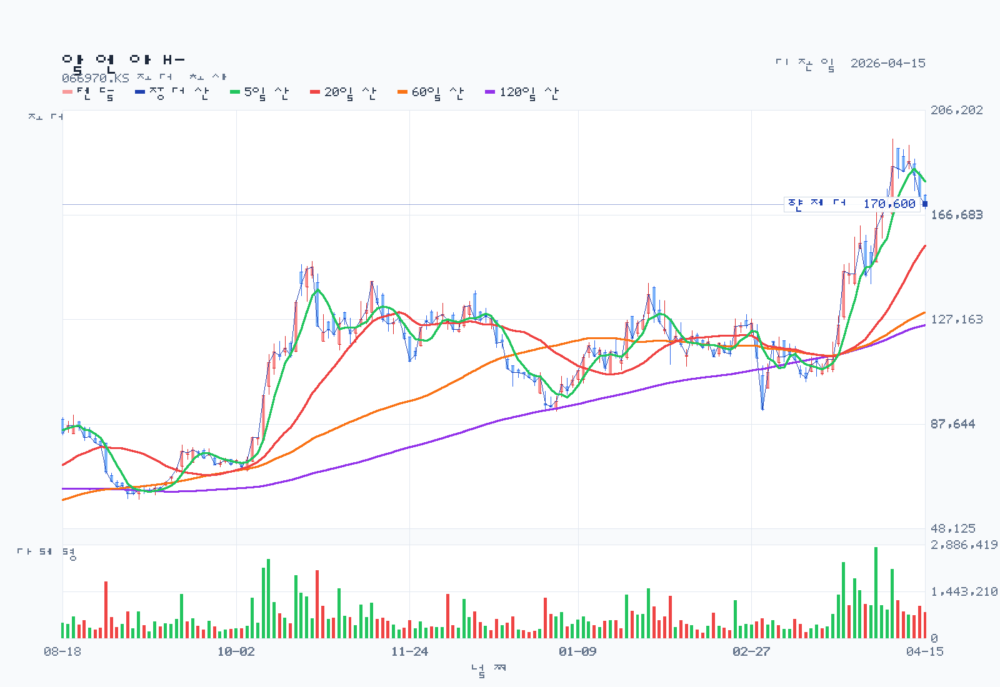
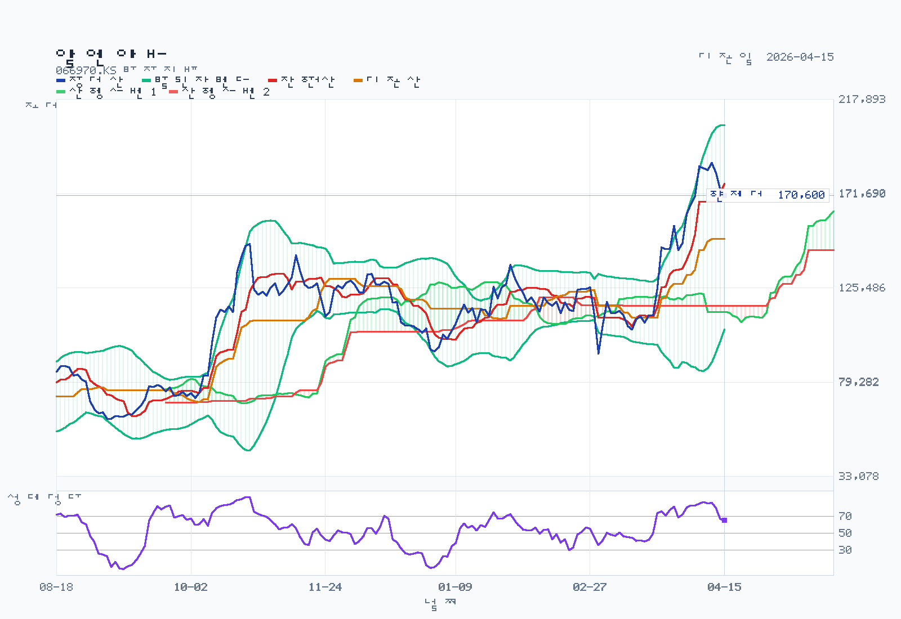
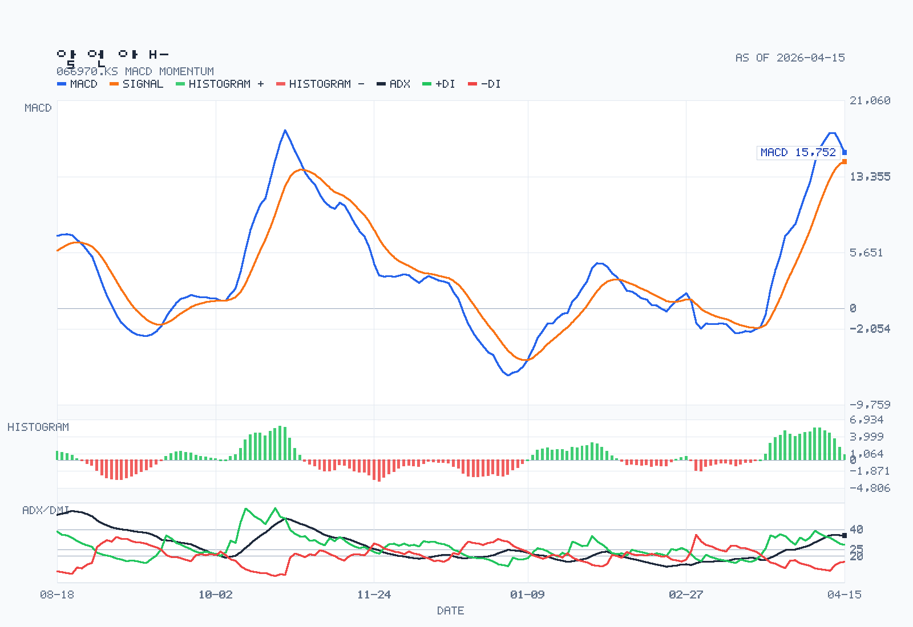

# 엘앤에프 분석 예시

기준일: 2026-03-20
최근 업데이트일: 2026-04-15

## Decision Frame

- 현재 판단: 엘앤에프는 `단순 턴어라운드 후보`에서 `LFP 계약으로 실체가 붙은 고베타 회복주`로 성격이 바뀌었다. 다만 2026-04-15 종가 `170,600원` 기준 시가총액은 약 `6.88조원`으로 커졌고, Fwd 12M PER은 300배 후반대라 가격은 이미 강한 정상화와 LFP 옵션을 상당히 반영한다.
- 가장 큰 변화: 2026-03-24 삼성SDI와 `1.6067조원` 규모 LFP 양극재 중장기 공급계약을 공시했다. 계약기간은 2026-03-30~2029-12-31이고, 공급지역은 미국 등으로 공시됐다.
- 확인할 것: 2026년 상반기 영업흑자 지속, LFP 1단계 설비의 실제 고객 테스트/양산 전환, 46파이 양극재 출하 확대, 그리고 추가 증설 재원을 주주가치 훼손 없이 조달할 수 있는지가 핵심이다.
- 결론: `관찰 유지 / 추격 보류`다. 회사의 스토리는 3월보다 좋아졌지만, 주가와 멀티플도 더 빨리 올라왔다. 다음 분기 숫자와 LFP 양산 증거가 없으면 확신을 더 올리기 어렵다.

## Summary

엘앤에프는 2025년 4분기 영업흑자 전환 이후 2026년 3월 삼성SDI LFP 공급계약까지 확보하면서 회복 서사의 질이 좋아졌다. 회사가 제시하는 축은 `NCMA95/46파이`와 `LFP`의 투트랙이고, 독립 블로거들도 같은 방향의 강세 논리를 밀고 있다.

하지만 현재 주가는 2026-04-15 종가 기준 2026년 저점 구간에서 크게 반등한 상태다. Fwd 12M EPS가 아직 낮아 컨센서스 PER은 매우 높고, P/B도 10배 안팎이다. 지금의 투자 판단은 `좋아진 사실`보다 `이미 반영된 기대의 크기`를 먼저 점검해야 한다.

## Business and Thesis

엘앤에프는 2차전지용 양극활물질 제조/판매가 핵심 사업인 양극재 회사다. 회사 IR과 홈페이지는 주력 제품을 양극활물질로 제시하며, 최근 사업 메시지는 `울트라 하이니켈 NCMA95`, `46파이 배터리용 양극재`, `LFP 양극재`로 수렴한다.

투자 논리는 이전보다 명확해졌다. 2025년 4분기에는 NCMA95 출하 확대와 가동률 개선이 실적 회복을 만들었고, 2026년 3월에는 삼성SDI LFP 계약으로 LFP가 단순 전시회/IR 스토리가 아니라 공급계약으로 확인됐다. 반대로 밸류에이션은 이미 `회복 + 신규 제품 성공`을 전제로 둔 수준이라, 실행 지연이나 추가 희석성 자금조달에는 민감할 수밖에 없다.

## Revenue Mix

- 제품/사업부: 현재 확인 가능한 회사 자료 기준으로 사실상 `양극활물질 중심 단일 핵심 사업`이다.
- 제품 세부축: 공식 커뮤니케이션상 `NCMA95/울트라 하이니켈`, `46파이`, `LFP`가 핵심 성장축이다. 다만 제품별 매출 비중은 정량적으로 별도 공시되지 않았다.
- 지역 믹스: 삼성SDI LFP 계약은 공급지역을 `미국 등`으로 공시했지만, 전체 매출의 지역별 비중은 현재 소스셋에서 깔끔하게 분리되지 않는다.
- 고객 집중도: 삼성SDI 계약은 확인되지만, 전체 고객사별 매출 비중과 46파이/NCMA95의 최종 고객별 비중은 별도 공시되지 않았다.

따라서 매출구조 해석의 핵심은 사업부 다각화가 아니라 `특정 제품/고객/최종 EV·ESS 수요에 대한 민감도`다. 고객과 제품 믹스가 비공개인 만큼, 시장이 붙이는 멀티플에는 정보 비대칭 리스크가 남아 있다.

## What The Latest Results Say

2026-02-02 잠정실적 공시 기준 2025년 4분기 매출은 약 `6,178억원`, 영업이익은 `825억원`, 순손실은 `1,830억원`이었다. 같은 날 손익구조 변경 공시는 매출 `6,177억원`, 영업이익 `826억원`, 순손실 `1,829억원`으로 제시했고, 개선 배경을 `주요제품(NCMA95) 출하량 확대에 따른 가동률 개선`으로 설명했다. 순손실은 주가 상승에 따른 CB/BW 등 주식연계채권의 현금유출 없는 파생상품평가손실 영향이 컸다.

2026-03-24에는 삼성SDI와 LFP 양극재 중장기 공급 및 구매합의서를 공시했다. 계약금액은 `16,067억원`, 계약기간은 `2026-03-30~2029-12-31`, 매출 대비 `84.23%`로 공시됐다. 회사 보도자료는 2027~2029년 확정 물량과 추가 3년 옵션 구조, 연 `6만톤` 공급능력 구축, 1단계 `3만톤` 설비의 2026년 4월 준공 예정과 빠르면 2026년 3분기 대량 양산 계획을 제시했다.

2026-04-10에는 미쓰비시케미컬과 검토하던 음극재 사업 진출을 `대외 정책 및 업황 변동`으로 중단했다고 확정 공시했다. 이는 양극재/LFP 집중이라는 관점에서는 자원 배분 정리로 볼 수 있지만, 음극재까지 포함한 소재 포트폴리오 확장 옵션은 낮아진다.

## DART Recheck

| 주장 | 상태 | 확인값 또는 판단 | 출처 | 비고 |
| --- | --- | --- | --- | --- |
| 2025년 4분기 영업흑자 전환은 NCMA95 출하 확대와 가동률 개선이 핵심이었다 | confirmed | 4Q25 영업이익 825~826억원, 변동요인으로 NCMA95 출하량 확대와 가동률 개선 제시 | 2026-02-02 잠정실적/손익구조 공시 | 순손실은 파생상품평가손실 영향이 커 본업 회복과 순이익 정상화는 구분 필요 |
| 삼성SDI LFP 계약은 실체가 있는 공급계약이다 | confirmed | 계약상대 삼성SDI, LFP 양극재 중장기 공급 및 구매합의서, 계약금액 16,067억원, 2026-03-30~2029-12-31 | 2026-03-24 단일판매ㆍ공급계약체결 | LFP 스토리의 질은 개선 |
| LFP 1단계 3만톤 설비는 2026년 4월 준공, 빠르면 3Q26 대량 양산이 가능하다 | partially supported | 회사 보도자료의 계획으로 확인되나, 실제 고객 승인·수율·출하·마진은 아직 미확인 | 2026-03-24 회사 보도자료 | 다음 분기와 3Q26 이벤트 체크 필요 |
| 정관 변경은 IP/라이선스 사업 옵션을 열었다 | partially supported | 주총에서 지적재산권 관리·라이센스업 추가 등 사업목적 확대가 승인됨 | 2026-03-26 회사 주총 보도자료 | 라이선스 매출 또는 계약은 별도 확인되지 않음 |
| 음극재 JV 검토는 중단됐다 | confirmed | 미쓰비시케미컬과의 음극재 사업 진출 검토 중단 | 2026-04-10 풍문또는보도에대한해명 | 포트폴리오 확장 옵션 축소, 투자 집중 효과는 가능 |
| 고객별 매출 비중과 지역별 전체 매출 비중은 확인 가능하다 | not separately disclosed | 삼성SDI 계약과 일부 공급지역은 확인되지만 전체 고객/지역 믹스는 별도 공시로 분리되지 않음 | 현재 소스셋 | 밸류에이션 판단의 핵심 공백 |

## Street / Alternative Views

- `Street view`: FnGuide/CompanyWise 기준 최근 3개월 컨센서스 목표가는 2026-04-14 기준 `197,474원`, 투자의견 컨센서스는 `3.89`다. 2026년 3월 24일 이후 여러 증권사가 목표가를 상향했지만, Fwd 12M EPS가 `450원`에 불과해 PER은 여전히 매우 높다.
- `Company view`: 회사는 2026년 주총에서 `NCM·LFP 투트랙`, 46파이 배터리 출하 확대, 북미 시장 공략, LFP의 ESS·EV·AI 데이터센터 적용 확대를 제시했다. 이 내용은 사업 방향을 보여주지만, 고객별 물량과 수익성은 아직 공시 숫자로 분해되지 않는다.
- `Independent view`: `analysis-example/kr/엘앤에프/naver-insights.md`는 4명 블로거의 19개 포스트를 담고 있다. 반복 커버 후보는 `mooyoung_2022`, `shmoon305`, `bosbos2`, `naburo`다. 이번 2026-04-15 실시간 `discover-bloggers.js`와 `fetch-blog-posts.js` 실행은 각각 후보 0명/포스트 0건을 반환했으므로, 메모에는 기존 저장 digest를 사용했다.
- `Independent view`: 무영(`mooyoung_2022`)은 테슬라/현대차 직납, Ni 95% 기술 우위, IP 라이선스 옵션을 강하게 본다. 이 중 IP 사업목적 추가는 주총 보도자료로 확인되지만, 직납·라이선스 매출은 아직 회사 공시로 확인되지 않은 시나리오다.
- `Independent view`: 문벵이(`shmoon305`)는 LFP 쇼티지와 삼성SDI향 LFP 재평가를 핵심 논리로 본다. 3월 24일 삼성SDI 계약으로 방향은 일부 확인됐지만, LFP의 실제 마진과 양산 수율은 아직 미검증이다.
- `Independent view`: 엘앤에프형(`bosbos2`)은 월별 수출 데이터와 사이클 회복을 추적한다. 3월 6,900톤 출하 주장은 중요한 힌트지만, 메모에서는 관세청 데이터와 회사 매출 인식의 직접 연결을 아직 검증하지 못했다.
- `Bias warning`: 확인된 블로거들은 모두 장기 보유/우호적 성향이 강하다. 네이버 인사이트는 강세 논리의 구조를 이해하는 데 유용하지만, 반대 시각을 대체하지 못한다.

## Current Valuation Snapshot

| Metric | Value | Date | Note |
| --- | --- | --- | --- |
| Current price | 170,600 KRW | 2026-04-15 | Yahoo Finance chart API 종가 |
| Market cap | about 6.879tn KRW | 2026-04-15 | 2026-04-14 CompanyWise 발행주식수 40,325,085주 x 2026-04-15 종가로 계산 |
| Trailing PER | N/A | 2026-04-14 | 2025 EPS -14,393원 |
| Fwd 12M PER | about 379x | Mixed date | 2026-04-14 Fwd 12M EPS 450원과 2026-04-15 종가 기준 단순 계산. CompanyWise 2026-04-14 표기는 385.20x |
| EV/EBITDA | 34.29x | 2026-04-14 | CompanyWise Fwd 12M 기준 |
| P/B | about 9.76x | Mixed date | 2025 BPS 17,482원과 2026-04-15 종가 기준. CompanyWise 2026-04-14 표기는 9.92x |
| FCF yield | not separately refreshed | 2026-04-15 | 현재 소스셋에서 신뢰 가능한 FCF 컨센서스 미확보 |
| Dividend yield | 0.0% / N/A | 2025 | IR 배당내역상 2025년 현금배당 없음 |
| Major shareholders | 새로닉스 외 18인 25.36%, 국민연금 8.54%, 자사주 3.07% | 2026-04-14 | CompanyWise |

현재 밸류에이션은 `싸다`보다 `강한 실행을 요구한다`에 가깝다. LFP 계약이 사업 실체를 높였지만, 2027년 이후 매출 기여가 본격화되는 구조이고 2026년 컨센서스 이익은 아직 낮다. 가격이 먼저 움직인 만큼 1Q26~3Q26 실행 증거가 중요하다.

## Historical Valuation Bands

### P/E band

`2023~2025`에 적자 구간이 길어 역사적 P/E 밴드는 해석 품질이 낮다. 현재도 trailing PER은 음수 EPS 때문에 의미가 없다. Fwd 12M PER은 300배 후반대로 높지만, 분모가 작은 턴어라운드 초입이라 작은 이익 추정 변화에도 배수가 크게 흔들린다.

```text
P/E positive observations only
2022    26.7x  ##########
2026E   n/m    EPS near breakeven
Fwd12M  ~379x  ########################
```

### EV/EBITDA band

`2023~2025` EBITDA가 부진해 EV/EBITDA도 왜곡이 크다. CompanyWise 2026-04-14 기준 Fwd 12M EV/EBITDA는 `34.29x`다. LFP가 2027년 이후 의미 있게 반영되지 않으면 현재 배수는 부담스럽고, 반대로 LFP 마진이 예상보다 좋으면 EBITDA 분모가 빠르게 커질 수 있다.

```text
EV/EBITDA selected positive observations
2022      21.9x  ############
Fwd12M    34.3x  ####################
```

### P/B band

P/B는 현재 가장 직관적인 부담 지표다. 2026-04-15 종가와 2025 BPS 기준 P/B는 약 `9.76x`다. 턴어라운드가 실적과 현금흐름으로 이어지기 전에는 장부가치 대비 평가가 이미 높은 편이다.

```text
P/B year-end history
2020   8.14x  ####################
2021   9.50x  ########################
2022   4.51x  ###########
2023   6.22x  ################
2024   3.79x  ##########
2025   7.93x  ####################
Current ~9.76x #########################
```

## Chart and Positioning







### Rule Screen

- `Minervini Trend Template`: `incomplete`
  RS percentile 캐시가 없어 최종 판정은 incomplete지만, RS를 제외한 가격/이평선 조건은 모두 통과했다.
- `KRX 52주 신고가 리더십 점수`: `partial 68/80`
  RS percentile이 비어 있으므로 상대강도는 보류하고, 52주 고가 근접도와 추세 구조만 해석해야 한다.

| 항목 | 상태 | 세부 |
| --- | --- | --- |
| 현재가 > SMA50/SMA150/SMA200 | pass | 현재가 `170,600원` / SMA50 `131,464원` / SMA150 `114,845원` / SMA200 `102,542원` |
| SMA150 > SMA200 | pass | 장기 추세 양호 |
| SMA50 > SMA150 and SMA200 | pass | 정배열 유지 |
| SMA200이 최근 20거래일 전보다 상승 | pass | `92,212원 -> 102,542원` |
| 현재가 >= 52주 저가의 130% | pass | `356.9%` |
| 현재가 >= 52주 고가의 75% | pass | `91.3%` |
| RS percentile >= 70 | unavailable | RS cache not provided |
| 신고가 근접도 | 18/25 | 현재가/52주 고가 `91.3%` |
| 최근 신고가 recency | 25/25 | 마지막 신고가 이후 3거래일 |
| 최근 60거래일 신고가 경신 빈도 | 15/15 | 6회 |
| 추세/거래량 확인 | 10/15 | 정배열 yes / 거래량 `68.4%` |

차트 데이터는 `2026-04-15` 종가 `170,600원`까지의 2년 일봉이다. 주요 지표는 `MA5 179,120원`, `MA20 155,110원`, `MA60 129,827원`, `MA120 124,974원`, `볼린저 상단 205,147원`, `중단 155,110원`, `하단 105,073원`, `전환선 176,500원`, `기준선 149,350원`, `현재 구름대 A 113,725원`, `현재 구름대 B 116,700원`, `미래 구름대 A 162,925원`, `미래 구름대 B 143,900원`, `RSI14 65.12`, `MACD 15,752`, `시그널 14,863`, `히스토그램 889`, `ADX14 35.23`, `+DI 28.46`, `-DI 15.83`, `20일 평균 거래량 1,215,739주`, 당일 거래량은 평균의 `68.4%`였다.

주가는 중장기 이동평균과 구름대를 모두 웃돌아 추세 구조는 아직 우호적이다. 다만 4월 10일 종가 `186,800원`에서 4월 15일 `170,600원`으로 내려오면서 단기 과열은 일부 식었고, 종가는 5일선 아래로 내려왔다. RSI는 과열권에서 중립권으로 내려왔지만 MACD는 아직 0선 위와 시그널 위에 있다.

실전 레벨은 위로 `176,500원` 전환선 회복, 이후 `195,300원` 20일 돌파/52주 고점 재도전이 체크포인트다. 아래로는 `155,110원` 20일선과 `149,350원` 기준선이 1차 추세 훼손 여부를 가르는 구간이다. 차트만 보면 `강한 상승 추세 이후 과열 해소 중인 bullish continuation`이다.

## Governance and Structure

- CompanyWise 2026-04-14 기준 주요주주는 새로닉스 외 18인 `25.36%`, 국민연금 `8.54%`, 자사주 `3.07%`다.
- 회사 IR 페이지의 2025-12-31 주주구성은 최대주주 외 특수관계인 `22.3%`, 자사주 `4.3%`, 외국인 `13.5%`, 기타 `59.9%`로 제시된다. 이후 자사주 처분과 지분 공시 변화로 기준일별 숫자가 다르다.
- 2026-02-12 회사는 운영자금 조달 목적으로 보통주 `500,000주`, 약 `584억원` 규모의 자사주 처분을 공시했다. 처분 전 자사주 비중은 `4.32%`였다.
- 2026-03-25 주총에서는 류승헌 CFO가 사내이사로 신규 선임됐고, 정관 일부 변경으로 지적재산권 관리·라이센스업 추가, 발행예정주식 총수 및 사채 발행한도 조정 등이 승인됐다.

소수주주 관점에서 핵심은 자금조달 방식이다. LFP 증설은 긍정적이지만, 필요한 투자재원을 자사주 처분, 사채, BW/CB, 유상증자 중 무엇으로 조달하는지에 따라 주주가치 희석 위험이 크게 달라진다.

## Catalysts

- 2026년 1분기 실적 발표: 4Q25 흑자 전환이 이어지는지 확인.
- LFP 1단계 설비 준공 후 고객 테스트, 3Q26 대량 양산 가능성 확인.
- 삼성SDI 외 추가 LFP 고객사 또는 옵션 물량 구체화.
- 46파이 배터리용 양극재 출하 확대와 북미 고객 관련 공시/IR 업데이트.
- 2026년 5월 말 전후 KOSPI100 편입 확정 여부와 2026-06-12 정기변경 수급 이벤트.
- 증설 재원 조달 방식 발표.

## Risks

- LFP 계약의 본격 매출 기여가 2027년 이후라 2026년 실적 공백이 생길 수 있다.
- LFP는 중국 업체의 원가 경쟁력이 강해 비중국 프리미엄이 수익성으로 연결된다는 보장이 없다.
- 고객별/지역별/제품별 매출 비중이 충분히 공개되지 않아 시장 기대가 특정 고객 시나리오에 과도하게 의존할 수 있다.
- Fwd 12M PER 300배 후반, P/B 10배 안팎은 실적 미스에 취약하다.
- 자사주 처분 이후에도 증설 재원이 추가로 필요하면 희석성 조달 위험이 재부각될 수 있다.
- 음극재 JV 검토 중단은 투자 집중이라는 장점이 있지만, 소재 포트폴리오 확장 옵션을 낮춘다.

## Uncomfortable Questions

1. LFP 계약은 대형 호재지만, 2026년 실적에는 얼마나 반영되는가? 2027년 매출을 2026년 주가가 너무 빨리 당겨온 것은 아닌가?
2. NCMA95와 46파이의 `기술 우위`가 실제 고객 독점력과 마진으로 이어지는지, 아니면 멀티벤더화가 다시 반복될 가능성이 있는지?
3. 삼성SDI LFP 계약의 매출 규모는 확인됐지만, LFP 양극재의 목표 마진과 원가 구조는 무엇으로 검증할 수 있는가?
4. IP/라이선스 정관 변경은 진짜 현금창출 옵션인가, 아니면 아직은 투자자들이 덧붙인 시나리오에 가까운가?
5. LFP 증설과 운전자본을 감당하기 위해 추가 자사주 처분, 사채, 전환성 조달이 반복될 위험은 얼마나 큰가?
6. 네이버 독립 분석가들의 강세 논리가 모두 보유자 관점이라면, 반대편에서 봤을 때 가장 먼저 깨질 가정은 무엇인가?

## Decision-Changing Issues

1. 1Q26~2Q26 영업흑자 지속 여부: 4Q25 회복이 일회성인지 구조적 정상화인지 가른다.
2. LFP 양산 전환과 고객 승인: 삼성SDI 계약이 실제 출하·마진으로 연결되는지 확인해야 한다.
3. 증설 재원 조달 방식: 주주가치 희석이 커지면 좋은 계약도 주가에는 다르게 반영된다.
4. 46파이/NCMA95 고객 확대 증거: 현재 밸류가 정당화되려면 LFP 외 기존 하이니켈 축도 같이 돌아야 한다.
5. 고객별 매출 비중 공개 또는 우회 검증: 단일 고객/플랫폼 의존도가 높으면 멀티플 상단은 제한된다.

## Structured Stance

현재 스탠스는 `관찰 유지 / 추격 보류`다. 3월 24일 삼성SDI LFP 계약으로 이전보다 투자 논리의 질은 좋아졌지만, 4월 15일 기준 주가와 밸류에이션은 이미 상당한 성공을 요구한다.

긍정적으로 바뀌려면 2026년 상반기 영업흑자 지속, LFP 1단계 설비의 고객 테스트 통과와 양산 전환, 추가 고객/옵션 물량, 희석 없는 재원 조달이 함께 확인돼야 한다. 부정적으로 바뀌려면 1Q26 흑자 훼손, LFP 양산 지연, 추가 희석성 조달, 또는 46파이/NCMA95 고객 확대 부재가 나오면 된다.

## Follow-up Research Prompts

- 삼성SDI LFP 계약의 연도별 매출 인식 곡선은 어떻게 되는가? 왜 중요한가: 2026년 주가가 2027~2029년 매출을 얼마나 당겨 반영했는지 판단해야 한다.
- LFP 1단계 3만톤 설비의 고객 테스트 일정, 수율, 단가, 목표 마진은 어디까지 확인되는가? 왜 중요한가: LFP가 매출만 키우는지, 이익률도 개선하는지의 핵심이다.
- 1Q26 영업이익은 메탈 가격, 재고평가, 일회성 손익을 제외해도 흑자인가? 왜 중요한가: NCMA95 출하 확대가 구조적 수익성 회복인지 확인해야 한다.
- 46파이 양극재의 실제 고객, 출하량, 제품 마진은 공시 또는 IR에서 더 구체화되는가? 왜 중요한가: 현재 밸류는 LFP뿐 아니라 46파이 성장도 함께 반영한다.
- IP/라이선스 사업목적 추가 이후 실제 라이선스 협의, 계약, 로열티 수익 가능성이 확인되는가? 왜 중요한가: 블로거 강세 논리의 핵심 옵션이지만 아직 공시로 검증되지 않았다.
- LFP 증설 재원은 영업현금흐름, 차입, 사채, 자사주 처분, 전환성 조달 중 무엇으로 충당되는가? 왜 중요한가: 성장 자체보다 주당가치 희석 여부가 투자 성과를 좌우할 수 있다.
- 음극재 JV 중단 이후 엘앤에프플러스와 구지 부지의 자본배분 계획은 어떻게 바뀌는가? 왜 중요한가: 기존 투자 자산의 회수 가능성과 신규 LFP 집중도의 질을 평가해야 한다.

## Update Log

### 2026-04-15

- `네이버 블로거/인사이트 반영`: 기존 `naver-insights.md`의 4명 블로거, 19개 포스트를 `Street / Alternative Views`에 반영했다. 실시간 `discover-bloggers.js`는 후보 0명, 명시 블로거 기반 `fetch-blog-posts.js`는 포스트 0건을 반환해 기존 저장 digest를 사용했다.
- `공시 업데이트`: 2026-03-24 삼성SDI LFP 공급계약, 2026-03-26 주총/정관 변경, 2026-04-10 음극재 사업 검토 중단을 반영했다.
- `DART Recheck 추가`: LFP 계약, NCMA95 기반 4Q25 회복, IP 정관 변경, 음극재 JV 중단, 고객/지역 믹스 미공시를 검증 테이블로 분리했다.
- `가격/차트 업데이트`: Yahoo Finance 2년 일봉을 다시 받아 2026-04-15 종가 `170,600원` 기준 차트 PNG 3종과 Rule Screen을 재생성했다.
- `스탠스 조정`: `턴어라운드 가능성은 있으나 검증 필요`에서 `LFP 실체는 강화됐지만 밸류에이션상 추격 보류`로 업데이트했다.

### 2026-04-11

- `차트 업데이트`: `2026-04-10` 종가 `186,800원` 기준으로 2년 일봉과 차트 PNG 3종을 재생성했다.
- `추세 해석`: 기존 강세가 더 강화됐다. 가격은 모든 주요 이동평균선과 구름대를 상회하고 있고, `ADX 35.70`으로 추세 강도도 강한 편이다.
- `룰 스크린`: RS percentile은 비어 있지만, RS를 제외한 Minervini 핵심 조건은 모두 충족했다.
- `실전 레벨`: 상단은 `195,300원` 신고가 재돌파, 하단은 `181,920원` 5일선과 `167,800원` 전환선 방어가 우선 체크포인트다.

## Sources

- [엘앤에프 IR 페이지](https://landf.irpage.co.kr/)
- [엘앤에프 사업영역](https://www.landf.co.kr/business/mater_2.html)
- [CompanyWise 엘앤에프 기업현황](https://comp.wisereport.co.kr/company/c1010001.aspx?cmp_cd=066970)
- [AWAKEPLUS 2026-03-24 단일판매ㆍ공급계약체결](https://www.awakeplus.co.kr/data/view/20260324800257)
- [뉴스와이어 2026-03-24 삼성SDI LFP 공급계약 보도자료](https://www.newswire.co.kr/newsRead.php?no=1030911)
- [뉴스와이어 2026-03-26 제26기 주주총회 보도자료](https://www.newswire.co.kr/newsRead.php?no=1031084)
- [AWAKEPLUS 2026-04-10 풍문또는보도에대한해명](https://www.awakeplus.co.kr/data/view/20260410800346)
- [데일리안 2026-04-10 음극재 JV 중단 보도](https://www.dailian.co.kr/news/view/1632123/%EC%97%98%EC%95%A4%EC%97%90%ED%94%84-%EB%AF%B8%EC%93%B0%EB%B9%84%EC%8B%9C%EC%BC%80%EB%AF%B8%EC%BB%AC-%EC%9D%8C%EA%B7%B9%EC%9E%AC-JV-2026)
- [AWAKEPLUS 2026-02-02 연결재무제표기준영업(잠정)실적](https://www.awakeplus.co.kr/data/view/20260202801934)
- [AWAKEPLUS 2026-02-02 매출액또는손익구조30% 이상변경](https://www.awakeplus.co.kr/data/view/20260202802019)
- [AWAKEPLUS 2026-02-12 주요사항보고서(자기주식처분결정)](https://www.awakeplus.co.kr/data/view/20260212001688)
- [Yahoo Finance chart API, 066970.KS, 2y 1d](https://query1.finance.yahoo.com/v8/finance/chart/066970.KS?range=2y&interval=1d)
- [네이버 블로그 인사이트 digest](./naver-insights.md)
- [네이버 블로거 투자논리 정리](./네이버블로거-투자논리.md)
